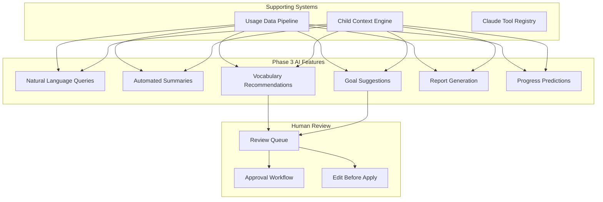

# AI-Powered Features — Technical Specification

**Version:** 1.0  
**Status:** Phase 3 Design  
**Last Updated:** January 2025

---

## 1. Executive Summary

Phase 3 introduces AI-powered intelligence features that leverage Claude to provide proactive assistance, generate personalized recommendations, and automate complex analysis tasks. These features build on the data infrastructure established in Phases 1-2.

### Safety First Principle

> **Critical:** AI features are therapist/caregiver-facing only. AI-generated content **never** reaches the child's AAC device without human review.

From the existing roadmap:
> "For a young child's primary communication system, LLM-generated content introduces unacceptable risks."

All AI features must be:
- Validated by humans before action
- Transparent in methodology
- Clearly labeled as AI-generated
- Reversible/editable

---

## 2. Feature Overview



---

## 3. Natural Language Query Interface

### 3.1 Concept

Enable caregivers and therapists to ask questions in natural language instead of navigating complex dashboards:

- "How has Flynn's vocabulary grown this month?"
- "What words does Flynn use most during mealtimes?"
- "Compare Flynn's progress to his goals"
- "When was the last time Flynn used 'help'?"

### 3.2 Query Processing Pipeline

```typescript
interface NaturalLanguageQuery {
  id: string;
  userId: string;
  childId: string;
  rawQuery: string;
  
  // Classification
  intent: QueryIntent;
  entities: ExtractedEntity[];
  confidence: number;
  
  // Execution
  toolsUsed: string[];
  rawResults: unknown[];
  
  // Response
  response: string;
  visualizations?: Visualization[];
  
  // Metadata
  latencyMs: number;
  tokensUsed: { input: number; output: number };
  
  createdAt: Date;
}

type QueryIntent = 
  | 'vocabulary_analysis'
  | 'progress_comparison'
  | 'usage_pattern'
  | 'milestone_check'
  | 'goal_status'
  | 'session_lookup'
  | 'team_activity'
  | 'general_question';

interface ExtractedEntity {
  type: 'date_range' | 'word' | 'category' | 'therapist' | 'goal' | 'metric';
  value: string;
  normalized?: unknown;
}
```

### 3.3 Query Router

```typescript
class NaturalLanguageQueryService {
  private claude: ClaudeService;
  private toolRegistry: ToolRegistry;
  
  async processQuery(
    userId: string,
    childId: string,
    query: string
  ): Promise<QueryResponse> {
    const startTime = Date.now();
    
    // Verify access
    await this.permissionChecker.requireAccess(userId, childId, 'aac_usage', 'read');
    
    // Build context
    const context = await this.buildQueryContext(childId);
    
    // Execute query with Claude
    const response = await this.claude.chat({
      model: 'sonnet', // Sonnet for analysis tasks
      system: this.buildSystemPrompt(context),
      messages: [{ role: 'user', content: query }],
      tools: this.getRelevantTools(context),
      maxTokens: 2000
    });
    
    // Process tool calls and generate response
    const { answer, visualizations, toolsUsed } = await this.processResponse(response);
    
    // Log query for analytics
    await this.logQuery({
      userId,
      childId,
      rawQuery: query,
      response: answer,
      toolsUsed,
      latencyMs: Date.now() - startTime
    });
    
    return {
      answer,
      visualizations,
      confidence: this.extractConfidence(response),
      suggestedFollowUps: await this.generateFollowUps(query, answer)
    };
  }
  
  private buildSystemPrompt(context: ChildContext): string {
    return `You are an AAC assistant helping caregivers and therapists understand ${context.childName}'s communication progress.

CONTEXT:
- Child: ${context.childName}, age ${context.age}
- Active vocabulary: ${context.vocabularySize} words
- Current therapy goals: ${context.activeGoals.map(g => g.title).join(', ')}
- Team members: ${context.teamMembers.map(m => `${m.name} (${m.discipline})`).join(', ')}

GUIDELINES:
1. Answer questions using the available tools to query real data
2. Always be encouraging and supportive in tone
3. If you can't find data, say so - don't make up numbers
4. Suggest visualizations when helpful
5. Keep answers concise but complete
6. Use the child's name naturally

AVAILABLE DATA:
- Usage logs (symbol taps, phrases, sessions)
- Therapy sessions across all disciplines
- Goal progress tracking
- Team activity logs`;
  }
  
  private getRelevantTools(context: ChildContext): Tool[] {
    return [
      this.toolRegistry.get('get_aac_usage'),
      this.toolRegistry.get('get_vocabulary_stats'),
      this.toolRegistry.get('get_progress_summary'),
      this.toolRegistry.get('list_goals'),
      this.toolRegistry.get('list_sessions'),
      this.toolRegistry.get('search_vocabulary'),
      this.toolRegistry.get('get_insights')
    ];
  }
}
```

### 3.4 Example Queries and Responses

```typescript
const EXAMPLE_QUERIES = [
  {
    query: "How many new words did Flynn learn this week?",
    expectedTools: ['get_vocabulary_stats'],
    exampleResponse: {
      answer: "Flynn used 5 new words this week! 🌟 The new words are: 'outside', 'music', 'finished', 'again', and 'different'. That's above his weekly average of 3 new words. Would you like to see which categories these words came from?",
      visualizations: [{
        type: 'word_list',
        data: ['outside', 'music', 'finished', 'again', 'different']
      }]
    }
  },
  {
    query: "What words does Flynn use most at breakfast?",
    expectedTools: ['get_aac_usage'],
    exampleResponse: {
      answer: "During breakfast time (6-9 AM), Flynn's top words are:\n1. 'more' (47 uses)\n2. 'eat' (35 uses)\n3. 'drink' (28 uses)\n4. 'cereal' (22 uses)\n5. 'milk' (18 uses)\n\nHe's showing strong functional communication around food and drink!",
      visualizations: [{
        type: 'bar_chart',
        title: 'Top Breakfast Words',
        data: [
          { label: 'more', value: 47 },
          { label: 'eat', value: 35 },
          { label: 'drink', value: 28 },
          { label: 'cereal', value: 22 },
          { label: 'milk', value: 18 }
        ]
      }]
    }
  }
];
```

---

## 4. Automated Summary Generation

### 4.1 Summary Types

```typescript
type SummaryType = 
  | 'daily_recap'           // End of day summary
  | 'weekly_digest'         // Weekly progress summary
  | 'session_summary'       // Post-therapy session summary
  | 'goal_progress_report'  // Goal-focused summary
  | 'team_update'           // Multi-discipline team summary
  | 'parent_report'         // Simplified report for parents
  | 'insurance_documentation'; // Formal documentation for insurance

interface GeneratedSummary {
  id: string;
  type: SummaryType;
  childId: string;
  
  // Content
  title: string;
  sections: SummarySection[];
  highlights: string[];
  concerns: string[];
  recommendations: string[];
  
  // Data sources
  dataRange: { from: Date; to: Date };
  sourcesUsed: string[];
  
  // Review status
  status: 'draft' | 'reviewed' | 'approved' | 'sent';
  reviewedBy?: string;
  approvedAt?: Date;
  
  createdAt: Date;
}

interface SummarySection {
  title: string;
  content: string;
  data?: unknown;
  visualizations?: Visualization[];
}
```

### 4.2 Summary Generator

```typescript
class SummaryGenerator {
  async generateSummary(
    type: SummaryType,
    childId: string,
    options: SummaryOptions
  ): Promise<GeneratedSummary> {
    // Gather all relevant data
    const data = await this.gatherSummaryData(type, childId, options);
    
    // Select appropriate prompt template
    const template = this.getPromptTemplate(type);
    
    // Generate with Claude
    const response = await this.claude.chat({
      model: type === 'insurance_documentation' ? 'opus' : 'sonnet',
      system: template.system,
      messages: [{
        role: 'user',
        content: this.formatDataForPrompt(data)
      }],
      maxTokens: 3000
    });
    
    // Parse structured response
    const summary = this.parseSummaryResponse(response, type);
    
    // Store as draft for review
    return await this.storeDraft(summary, childId);
  }
  
  private getPromptTemplate(type: SummaryType): PromptTemplate {
    switch (type) {
      case 'daily_recap':
        return {
          system: `Generate a warm, encouraging daily recap for parents. Focus on:
1. Today's communication highlights
2. New words or phrases used
3. Notable moments worth celebrating
4. Brief comparison to recent days
5. One simple tip for tomorrow

Keep it under 200 words. Use emoji sparingly. Address the parent directly.`,
          outputFormat: 'markdown'
        };
        
      case 'weekly_digest':
        return {
          system: `Generate a comprehensive weekly digest. Include:
1. Executive summary (2-3 sentences)
2. Vocabulary growth (new words, total count, growth rate)
3. Usage patterns (peak times, session frequency)
4. Goal progress (which goals advanced, any concerns)
5. Highlights and celebrations
6. Recommendations for next week

Use clear sections with headers. Include specific numbers and comparisons.`,
          outputFormat: 'structured'
        };
        
      case 'insurance_documentation':
        return {
          system: `Generate formal clinical documentation suitable for insurance purposes. 
Requirements:
- Professional medical terminology
- Objective, measurable data only
- Clear goal correlation
- Treatment necessity justification
- Progress toward functional outcomes

Use formal clinical language. Include dates and specific metrics.`,
          outputFormat: 'clinical'
        };
        
      default:
        return {
          system: 'Generate a helpful summary of the provided data.',
          outputFormat: 'markdown'
        };
    }
  }
  
  private async gatherSummaryData(
    type: SummaryType,
    childId: string,
    options: SummaryOptions
  ): Promise<SummaryData> {
    const dateRange = this.getDateRange(type, options);
    
    const [
      usage,
      vocabulary,
      sessions,
      goals,
      insights,
      previousSummary
    ] = await Promise.all([
      this.getUsageData(childId, dateRange),
      this.getVocabularyData(childId, dateRange),
      this.getSessions(childId, dateRange),
      this.getGoals(childId),
      this.getInsights(childId, dateRange),
      this.getPreviousSummary(type, childId)
    ]);
    
    return {
      dateRange,
      usage,
      vocabulary,
      sessions,
      goals,
      insights,
      previousSummary,
      childContext: await this.getChildContext(childId)
    };
  }
}
```

### 4.3 Review Workflow

```typescript
export const summaryReviews = pgTable("summary_reviews", {
  id: uuid("id").primaryKey().defaultRandom(),
  summaryId: uuid("summary_id")
    .references(() => generatedSummaries.id)
    .notNull(),
  
  reviewerId: uuid("reviewer_id")
    .references(() => users.id)
    .notNull(),
  
  // Review details
  action: varchar("action", { length: 20 }).notNull(), // approve, reject, edit
  comments: text("comments"),
  edits: jsonb("edits"), // Track what was changed
  
  createdAt: timestamp("created_at").defaultNow().notNull(),
});

class SummaryReviewService {
  async submitForReview(summaryId: string, reviewerIds: string[]): Promise<void> {
    const summary = await this.getSummary(summaryId);
    
    // Update status
    await this.db.update(generatedSummaries)
      .set({ status: 'pending_review' })
      .where(eq(generatedSummaries.id, summaryId));
    
    // Create review tasks
    for (const reviewerId of reviewerIds) {
      await this.createReviewTask(summaryId, reviewerId);
    }
    
    // Notify reviewers
    await this.notifyReviewers(summary, reviewerIds);
  }
  
  async approveSummary(
    summaryId: string,
    reviewerId: string,
    edits?: SummaryEdits
  ): Promise<void> {
    // Apply edits if any
    if (edits && Object.keys(edits).length > 0) {
      await this.applyEdits(summaryId, edits);
    }
    
    // Log review
    await this.db.insert(summaryReviews).values({
      summaryId,
      reviewerId,
      action: edits ? 'edit' : 'approve',
      edits
    });
    
    // Update status
    await this.db.update(generatedSummaries)
      .set({
        status: 'approved',
        reviewedBy: reviewerId,
        approvedAt: new Date()
      })
      .where(eq(generatedSummaries.id, summaryId));
  }
}
```

---

## 5. Vocabulary Recommendation Engine

### 5.1 Recommendation Types

```typescript
type VocabularyRecommendationType = 
  | 'core_vocabulary_gap'    // Missing essential core words
  | 'category_expansion'     // Expand frequently used category
  | 'therapy_goal_aligned'   // Words that support current goals
  | 'contextual'             // Words relevant to upcoming events
  | 'social_expansion'       // More social/pragmatic vocabulary
  | 'complexity_growth';     // Multi-word phrases, complex vocabulary

interface VocabularyRecommendation {
  id: string;
  childId: string;
  type: VocabularyRecommendationType;
  
  // Recommendation
  symbolId: string;
  symbolLabel: string;
  category: string;
  
  // Reasoning
  reason: string;
  supportingData: Record<string, unknown>;
  confidence: number;
  
  // Priority
  priority: 'high' | 'medium' | 'low';
  suggestedPosition?: { row: number; col: number }; // LAMP position
  
  // Status
  status: 'pending' | 'accepted' | 'rejected' | 'deferred';
  reviewedBy?: string;
  reviewedAt?: Date;
  addedToDevice?: Date;
  
  createdAt: Date;
}
```

### 5.2 Recommendation Algorithm

```typescript
class VocabularyRecommendationEngine {
  async generateRecommendations(childId: string): Promise<VocabularyRecommendation[]> {
    const recommendations: VocabularyRecommendation[] = [];
    
    // Get current vocabulary and usage
    const currentVocabulary = await this.getCurrentVocabulary(childId);
    const usagePatterns = await this.getUsagePatterns(childId, 30);
    const goals = await this.getActiveGoals(childId);
    
    // Strategy 1: Core vocabulary gaps
    const coreGaps = await this.findCoreVocabularyGaps(currentVocabulary);
    for (const gap of coreGaps) {
      recommendations.push({
        type: 'core_vocabulary_gap',
        symbolId: gap.symbolId,
        symbolLabel: gap.label,
        category: gap.category,
        reason: `"${gap.label}" is a core word that enables flexible communication. ` +
                `It's used in ${gap.estimatedContexts} common contexts.`,
        priority: 'high',
        confidence: 0.9
      });
    }
    
    // Strategy 2: Category expansion
    const categoryExpansions = await this.findCategoryExpansions(
      currentVocabulary, 
      usagePatterns
    );
    for (const exp of categoryExpansions) {
      recommendations.push({
        type: 'category_expansion',
        symbolId: exp.symbolId,
        symbolLabel: exp.label,
        category: exp.category,
        reason: `${exp.category} is frequently used but only has ${exp.currentCount} words. ` +
                `Adding "${exp.label}" would expand communication options.`,
        priority: 'medium',
        confidence: exp.confidence
      });
    }
    
    // Strategy 3: Goal alignment
    const goalAligned = await this.findGoalAlignedVocabulary(currentVocabulary, goals);
    for (const aligned of goalAligned) {
      recommendations.push({
        type: 'therapy_goal_aligned',
        symbolId: aligned.symbolId,
        symbolLabel: aligned.label,
        category: aligned.category,
        reason: `Supports goal: "${aligned.goalTitle}". ` +
                `Adding "${aligned.label}" could help with ${aligned.goalArea}.`,
        priority: 'high',
        confidence: 0.85
      });
    }
    
    // Use Claude to rank and refine
    const refined = await this.refineWithClaude(recommendations, childId);
    
    // Deduplicate and limit
    return this.deduplicateAndLimit(refined, 10);
  }
  
  private async findCoreVocabularyGaps(
    currentVocabulary: Symbol[]
  ): Promise<CoreVocabularyGap[]> {
    // Core vocabulary list (research-based)
    const CORE_WORDS = [
      // Pronouns
      'I', 'you', 'it', 'he', 'she', 'we', 'they',
      // Verbs
      'want', 'need', 'like', 'have', 'go', 'stop', 'help', 'get', 'make', 'put',
      'look', 'see', 'eat', 'drink', 'play', 'read', 'open', 'close', 'turn',
      // Descriptors
      'more', 'all done', 'different', 'same', 'big', 'little', 'hot', 'cold',
      // Questions
      'what', 'where', 'who', 'why', 'when', 'how',
      // Social
      'hi', 'bye', 'please', 'thank you', 'sorry', 'yes', 'no', 'help',
      // Demonstratives
      'that', 'this', 'here', 'there'
    ];
    
    const currentLabels = new Set(currentVocabulary.map(s => s.label.toLowerCase()));
    const gaps: CoreVocabularyGap[] = [];
    
    for (const word of CORE_WORDS) {
      if (!currentLabels.has(word.toLowerCase())) {
        const symbol = await this.findSymbolForWord(word);
        if (symbol) {
          gaps.push({
            symbolId: symbol.id,
            label: word,
            category: symbol.category,
            estimatedContexts: await this.estimateContexts(word)
          });
        }
      }
    }
    
    // Prioritize by importance
    gaps.sort((a, b) => b.estimatedContexts - a.estimatedContexts);
    
    return gaps.slice(0, 5);
  }
  
  private async refineWithClaude(
    recommendations: VocabularyRecommendation[],
    childId: string
  ): Promise<VocabularyRecommendation[]> {
    const context = await this.getChildContext(childId);
    
    const response = await this.claude.chat({
      model: 'haiku',
      system: `You are helping prioritize vocabulary recommendations for a ${context.age}-year-old AAC user.

Current vocabulary size: ${context.vocabularySize}
Active therapy goals: ${context.goals.map(g => g.title).join(', ')}
Recent word focus: ${context.recentFocus}

For each recommendation, provide:
1. Adjusted priority (high/medium/low)
2. Brief rationale (1 sentence)
3. Skip if not appropriate for this child

Output as JSON array.`,
      messages: [{
        role: 'user',
        content: JSON.stringify(recommendations.map(r => ({
          label: r.symbolLabel,
          type: r.type,
          originalReason: r.reason,
          originalPriority: r.priority
        })))
      }],
      maxTokens: 1000
    });
    
    const refinements = JSON.parse(response.content[0].text);
    
    return recommendations
      .map((rec, i) => ({
        ...rec,
        priority: refinements[i]?.priority ?? rec.priority,
        reason: refinements[i]?.rationale ?? rec.reason
      }))
      .filter((_, i) => !refinements[i]?.skip);
  }
}
```

### 5.3 Human Review Flow

```typescript
class VocabularyReviewService {
  async submitRecommendation(
    recommendationId: string,
    action: 'accept' | 'reject' | 'defer',
    userId: string,
    notes?: string
  ): Promise<void> {
    await this.db.update(vocabularyRecommendations)
      .set({
        status: action === 'accept' ? 'accepted' : 
                action === 'reject' ? 'rejected' : 'deferred',
        reviewedBy: userId,
        reviewedAt: new Date()
      })
      .where(eq(vocabularyRecommendations.id, recommendationId));
    
    if (action === 'accept') {
      // Queue for device sync
      const rec = await this.getRecommendation(recommendationId);
      await this.queueForDeviceSync(rec.childId, rec.symbolId, rec.suggestedPosition);
    }
    
    // Log for ML improvement
    await this.logReviewDecision(recommendationId, action, notes);
  }
  
  async queueForDeviceSync(
    childId: string,
    symbolId: string,
    position?: { row: number; col: number }
  ): Promise<void> {
    // Add to device sync queue
    await this.db.insert(pendingDeviceChanges).values({
      childId,
      changeType: 'add_vocabulary',
      payload: { symbolId, position },
      status: 'pending',
      createdAt: new Date()
    });
    
    // Notify caregiver that device sync is pending
    await this.notifyDeviceSyncPending(childId);
  }
}
```

---

## 6. Goal Suggestion Engine

### 6.1 Goal Generation

```typescript
interface GoalSuggestion {
  id: string;
  childId: string;
  
  // Suggested goal
  domain: string;
  title: string;
  description: string;
  shortTermObjectives: string[];
  targetCriteria: string;
  suggestedTimeframe: string;
  
  // Reasoning
  basedOn: GoalBasis[];
  rationale: string;
  expectedOutcome: string;
  
  // Review
  status: 'pending' | 'accepted' | 'modified' | 'rejected';
  finalGoalId?: string;
  
  createdAt: Date;
}

type GoalBasis = 
  | { type: 'usage_pattern'; pattern: string }
  | { type: 'vocabulary_gap'; gap: string }
  | { type: 'developmental_stage'; stage: string }
  | { type: 'therapist_input'; input: string }
  | { type: 'parent_concern'; concern: string }
  | { type: 'regression_risk'; risk: string };
```

### 6.2 Goal Generator

```typescript
class GoalSuggestionEngine {
  async generateGoalSuggestions(childId: string): Promise<GoalSuggestion[]> {
    const context = await this.buildGoalContext(childId);
    
    // Use Claude Opus for complex reasoning
    const response = await this.claude.chat({
      model: 'opus',
      system: GOAL_SUGGESTION_SYSTEM_PROMPT,
      messages: [{
        role: 'user',
        content: JSON.stringify(context)
      }],
      maxTokens: 3000
    });
    
    const suggestions = JSON.parse(response.content[0].text);
    
    // Validate and store
    return await this.validateAndStoreSuggestions(suggestions, childId);
  }
  
  private async buildGoalContext(childId: string): Promise<GoalContext> {
    const [
      currentGoals,
      completedGoals,
      usage,
      vocabulary,
      assessments,
      parentConcerns,
      therapistNotes
    ] = await Promise.all([
      this.getActiveGoals(childId),
      this.getCompletedGoals(childId),
      this.getUsageSummary(childId, 90),
      this.getVocabularyAnalysis(childId),
      this.getRecentAssessments(childId),
      this.getParentConcerns(childId),
      this.getTherapistNotes(childId, 30)
    ]);
    
    return {
      child: await this.getChildProfile(childId),
      currentGoals,
      goalHistory: completedGoals,
      usagePatterns: usage,
      vocabularyStatus: vocabulary,
      assessments,
      parentInput: parentConcerns,
      therapistObservations: therapistNotes
    };
  }
}

const GOAL_SUGGESTION_SYSTEM_PROMPT = `You are an expert AAC consultant helping develop therapy goals.

Given the child's context, suggest 3-5 appropriate goals that:
1. Build on existing strengths
2. Address identified gaps
3. Are measurable and achievable
4. Align with parent priorities
5. Follow evidence-based AAC practices

For each goal, provide:
- Domain (communication, motor, social, academic)
- Title (clear, specific)
- Description (detailed explanation)
- Short-term objectives (3-5 measurable steps)
- Target criteria (how we know it's achieved)
- Suggested timeframe (realistic estimate)
- Rationale (why this goal now)
- Expected outcome (functional benefit)

Respond with JSON array of goal objects.`;
```

---

## 7. Progress Prediction

### 7.1 Prediction Model

```typescript
interface ProgressPrediction {
  id: string;
  childId: string;
  goalId?: string;
  
  // Prediction
  metric: string;
  currentValue: number;
  predictedValue: number;
  predictedDate: Date;
  confidence: number;
  
  // Trajectory
  trajectory: 'on_track' | 'ahead' | 'behind' | 'at_risk';
  riskFactors?: string[];
  accelerators?: string[];
  
  // Recommendations
  recommendations: string[];
  
  // Model info
  modelVersion: string;
  featuresUsed: string[];
  
  createdAt: Date;
}
```

### 7.2 Prediction Service

```typescript
class ProgressPredictionService {
  async predictGoalProgress(goalId: string): Promise<ProgressPrediction> {
    const goal = await this.getGoal(goalId);
    const history = await this.getProgressHistory(goalId);
    const contextFactors = await this.getContextFactors(goal.childId);
    
    // Calculate trajectory using time series analysis
    const trajectory = this.calculateTrajectory(history);
    
    // Predict completion date
    const prediction = this.extrapolateProgress(trajectory, goal.targetCriteria);
    
    // Identify factors
    const { risks, accelerators } = await this.identifyFactors(
      goal.childId,
      trajectory,
      contextFactors
    );
    
    // Generate recommendations
    const recommendations = await this.generateRecommendations(
      goal,
      trajectory,
      risks
    );
    
    return {
      goalId,
      childId: goal.childId,
      metric: 'goal_completion',
      currentValue: trajectory.currentProgress,
      predictedValue: prediction.estimatedProgress,
      predictedDate: prediction.estimatedCompletionDate,
      confidence: prediction.confidence,
      trajectory: this.classifyTrajectory(prediction, goal.targetDate),
      riskFactors: risks,
      accelerators,
      recommendations,
      modelVersion: '1.0',
      featuresUsed: ['historical_progress', 'session_frequency', 'usage_correlation']
    };
  }
  
  private calculateTrajectory(history: ProgressPoint[]): ProgressTrajectory {
    if (history.length < 5) {
      return { type: 'insufficient_data', currentProgress: history[0]?.value ?? 0 };
    }
    
    // Linear regression on progress over time
    const x = history.map((_, i) => i);
    const y = history.map(p => p.value);
    const { slope, intercept, rSquared } = this.linearRegression(x, y);
    
    // Calculate velocity (progress per week)
    const velocity = slope * 7; // Assuming daily data points
    
    return {
      type: velocity > 0.5 ? 'improving' : velocity < -0.5 ? 'declining' : 'stable',
      currentProgress: history[history.length - 1].value,
      velocity,
      trend: {
        slope,
        intercept,
        rSquared
      }
    };
  }
  
  private async identifyFactors(
    childId: string,
    trajectory: ProgressTrajectory,
    context: ContextFactors
  ): Promise<{ risks: string[]; accelerators: string[] }> {
    const risks: string[] = [];
    const accelerators: string[] = [];
    
    // Check session frequency
    if (context.sessionFrequency < context.averageSessionFrequency * 0.7) {
      risks.push('Therapy sessions below average frequency');
    } else if (context.sessionFrequency > context.averageSessionFrequency * 1.3) {
      accelerators.push('High therapy session frequency');
    }
    
    // Check home practice
    if (context.homePracticeStreak === 0) {
      risks.push('No recent home practice logged');
    } else if (context.homePracticeStreak >= 7) {
      accelerators.push('Strong home practice streak');
    }
    
    // Check for recent regressions
    if (context.recentRegressionAlerts > 0) {
      risks.push('Recent regression alerts detected');
    }
    
    // Check vocabulary growth correlation
    if (context.vocabularyGrowthRate > 0.1) {
      accelerators.push('Strong vocabulary growth supports goal');
    }
    
    return { risks, accelerators };
  }
}
```

---

## 8. Database Schema Additions

```typescript
// Natural language queries
export const nlQueries = pgTable("nl_queries", {
  id: uuid("id").primaryKey().defaultRandom(),
  userId: uuid("user_id").references(() => users.id).notNull(),
  childId: uuid("child_id").references(() => children.id).notNull(),
  
  rawQuery: text("raw_query").notNull(),
  intent: varchar("intent", { length: 50 }),
  entities: jsonb("entities"),
  
  response: text("response").notNull(),
  visualizations: jsonb("visualizations"),
  toolsUsed: jsonb("tools_used"),
  
  tokensInput: integer("tokens_input"),
  tokensOutput: integer("tokens_output"),
  latencyMs: integer("latency_ms"),
  
  helpful: boolean("helpful"),
  feedback: text("feedback"),
  
  createdAt: timestamp("created_at").defaultNow().notNull(),
});

// Generated summaries
export const generatedSummaries = pgTable("generated_summaries", {
  id: uuid("id").primaryKey().defaultRandom(),
  childId: uuid("child_id").references(() => children.id).notNull(),
  
  type: varchar("type", { length: 50 }).notNull(),
  title: varchar("title", { length: 255 }).notNull(),
  content: jsonb("content").notNull(),
  
  dateRangeStart: date("date_range_start").notNull(),
  dateRangeEnd: date("date_range_end").notNull(),
  sourcesUsed: jsonb("sources_used"),
  
  status: varchar("status", { length: 20 }).notNull().default("draft"),
  reviewedBy: uuid("reviewed_by").references(() => users.id),
  approvedAt: timestamp("approved_at"),
  
  createdAt: timestamp("created_at").defaultNow().notNull(),
});

// Vocabulary recommendations
export const vocabularyRecommendations = pgTable("vocabulary_recommendations", {
  id: uuid("id").primaryKey().defaultRandom(),
  childId: uuid("child_id").references(() => children.id).notNull(),
  
  type: varchar("type", { length: 50 }).notNull(),
  symbolId: varchar("symbol_id", { length: 100 }).notNull(),
  symbolLabel: varchar("symbol_label", { length: 255 }).notNull(),
  category: varchar("category", { length: 100 }),
  
  reason: text("reason").notNull(),
  supportingData: jsonb("supporting_data"),
  confidence: decimal("confidence", { precision: 4, scale: 3 }).notNull(),
  priority: varchar("priority", { length: 20 }).notNull(),
  
  suggestedPosition: jsonb("suggested_position"),
  
  status: varchar("status", { length: 20 }).notNull().default("pending"),
  reviewedBy: uuid("reviewed_by").references(() => users.id),
  reviewedAt: timestamp("reviewed_at"),
  addedToDevice: timestamp("added_to_device"),
  
  createdAt: timestamp("created_at").defaultNow().notNull(),
});

// Goal suggestions
export const goalSuggestions = pgTable("goal_suggestions", {
  id: uuid("id").primaryKey().defaultRandom(),
  childId: uuid("child_id").references(() => children.id).notNull(),
  
  domain: varchar("domain", { length: 50 }).notNull(),
  title: varchar("title", { length: 255 }).notNull(),
  description: text("description").notNull(),
  shortTermObjectives: jsonb("short_term_objectives").notNull(),
  targetCriteria: text("target_criteria").notNull(),
  suggestedTimeframe: varchar("suggested_timeframe", { length: 50 }),
  
  basedOn: jsonb("based_on").notNull(),
  rationale: text("rationale").notNull(),
  expectedOutcome: text("expected_outcome"),
  
  status: varchar("status", { length: 20 }).notNull().default("pending"),
  finalGoalId: uuid("final_goal_id").references(() => therapyGoals.id),
  
  createdAt: timestamp("created_at").defaultNow().notNull(),
});

// Progress predictions
export const progressPredictions = pgTable("progress_predictions", {
  id: uuid("id").primaryKey().defaultRandom(),
  childId: uuid("child_id").references(() => children.id).notNull(),
  goalId: uuid("goal_id").references(() => therapyGoals.id),
  
  metric: varchar("metric", { length: 50 }).notNull(),
  currentValue: decimal("current_value", { precision: 10, scale: 4 }).notNull(),
  predictedValue: decimal("predicted_value", { precision: 10, scale: 4 }).notNull(),
  predictedDate: date("predicted_date").notNull(),
  confidence: decimal("confidence", { precision: 4, scale: 3 }).notNull(),
  
  trajectory: varchar("trajectory", { length: 20 }).notNull(),
  riskFactors: jsonb("risk_factors"),
  accelerators: jsonb("accelerators"),
  recommendations: jsonb("recommendations"),
  
  modelVersion: varchar("model_version", { length: 20 }).notNull(),
  featuresUsed: jsonb("features_used"),
  
  createdAt: timestamp("created_at").defaultNow().notNull(),
});
```

---

## 9. Implementation Phases

### Phase 3a: Natural Language Interface (Weeks 1-4)
- [ ] Query classification and entity extraction
- [ ] Tool integration for data retrieval
- [ ] Response generation with Claude
- [ ] Query history and feedback collection

### Phase 3b: Automated Summaries (Weeks 5-8)
- [ ] Summary template system
- [ ] Data aggregation for summaries
- [ ] Review workflow with approval
- [ ] Scheduled summary generation

### Phase 3c: Vocabulary Intelligence (Weeks 9-12)
- [ ] Core vocabulary gap analysis
- [ ] Category expansion recommendations
- [ ] Goal-aligned vocabulary
- [ ] Human review and device sync

### Phase 3d: Goal & Prediction (Weeks 13-16)
- [ ] Goal suggestion engine
- [ ] Progress prediction model
- [ ] Risk factor identification
- [ ] Recommendation generation

---

*Document authored for Flynn AAC Phase 3 AI features. All AI-generated content requires human review before application.*
