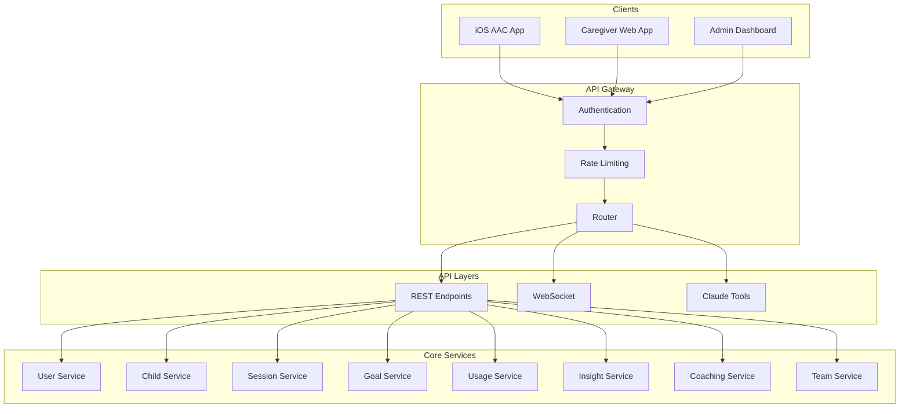

# Flynn AAC API Overview

**Version:** 1.0  
**Last Updated:** January 2025

---

## 1. API Architecture



---

## 2. Authentication

### 2.1 Authentication Flow

```
Authorization: Bearer <JWT_TOKEN>
```

All API requests require a valid JWT token from Clerk. The token contains:

```json
{
  "sub": "user_123",
  "email": "parent@example.com",
  "role": "caregiver",
  "exp": 1704067200
}
```

### 2.2 Permission Scopes

| Scope | Description |
|-------|-------------|
| `children:read` | View child profiles and data |
| `children:write` | Create/edit child profiles |
| `sessions:read` | View therapy sessions |
| `sessions:write` | Log therapy sessions |
| `goals:read` | View therapy goals |
| `goals:write` | Create/edit goals |
| `team:read` | View team members |
| `team:manage` | Invite/remove team members |
| `insights:read` | View AI insights |
| `admin` | Full administrative access |

---

## 3. Core Endpoints

### 3.1 Children

```typescript
// GET /api/v1/children
// List accessible children

// GET /api/v1/children/:id
// Get child details

// POST /api/v1/children
// Create new child profile

// PATCH /api/v1/children/:id
// Update child profile

// GET /api/v1/children/:id/dashboard
// Get dashboard data
interface DashboardResponse {
  child: Child;
  snapshot: {
    aacTapsToday: number;
    uniqueWordsToday: number;
    sessionsThisWeek: number;
    activeGoals: number;
  };
  recentActivity: Activity[];
  upcomingReminders: Reminder[];
}
```

### 3.2 Therapy Sessions

```typescript
// GET /api/v1/children/:id/sessions
interface GetSessionsRequest {
  type?: 'ABA' | 'OT' | 'SLP' | 'HOME_PRACTICE';
  from?: string; // ISO date
  to?: string;
  limit?: number;
  offset?: number;
}

// POST /api/v1/children/:id/sessions
interface CreateSessionRequest {
  type: 'ABA' | 'OT' | 'SLP' | 'HOME_PRACTICE';
  startTime: string;
  endTime: string;
  location: 'HOME' | 'CLINIC' | 'SCHOOL' | 'REMOTE';
  notes?: string;
  goals?: SessionGoalProgress[];
}

// GET /api/v1/sessions/:id
// Get session details

// PATCH /api/v1/sessions/:id
// Update session

// DELETE /api/v1/sessions/:id
// Delete session
```

### 3.3 Goals

```typescript
// GET /api/v1/children/:id/goals
interface GetGoalsRequest {
  status?: 'active' | 'completed' | 'paused' | 'all';
  domain?: string;
  discipline?: string;
}

// POST /api/v1/children/:id/goals
interface CreateGoalRequest {
  title: string;
  description?: string;
  domain: string;
  targetCriteria: string;
  discipline: 'ABA' | 'OT' | 'SLP' | 'MULTI';
  targetDate?: string;
}

// GET /api/v1/goals/:id
// PATCH /api/v1/goals/:id
// POST /api/v1/goals/:id/progress
// POST /api/v1/goals/:id/contributions
// GET /api/v1/goals/:id/network
```

### 3.4 AAC Usage

```typescript
// GET /api/v1/children/:id/usage
interface GetUsageRequest {
  from?: string;
  to?: string;
  granularity?: 'hour' | 'day' | 'week' | 'month';
}

interface UsageResponse {
  period: { from: string; to: string };
  totalTaps: number;
  uniqueSymbols: number;
  sessions: number;
  topSymbols: { symbolId: string; label: string; count: number }[];
  hourlyDistribution: number[];
  dailyTrend: { date: string; taps: number; symbols: number }[];
}

// GET /api/v1/children/:id/vocabulary
interface VocabularyResponse {
  totalWords: number;
  categories: { name: string; count: number }[];
  recentlyUsed: Symbol[];
  newThisWeek: Symbol[];
  abandoned: Symbol[];
}

// POST /api/v1/children/:id/usage/sync
// Batch upload from iOS app
interface SyncRequest {
  deviceId: string;
  events: UsageEvent[];
  lastSyncTimestamp: string;
}
```

---

## 4. Phase 2 Endpoints

### 4.1 Proactive Insights

```typescript
// GET /api/v1/children/:id/insights
interface GetInsightsRequest {
  types?: InsightType[];
  unreadOnly?: boolean;
  limit?: number;
}

// GET /api/v1/children/:id/insights/:insightId
// PATCH /api/v1/insights/:id/read
// POST /api/v1/children/:id/insights/generate
interface GenerateInsightRequest {
  type: 'daily_digest' | 'weekly_report' | 'vocabulary_analysis';
  dateRange?: { from: string; to: string };
}
```

### 4.2 Regression Detection

```typescript
// GET /api/v1/children/:id/regression-alerts
interface GetAlertsRequest {
  severity?: 'critical' | 'warning' | 'info'[];
  status?: 'active' | 'acknowledged' | 'resolved';
}

// PATCH /api/v1/regression-alerts/:id
interface UpdateAlertRequest {
  status: 'acknowledged' | 'resolved' | 'dismissed';
  notes?: string;
}

// POST /api/v1/regression-alerts/:id/feedback
interface AlertFeedbackRequest {
  feedback: 'true_positive' | 'false_positive' | 'unsure';
  notes?: string;
}

// POST /api/v1/children/:id/alert-suppressions
interface CreateSuppressionRequest {
  reason: 'illness' | 'travel' | 'vacation' | 'device_issue' | 'other';
  startDate: string;
  endDate?: string;
  notes?: string;
}

// DELETE /api/v1/alert-suppressions/:id
```

### 4.3 Cross-Therapy Coordination

```typescript
// GET /api/v1/children/:id/team
interface TeamResponse {
  members: TeamMember[];
  pendingInvitations: Invitation[];
}

// POST /api/v1/children/:id/team/invite
interface InviteRequest {
  email: string;
  relationship: 'primary_therapist' | 'team_therapist' | 'consultant';
  disciplines: string[];
  canViewOtherDisciplines?: boolean;
}

// DELETE /api/v1/children/:id/team/:memberId
// POST /api/v1/invitations/:token/accept

// GET /api/v1/children/:id/conflicts
// POST /api/v1/conflicts/:id/resolve
// POST /api/v1/resolutions/:id/agree

// GET /api/v1/children/:id/progress/unified
```

### 4.4 Parent Coaching

```typescript
// GET /api/v1/coaching/recommendations
interface CoachingRecommendationsResponse {
  recommendations: CoachingRecommendation[];
  dailyLimit: number;
  remainingToday: number;
}

// POST /api/v1/coaching/:id/complete
interface CompleteCoachingRequest {
  feedback?: 'helpful' | 'not_helpful' | 'already_knew';
  notes?: string;
}

// GET /api/v1/achievements
interface AchievementsResponse {
  xp: number;
  level: number;
  xpToNextLevel: number;
  streak: number;
  longestStreak: number;
  badges: Badge[];
}

// GET /api/v1/curriculum
// POST /api/v1/curriculum/:moduleId/lessons/:lessonId/complete

// GET /api/v1/celebrations
// POST /api/v1/celebrations/:id/share
```

---

## 5. Phase 3 Endpoints

### 5.1 Natural Language Queries

```typescript
// POST /api/v1/children/:id/query
interface NLQueryRequest {
  query: string;
  includeVisualizations?: boolean;
}

interface NLQueryResponse {
  answer: string;
  visualizations?: Visualization[];
  confidence: number;
  suggestedFollowUps?: string[];
  tokensUsed: { input: number; output: number };
}
```

### 5.2 AI Summaries

```typescript
// GET /api/v1/children/:id/summaries
// POST /api/v1/children/:id/summaries/generate
interface GenerateSummaryRequest {
  type: 'daily_recap' | 'weekly_digest' | 'session_summary' | 'insurance_documentation';
  dateRange?: { from: string; to: string };
}

// GET /api/v1/summaries/:id
// POST /api/v1/summaries/:id/approve
// POST /api/v1/summaries/:id/reject
```

### 5.3 Vocabulary Recommendations

```typescript
// GET /api/v1/children/:id/vocabulary-recommendations
interface VocabRecommendationsResponse {
  recommendations: VocabularyRecommendation[];
  lastGenerated: string;
}

// POST /api/v1/vocabulary-recommendations/:id/accept
// POST /api/v1/vocabulary-recommendations/:id/reject
// POST /api/v1/vocabulary-recommendations/:id/defer
```

### 5.4 Goal Suggestions

```typescript
// GET /api/v1/children/:id/goal-suggestions
// POST /api/v1/children/:id/goal-suggestions/generate

// POST /api/v1/goal-suggestions/:id/accept
interface AcceptGoalSuggestionRequest {
  modifications?: Partial<GoalSuggestion>;
}

// POST /api/v1/goal-suggestions/:id/reject
```

### 5.5 Progress Predictions

```typescript
// GET /api/v1/children/:id/predictions
// GET /api/v1/goals/:id/prediction
interface PredictionResponse {
  prediction: ProgressPrediction;
  trajectory: 'on_track' | 'ahead' | 'behind' | 'at_risk';
  recommendations: string[];
}
```

---

## 6. Claude Tool Registry

### 6.1 Read-Only Tools

| Tool | Description | Model |
|------|-------------|-------|
| `list_children` | List accessible children | Haiku |
| `get_child` | Get child profile | Haiku |
| `get_aac_usage` | Get AAC usage data | Haiku |
| `search_vocabulary` | Search vocabulary | Haiku |
| `list_goals` | List therapy goals | Haiku |
| `get_progress_summary` | Get progress summary | Sonnet |
| `get_insights` | Get generated insights | Haiku |
| `get_regression_alerts` | Get regression alerts | Haiku |
| `get_child_team` | Get therapy team | Haiku |
| `get_conflicts` | Get detected conflicts | Haiku |
| `get_unified_progress` | Get cross-discipline progress | Sonnet |
| `get_coaching_recommendations` | Get coaching tips | Sonnet |
| `get_curriculum_progress` | Get curriculum status | Haiku |

### 6.2 Write Tools

| Tool | Description | Model |
|------|-------------|-------|
| `create_session` | Log therapy session | Haiku |
| `update_session` | Update session | Haiku |
| `create_goal` | Create therapy goal | Sonnet |
| `update_goal` | Update goal | Haiku |
| `add_note` | Add clinical note | Haiku |
| `create_custom_symbol` | Create custom vocabulary | Sonnet |
| `invite_team_member` | Invite to team | Sonnet |
| `propose_goal_contribution` | Propose collaboration | Sonnet |
| `link_goals` | Create goal relationship | Haiku |
| `propose_conflict_resolution` | Propose resolution | Opus |
| `complete_coaching` | Mark coaching done | Haiku |
| `complete_lesson` | Complete curriculum lesson | Haiku |
| `trigger_celebration` | Trigger celebration | Haiku |
| `update_notification_preferences` | Update prefs | Haiku |

### 6.3 Analysis Tools

| Tool | Description | Model |
|------|-------------|-------|
| `generate_insight` | Generate specific insight | Sonnet |
| `generate_summary` | Generate report | Sonnet/Opus |
| `get_vocabulary_recommendations` | Get vocab suggestions | Sonnet |
| `get_goal_suggestions` | Get goal suggestions | Opus |
| `get_progress_prediction` | Get predictions | Sonnet |

---

## 7. WebSocket Events

### 7.1 Real-Time Updates

```typescript
// Connection
ws://api.flynn.app/ws?token=<JWT>

// Subscribe to child updates
{ "type": "subscribe", "channel": "child:123" }

// Events
interface WSEvent {
  type: string;
  channel: string;
  data: unknown;
  timestamp: string;
}

// Event types
type EventType =
  | 'usage.new'          // New AAC usage logged
  | 'session.created'    // New therapy session
  | 'goal.progress'      // Goal progress update
  | 'insight.new'        // New insight generated
  | 'alert.new'          // New regression alert
  | 'team.activity'      // Team member activity
  | 'celebration.trigger'; // Celebration event
```

### 7.2 Presence

```typescript
// Join child's presence channel
{ "type": "presence.join", "channel": "child:123" }

// Presence update
interface PresenceUpdate {
  type: 'presence.update';
  channel: string;
  users: { userId: string; name: string; discipline?: string; lastSeen: string }[];
}
```

---

## 8. Error Handling

### 8.1 Error Response Format

```typescript
interface ErrorResponse {
  error: {
    code: string;
    message: string;
    details?: Record<string, unknown>;
    requestId: string;
  };
}
```

### 8.2 Error Codes

| Code | HTTP Status | Description |
|------|-------------|-------------|
| `UNAUTHORIZED` | 401 | Invalid or missing token |
| `FORBIDDEN` | 403 | Insufficient permissions |
| `NOT_FOUND` | 404 | Resource not found |
| `VALIDATION_ERROR` | 400 | Invalid request data |
| `CONFLICT` | 409 | Resource conflict |
| `RATE_LIMITED` | 429 | Too many requests |
| `INTERNAL_ERROR` | 500 | Server error |
| `SERVICE_UNAVAILABLE` | 503 | Temporary unavailability |

---

## 9. Rate Limits

| Endpoint Category | Limit | Window |
|-------------------|-------|--------|
| Read operations | 1000 | 1 hour |
| Write operations | 100 | 1 hour |
| Claude queries | 50 | 1 hour |
| Summary generation | 10 | 1 day |
| File uploads | 20 | 1 hour |
| WebSocket messages | 100 | 1 minute |

Rate limit headers:
```
X-RateLimit-Limit: 1000
X-RateLimit-Remaining: 950
X-RateLimit-Reset: 1704070800
```

---

## 10. Versioning

API version is specified in the URL path:

```
/api/v1/...
/api/v2/...
```

Breaking changes require new version. Deprecated endpoints include:
```
Deprecation: true
Sunset: Sat, 1 Feb 2025 00:00:00 GMT
```

---

## 11. SDK Examples

### 11.1 JavaScript/TypeScript

```typescript
import { FlynnClient } from '@flynn/sdk';

const flynn = new FlynnClient({
  token: 'your-jwt-token',
  baseUrl: 'https://api.flynn.app'
});

// Get child dashboard
const dashboard = await flynn.children.getDashboard('child-id');

// Log session
const session = await flynn.sessions.create({
  childId: 'child-id',
  type: 'SLP',
  startTime: new Date().toISOString(),
  endTime: new Date(Date.now() + 3600000).toISOString(),
  location: 'HOME',
  notes: 'Practiced requesting'
});

// Get AAC usage
const usage = await flynn.usage.get({
  childId: 'child-id',
  from: '2025-01-01',
  granularity: 'day'
});

// Natural language query
const answer = await flynn.query({
  childId: 'child-id',
  query: 'What words did Flynn use most this week?'
});
```

### 11.2 Swift (iOS)

```swift
import FlynnSDK

let flynn = FlynnClient(token: "your-jwt-token")

// Sync usage events
try await flynn.usage.sync(
    deviceId: UIDevice.current.identifierForVendor!.uuidString,
    events: pendingEvents
)

// Get vocabulary
let vocabulary = try await flynn.vocabulary.get(childId: childId)
```

---

## 12. Webhooks

### 12.1 Configuration

```typescript
POST /api/v1/webhooks
{
  "url": "https://your-server.com/webhook",
  "events": ["session.created", "goal.achieved", "alert.new"],
  "secret": "your-webhook-secret"
}
```

### 12.2 Payload

```typescript
interface WebhookPayload {
  id: string;
  type: string;
  createdAt: string;
  data: unknown;
}

// Signature verification
const signature = crypto
  .createHmac('sha256', webhookSecret)
  .update(JSON.stringify(payload))
  .digest('hex');

// Header: X-Flynn-Signature: sha256=<signature>
```

---

*This API overview covers all Phase 1-3 endpoints. For detailed schema definitions, see individual spec documents.*
