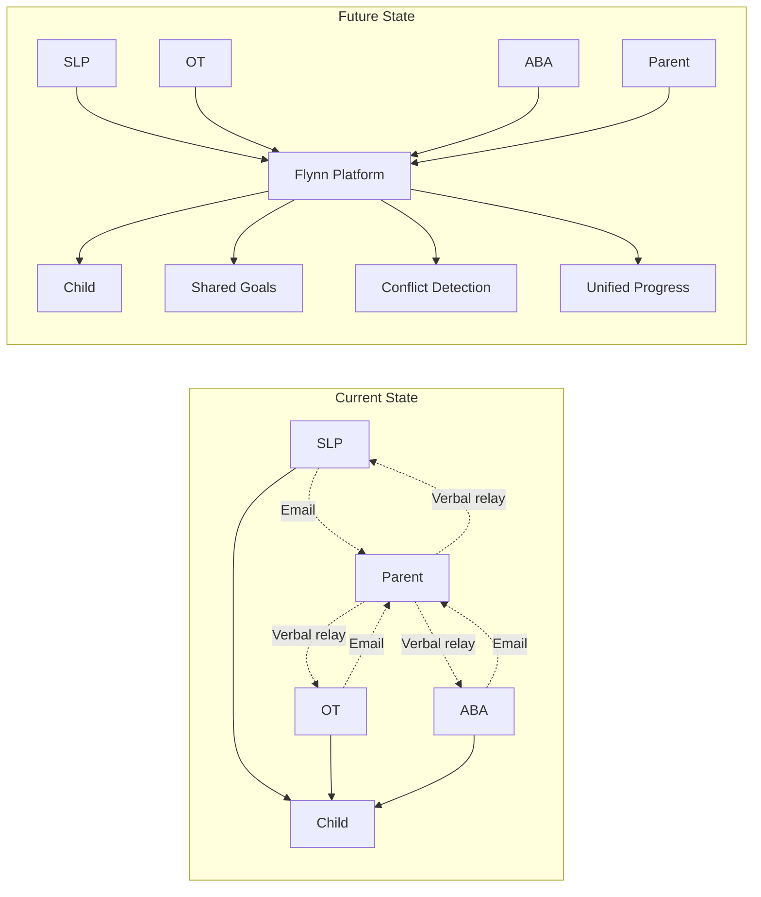
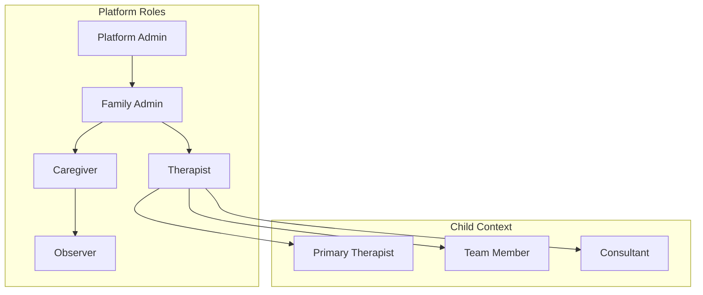

# Cross-Therapy Coordination — Technical Specification

**Version:** 1.0  
**Status:** Phase 2 Design  
**Last Updated:** January 2025

---

## 1. Executive Summary

Children receiving AAC support typically work with multiple therapists across different disciplines (ABA, OT, SLP). Currently, coordination between these providers is ad-hoc, leading to duplicated effort, conflicting strategies, and missed opportunities for synergy. This system enables structured collaboration while respecting professional boundaries and data privacy.

### The Coordination Problem



### Key Benefits

| Stakeholder | Benefit |
|-------------|---------|
| **Child** | Consistent approach across all therapy settings |
| **Parent** | Single source of truth, reduced coordination burden |
| **Therapists** | Visibility into related goals, avoid stepping on toes |
| **Team** | Synergy identification, conflict prevention |

---

## 2. Multi-User Permission Model

### 2.1 Role Hierarchy



### 2.2 Permission Schema

```typescript
// User roles at platform level
type PlatformRole = 'admin' | 'family_admin' | 'caregiver' | 'therapist' | 'observer';

// Relationship to a specific child
type ChildRelationship = 
  | 'parent'           // Full access, can grant/revoke
  | 'primary_therapist' // Full therapy access, lead coordinator
  | 'team_therapist'    // Therapy access, collaborative
  | 'consultant'        // Read-only + notes
  | 'observer';         // Read-only limited

// Discipline-specific access
type TherapyDiscipline = 'ABA' | 'OT' | 'SLP' | 'PT' | 'OTHER';

interface UserChildAccess {
  userId: string;
  childId: string;
  relationship: ChildRelationship;
  disciplines: TherapyDiscipline[]; // Empty = all (for parents)
  grantedBy: string;
  grantedAt: Date;
  expiresAt?: Date;
  permissions: Permission[];
}

interface Permission {
  resource: ResourceType;
  actions: Action[];
  scope?: PermissionScope;
}

type ResourceType = 
  | 'sessions'
  | 'goals'
  | 'progress'
  | 'aac_usage'
  | 'insights'
  | 'notes'
  | 'files'
  | 'team';

type Action = 'read' | 'write' | 'delete' | 'share';

interface PermissionScope {
  // Limit to specific discipline
  discipline?: TherapyDiscipline;
  // Limit to own entries only
  ownEntriesOnly?: boolean;
  // Time-limited access
  dateRange?: { from: Date; to: Date };
}
```

### 2.3 Database Schema

```typescript
export const teamMembers = pgTable("team_members", {
  id: uuid("id").primaryKey().defaultRandom(),
  childId: uuid("child_id")
    .references(() => children.id, { onDelete: "cascade" })
    .notNull(),
  userId: uuid("user_id")
    .references(() => users.id, { onDelete: "cascade" })
    .notNull(),
  
  // Role configuration
  relationship: varchar("relationship", { length: 30 }).notNull(),
  disciplines: jsonb("disciplines").notNull(), // TherapyDiscipline[]
  isPrimaryForDiscipline: boolean("is_primary_for_discipline").default(false),
  
  // Access control
  permissions: jsonb("permissions").notNull(), // Permission[]
  canInviteOthers: boolean("can_invite_others").default(false),
  canModifyGoals: boolean("can_modify_goals").default(true),
  canViewOtherDisciplines: boolean("can_view_other_disciplines").default(true),
  
  // Notification preferences
  notifyOnSessionLog: boolean("notify_on_session_log").default(true),
  notifyOnGoalProgress: boolean("notify_on_goal_progress").default(true),
  notifyOnConflict: boolean("notify_on_conflict").default(true),
  
  // Audit
  grantedBy: uuid("granted_by")
    .references(() => users.id)
    .notNull(),
  grantedAt: timestamp("granted_at").defaultNow().notNull(),
  expiresAt: timestamp("expires_at"),
  revokedAt: timestamp("revoked_at"),
  revokedBy: uuid("revoked_by").references(() => users.id),
  
  createdAt: timestamp("created_at").defaultNow().notNull(),
  updatedAt: timestamp("updated_at").defaultNow().notNull(),
}, (table) => ({
  childUserUnique: unique().on(table.childId, table.userId),
  childIdx: index("team_members_child_idx").on(table.childId),
}));

export const accessInvitations = pgTable("access_invitations", {
  id: uuid("id").primaryKey().defaultRandom(),
  childId: uuid("child_id")
    .references(() => children.id, { onDelete: "cascade" })
    .notNull(),
  
  // Invitation details
  email: varchar("email", { length: 255 }).notNull(),
  relationship: varchar("relationship", { length: 30 }).notNull(),
  disciplines: jsonb("disciplines").notNull(),
  permissions: jsonb("permissions").notNull(),
  
  // Token for accepting
  token: varchar("token", { length: 64 }).notNull().unique(),
  
  // State
  status: varchar("status", { length: 20 }).notNull().default("pending"), // pending, accepted, expired, revoked
  
  // Audit
  invitedBy: uuid("invited_by")
    .references(() => users.id)
    .notNull(),
  expiresAt: timestamp("expires_at").notNull(),
  acceptedAt: timestamp("accepted_at"),
  acceptedByUserId: uuid("accepted_by_user_id").references(() => users.id),
  
  createdAt: timestamp("created_at").defaultNow().notNull(),
});

export const accessAuditLog = pgTable("access_audit_log", {
  id: uuid("id").primaryKey().defaultRandom(),
  childId: uuid("child_id")
    .references(() => children.id, { onDelete: "cascade" })
    .notNull(),
  userId: uuid("user_id")
    .references(() => users.id)
    .notNull(),
  action: varchar("action", { length: 50 }).notNull(), // grant, revoke, modify, access
  resourceType: varchar("resource_type", { length: 50 }),
  resourceId: varchar("resource_id", { length: 50 }),
  details: jsonb("details"),
  ipAddress: varchar("ip_address", { length: 45 }),
  userAgent: text("user_agent"),
  createdAt: timestamp("created_at").defaultNow().notNull(),
}, (table) => ({
  childCreatedAtIdx: index("access_audit_child_created_at_idx").on(table.childId, table.createdAt),
}));
```

### 2.4 Permission Checker

```typescript
class PermissionChecker {
  async canAccess(
    userId: string,
    childId: string,
    resource: ResourceType,
    action: Action,
    context?: { discipline?: TherapyDiscipline; resourceOwnerId?: string }
  ): Promise<{ allowed: boolean; reason?: string }> {
    // Get user's access record
    const access = await this.getAccess(userId, childId);
    
    if (!access) {
      return { allowed: false, reason: 'No access to this child' };
    }
    
    if (access.revokedAt) {
      return { allowed: false, reason: 'Access has been revoked' };
    }
    
    if (access.expiresAt && access.expiresAt < new Date()) {
      return { allowed: false, reason: 'Access has expired' };
    }
    
    // Check permissions
    const permission = access.permissions.find(p => p.resource === resource);
    
    if (!permission) {
      return { allowed: false, reason: `No permission for ${resource}` };
    }
    
    if (!permission.actions.includes(action)) {
      return { allowed: false, reason: `Cannot ${action} ${resource}` };
    }
    
    // Check scope restrictions
    if (permission.scope) {
      if (permission.scope.discipline && context?.discipline) {
        if (permission.scope.discipline !== context.discipline) {
          return { allowed: false, reason: `Only allowed for ${permission.scope.discipline} discipline` };
        }
      }
      
      if (permission.scope.ownEntriesOnly && context?.resourceOwnerId) {
        if (context.resourceOwnerId !== userId) {
          return { allowed: false, reason: 'Can only access own entries' };
        }
      }
    }
    
    // Cross-discipline visibility check
    if (context?.discipline && !access.canViewOtherDisciplines) {
      if (!access.disciplines.includes(context.discipline)) {
        return { allowed: false, reason: 'Cannot view other disciplines' };
      }
    }
    
    return { allowed: true };
  }
  
  async getAccessibleChildren(userId: string): Promise<ChildAccessSummary[]> {
    const memberships = await this.db.query.teamMembers.findMany({
      where: and(
        eq(teamMembers.userId, userId),
        isNull(teamMembers.revokedAt),
        or(
          isNull(teamMembers.expiresAt),
          gte(teamMembers.expiresAt, new Date())
        )
      ),
      with: {
        child: true
      }
    });
    
    return memberships.map(m => ({
      childId: m.childId,
      childName: m.child.name,
      relationship: m.relationship,
      disciplines: m.disciplines,
      isPrimary: m.isPrimaryForDiscipline
    }));
  }
}
```

---

## 3. Goal Linking Across Disciplines

### 3.1 Cross-Disciplinary Goal Model

```typescript
interface CrossDisciplinaryGoal {
  id: string;
  childId: string;
  
  // Goal content
  title: string;
  description: string;
  targetCriteria: string;
  
  // Ownership
  primaryDiscipline: TherapyDiscipline;
  primaryOwnerId: string;
  contributingDisciplines: DisciplineContribution[];
  
  // Relationships
  parentGoalId?: string;       // Hierarchical
  relatedGoalIds: string[];    // Horizontal links
  conflictsWith?: string[];    // Detected conflicts
  
  // Status
  status: GoalStatus;
  startDate: Date;
  targetDate: Date;
  achievedDate?: Date;
  
  // Progress aggregation
  overallProgress: number;     // 0-100
  progressByDiscipline: Record<TherapyDiscipline, number>;
  
  createdAt: Date;
  updatedAt: Date;
}

interface DisciplineContribution {
  discipline: TherapyDiscipline;
  contributorId: string;
  role: 'primary' | 'supporting' | 'monitoring';
  specificObjectives: string[];
  approvedAt?: Date;
}

type GoalStatus = 
  | 'draft'
  | 'proposed'       // Awaiting team approval
  | 'active'
  | 'paused'
  | 'achieved'
  | 'discontinued';
```

### 3.2 Database Schema

```typescript
export const therapyGoals = pgTable("therapy_goals", {
  id: uuid("id").primaryKey().defaultRandom(),
  childId: uuid("child_id")
    .references(() => children.id, { onDelete: "cascade" })
    .notNull(),
  
  // Content
  title: varchar("title", { length: 255 }).notNull(),
  description: text("description"),
  targetCriteria: text("target_criteria").notNull(),
  measurementMethod: text("measurement_method"),
  
  // Categorization
  domain: varchar("domain", { length: 50 }).notNull(), // communication, motor, behavior, etc.
  subdomain: varchar("subdomain", { length: 50 }),
  
  // Ownership
  primaryDiscipline: varchar("primary_discipline", { length: 20 }).notNull(),
  createdBy: uuid("created_by")
    .references(() => users.id)
    .notNull(),
  
  // Hierarchy
  parentGoalId: uuid("parent_goal_id").references(() => therapyGoals.id),
  
  // Timeline
  status: varchar("status", { length: 20 }).notNull().default("draft"),
  startDate: date("start_date"),
  targetDate: date("target_date"),
  achievedDate: date("achieved_date"),
  
  // Progress
  overallProgress: integer("overall_progress").default(0),
  progressByDiscipline: jsonb("progress_by_discipline"), // {ABA: 50, SLP: 75}
  
  createdAt: timestamp("created_at").defaultNow().notNull(),
  updatedAt: timestamp("updated_at").defaultNow().notNull(),
}, (table) => ({
  childStatusIdx: index("therapy_goals_child_status_idx").on(table.childId, table.status),
  parentIdx: index("therapy_goals_parent_idx").on(table.parentGoalId),
}));

export const goalContributions = pgTable("goal_contributions", {
  id: uuid("id").primaryKey().defaultRandom(),
  goalId: uuid("goal_id")
    .references(() => therapyGoals.id, { onDelete: "cascade" })
    .notNull(),
  userId: uuid("user_id")
    .references(() => users.id)
    .notNull(),
  discipline: varchar("discipline", { length: 20 }).notNull(),
  role: varchar("role", { length: 20 }).notNull(), // primary, supporting, monitoring
  specificObjectives: jsonb("specific_objectives"), // string[]
  
  // Approval workflow
  status: varchar("status", { length: 20 }).notNull().default("pending"), // pending, approved, declined
  approvedBy: uuid("approved_by").references(() => users.id),
  approvedAt: timestamp("approved_at"),
  declinedReason: text("declined_reason"),
  
  createdAt: timestamp("created_at").defaultNow().notNull(),
}, (table) => ({
  goalUserUnique: unique().on(table.goalId, table.userId),
}));

export const goalLinks = pgTable("goal_links", {
  id: uuid("id").primaryKey().defaultRandom(),
  sourceGoalId: uuid("source_goal_id")
    .references(() => therapyGoals.id, { onDelete: "cascade" })
    .notNull(),
  targetGoalId: uuid("target_goal_id")
    .references(() => therapyGoals.id, { onDelete: "cascade" })
    .notNull(),
  linkType: varchar("link_type", { length: 30 }).notNull(), // supports, conflicts, prerequisite, related
  description: text("description"),
  createdBy: uuid("created_by")
    .references(() => users.id)
    .notNull(),
  createdAt: timestamp("created_at").defaultNow().notNull(),
}, (table) => ({
  sourceTargetUnique: unique().on(table.sourceGoalId, table.targetGoalId),
}));
```

### 3.3 Goal Linking Service

```typescript
class GoalLinkingService {
  async proposeGoalContribution(
    goalId: string,
    userId: string,
    discipline: TherapyDiscipline,
    objectives: string[]
  ): Promise<GoalContribution> {
    // Check user has access
    const goal = await this.getGoal(goalId);
    await this.permissionChecker.requireAccess(userId, goal.childId, 'goals', 'write');
    
    // Check for existing contribution
    const existing = await this.getContribution(goalId, userId);
    if (existing) {
      throw new ConflictError('Already contributing to this goal');
    }
    
    // Create contribution proposal
    const contribution = await this.db.insert(goalContributions).values({
      goalId,
      userId,
      discipline,
      role: 'supporting',
      specificObjectives: objectives,
      status: 'pending'
    }).returning();
    
    // Notify goal owner
    await this.notifyGoalOwner(goal, contribution[0], 'contribution_proposed');
    
    return contribution[0];
  }
  
  async approveContribution(
    contributionId: string,
    approverId: string
  ): Promise<void> {
    const contribution = await this.getContribution(contributionId);
    const goal = await this.getGoal(contribution.goalId);
    
    // Only goal creator or primary discipline owner can approve
    if (goal.createdBy !== approverId) {
      const primaryContrib = await this.getPrimaryContribution(goal.id);
      if (!primaryContrib || primaryContrib.userId !== approverId) {
        throw new ForbiddenError('Only goal owner can approve contributions');
      }
    }
    
    await this.db.update(goalContributions)
      .set({
        status: 'approved',
        approvedBy: approverId,
        approvedAt: new Date()
      })
      .where(eq(goalContributions.id, contributionId));
    
    // Notify contributor
    await this.notifyContributor(contribution, 'contribution_approved');
  }
  
  async linkGoals(
    sourceGoalId: string,
    targetGoalId: string,
    linkType: GoalLinkType,
    userId: string,
    description?: string
  ): Promise<GoalLink> {
    // Validate both goals are for same child
    const [source, target] = await Promise.all([
      this.getGoal(sourceGoalId),
      this.getGoal(targetGoalId)
    ]);
    
    if (source.childId !== target.childId) {
      throw new ValidationError('Cannot link goals for different children');
    }
    
    // Check for circular dependencies if prerequisite
    if (linkType === 'prerequisite') {
      if (await this.wouldCreateCycle(sourceGoalId, targetGoalId)) {
        throw new ValidationError('This link would create a circular dependency');
      }
    }
    
    // Create link
    const link = await this.db.insert(goalLinks).values({
      sourceGoalId,
      targetGoalId,
      linkType,
      description,
      createdBy: userId
    }).returning();
    
    // If conflict link, notify both goal owners
    if (linkType === 'conflicts') {
      await this.notifyConflictDetected(source, target, link[0]);
    }
    
    return link[0];
  }
  
  async getGoalNetwork(goalId: string): Promise<GoalNetwork> {
    const goal = await this.getGoal(goalId);
    
    // Get all linked goals (up to 2 degrees)
    const links = await this.db.query.goalLinks.findMany({
      where: or(
        eq(goalLinks.sourceGoalId, goalId),
        eq(goalLinks.targetGoalId, goalId)
      )
    });
    
    const relatedGoalIds = new Set<string>();
    links.forEach(link => {
      relatedGoalIds.add(link.sourceGoalId);
      relatedGoalIds.add(link.targetGoalId);
    });
    relatedGoalIds.delete(goalId);
    
    const relatedGoals = await this.db.query.therapyGoals.findMany({
      where: inArray(therapyGoals.id, [...relatedGoalIds])
    });
    
    // Get contributions for all goals
    const allGoalIds = [goalId, ...relatedGoalIds];
    const contributions = await this.db.query.goalContributions.findMany({
      where: and(
        inArray(goalContributions.goalId, allGoalIds),
        eq(goalContributions.status, 'approved')
      ),
      with: { user: true }
    });
    
    return {
      centerGoal: goal,
      relatedGoals,
      links,
      contributions: groupBy(contributions, 'goalId')
    };
  }
}
```

---

## 4. Conflict Detection Algorithms

### 4.1 Conflict Types

```typescript
type ConflictType = 
  | 'scheduling_conflict'      // Same time slot competing goals
  | 'strategy_conflict'        // Contradictory approaches
  | 'resource_conflict'        // Limited child attention/energy
  | 'prerequisite_conflict'    // Goal A requires B, but B is paused/discontinued
  | 'priority_conflict'        // Multiple high-priority goals competing
  | 'approach_inconsistency';  // Similar goals with different methods

interface DetectedConflict {
  id: string;
  type: ConflictType;
  severity: 'low' | 'medium' | 'high';
  involvedGoals: string[];
  involvedUsers: string[];
  description: string;
  suggestedResolution?: string;
  detectedAt: Date;
  status: 'open' | 'acknowledged' | 'resolved' | 'dismissed';
}
```

### 4.2 Conflict Detection Engine

```typescript
class ConflictDetectionEngine {
  private readonly detectors: ConflictDetector[] = [
    new StrategyConflictDetector(),
    new PriorityConflictDetector(),
    new PrerequisiteConflictDetector(),
    new ApproachInconsistencyDetector()
  ];
  
  async detectConflicts(childId: string): Promise<DetectedConflict[]> {
    const activeGoals = await this.getActiveGoals(childId);
    const contributions = await this.getContributions(childId);
    
    const conflicts: DetectedConflict[] = [];
    
    for (const detector of this.detectors) {
      const detected = await detector.detect(activeGoals, contributions);
      conflicts.push(...detected);
    }
    
    // Deduplicate
    return this.deduplicateConflicts(conflicts);
  }
  
  async runDailyConflictScan(): Promise<void> {
    const activeChildren = await this.getChildrenWithActiveGoals();
    
    for (const childId of activeChildren) {
      const conflicts = await this.detectConflicts(childId);
      const newConflicts = await this.filterNewConflicts(conflicts);
      
      if (newConflicts.length > 0) {
        await this.persistConflicts(newConflicts);
        await this.notifyRelevantUsers(newConflicts);
      }
    }
  }
}

class StrategyConflictDetector implements ConflictDetector {
  // Keywords that might indicate conflicting strategies
  private readonly CONFLICT_PATTERNS: [string, string][] = [
    ['ignore', 'redirect'],
    ['prompt', 'wait for initiation'],
    ['hand-over-hand', 'independent'],
    ['time-out', 'stay close'],
    ['verbal prompt', 'visual only'],
    ['physical guidance', 'hands-off']
  ];
  
  async detect(
    goals: TherapyGoal[],
    contributions: GoalContribution[]
  ): Promise<DetectedConflict[]> {
    const conflicts: DetectedConflict[] = [];
    
    // Compare each pair of goals
    for (let i = 0; i < goals.length; i++) {
      for (let j = i + 1; j < goals.length; j++) {
        const goalA = goals[i];
        const goalB = goals[j];
        
        // Check if goals are in same domain
        if (goalA.domain !== goalB.domain) continue;
        
        // Check for conflicting strategies in descriptions
        const conflict = this.checkStrategyConflict(goalA, goalB);
        
        if (conflict) {
          conflicts.push({
            id: generateId(),
            type: 'strategy_conflict',
            severity: 'high',
            involvedGoals: [goalA.id, goalB.id],
            involvedUsers: [goalA.createdBy, goalB.createdBy],
            description: conflict.description,
            suggestedResolution: conflict.suggestion,
            detectedAt: new Date(),
            status: 'open'
          });
        }
      }
    }
    
    return conflicts;
  }
  
  private checkStrategyConflict(
    goalA: TherapyGoal,
    goalB: TherapyGoal
  ): { description: string; suggestion: string } | null {
    const textA = `${goalA.description} ${goalA.measurementMethod}`.toLowerCase();
    const textB = `${goalB.description} ${goalB.measurementMethod}`.toLowerCase();
    
    for (const [pattern1, pattern2] of this.CONFLICT_PATTERNS) {
      if (
        (textA.includes(pattern1) && textB.includes(pattern2)) ||
        (textA.includes(pattern2) && textB.includes(pattern1))
      ) {
        return {
          description: `Goal "${goalA.title}" uses "${pattern1}" approach while ` +
                       `"${goalB.title}" uses "${pattern2}" approach. ` +
                       `These may be contradictory.`,
          suggestion: `Schedule a team meeting to align on approach for ${goalA.domain} goals.`
        };
      }
    }
    
    return null;
  }
}

class ApproachInconsistencyDetector implements ConflictDetector {
  async detect(
    goals: TherapyGoal[],
    contributions: GoalContribution[]
  ): Promise<DetectedConflict[]> {
    const conflicts: DetectedConflict[] = [];
    
    // Group goals by domain
    const goalsByDomain = groupBy(goals, 'domain');
    
    for (const [domain, domainGoals] of Object.entries(goalsByDomain)) {
      if (domainGoals.length < 2) continue;
      
      // Check for similar goals with different disciplines
      const similarity = await this.calculateGoalSimilarity(domainGoals);
      
      for (const { goalA, goalB, similarityScore } of similarity) {
        if (similarityScore > 0.7 && goalA.primaryDiscipline !== goalB.primaryDiscipline) {
          conflicts.push({
            id: generateId(),
            type: 'approach_inconsistency',
            severity: 'medium',
            involvedGoals: [goalA.id, goalB.id],
            involvedUsers: [goalA.createdBy, goalB.createdBy],
            description: `Similar goals "${goalA.title}" (${goalA.primaryDiscipline}) and ` +
                        `"${goalB.title}" (${goalB.primaryDiscipline}) may benefit from coordination.`,
            suggestedResolution: 'Consider linking these goals or creating a shared cross-disciplinary goal.',
            detectedAt: new Date(),
            status: 'open'
          });
        }
      }
    }
    
    return conflicts;
  }
  
  private async calculateGoalSimilarity(
    goals: TherapyGoal[]
  ): Promise<{ goalA: TherapyGoal; goalB: TherapyGoal; similarityScore: number }[]> {
    const results: { goalA: TherapyGoal; goalB: TherapyGoal; similarityScore: number }[] = [];
    
    for (let i = 0; i < goals.length; i++) {
      for (let j = i + 1; j < goals.length; j++) {
        const similarity = this.textSimilarity(
          goals[i].title + ' ' + goals[i].description,
          goals[j].title + ' ' + goals[j].description
        );
        
        results.push({
          goalA: goals[i],
          goalB: goals[j],
          similarityScore: similarity
        });
      }
    }
    
    return results;
  }
  
  private textSimilarity(text1: string, text2: string): number {
    // Simple Jaccard similarity
    const words1 = new Set(text1.toLowerCase().split(/\s+/));
    const words2 = new Set(text2.toLowerCase().split(/\s+/));
    
    const intersection = new Set([...words1].filter(w => words2.has(w)));
    const union = new Set([...words1, ...words2]);
    
    return intersection.size / union.size;
  }
}
```

### 4.3 Conflict Resolution Workflow

```typescript
export const conflictResolutions = pgTable("conflict_resolutions", {
  id: uuid("id").primaryKey().defaultRandom(),
  conflictId: uuid("conflict_id")
    .references(() => detectedConflicts.id, { onDelete: "cascade" })
    .notNull(),
  
  // Resolution details
  resolutionType: varchar("resolution_type", { length: 30 }).notNull(), // merged, dismissed, deferred, modified
  description: text("description").notNull(),
  
  // What changed
  goalsModified: jsonb("goals_modified"), // [{goalId, changes}]
  linksCreated: jsonb("links_created"),   // [{sourceId, targetId, type}]
  
  // Agreement
  agreedBy: jsonb("agreed_by").notNull(), // userId[]
  pendingAgreement: jsonb("pending_agreement"), // userId[]
  
  resolvedBy: uuid("resolved_by")
    .references(() => users.id)
    .notNull(),
  resolvedAt: timestamp("resolved_at").defaultNow().notNull(),
});

class ConflictResolutionService {
  async proposeResolution(
    conflictId: string,
    proposerId: string,
    resolution: ResolutionProposal
  ): Promise<ConflictResolution> {
    const conflict = await this.getConflict(conflictId);
    
    // Create resolution record
    const resolutionRecord = await this.db.insert(conflictResolutions).values({
      conflictId,
      resolutionType: resolution.type,
      description: resolution.description,
      goalsModified: resolution.goalChanges,
      linksCreated: resolution.newLinks,
      agreedBy: [proposerId],
      pendingAgreement: conflict.involvedUsers.filter(u => u !== proposerId),
      resolvedBy: proposerId
    }).returning();
    
    // Notify other involved parties
    for (const userId of conflict.involvedUsers) {
      if (userId !== proposerId) {
        await this.notifyResolutionProposed(userId, conflict, resolutionRecord[0]);
      }
    }
    
    return resolutionRecord[0];
  }
  
  async agreeToResolution(
    resolutionId: string,
    userId: string
  ): Promise<void> {
    const resolution = await this.getResolution(resolutionId);
    
    if (!resolution.pendingAgreement.includes(userId)) {
      throw new ForbiddenError('Not awaiting your agreement');
    }
    
    const newAgreed = [...resolution.agreedBy, userId];
    const newPending = resolution.pendingAgreement.filter(u => u !== userId);
    
    await this.db.update(conflictResolutions)
      .set({
        agreedBy: newAgreed,
        pendingAgreement: newPending
      })
      .where(eq(conflictResolutions.id, resolutionId));
    
    // If all agreed, apply resolution
    if (newPending.length === 0) {
      await this.applyResolution(resolution);
    }
  }
  
  private async applyResolution(resolution: ConflictResolution): Promise<void> {
    // Apply goal modifications
    for (const mod of resolution.goalsModified ?? []) {
      await this.db.update(therapyGoals)
        .set(mod.changes)
        .where(eq(therapyGoals.id, mod.goalId));
    }
    
    // Create new links
    for (const link of resolution.linksCreated ?? []) {
      await this.db.insert(goalLinks).values({
        sourceGoalId: link.sourceId,
        targetGoalId: link.targetId,
        linkType: link.type,
        createdBy: resolution.resolvedBy
      });
    }
    
    // Mark conflict as resolved
    await this.db.update(detectedConflicts)
      .set({ status: 'resolved' })
      .where(eq(detectedConflicts.id, resolution.conflictId));
  }
}
```

---

## 5. Shared Progress Visibility

### 5.1 Unified Progress Dashboard

```typescript
interface UnifiedProgressView {
  childId: string;
  generatedAt: Date;
  
  // Overall summary
  overallProgress: ProgressSummary;
  
  // By discipline
  disciplineBreakdown: DisciplineProgress[];
  
  // Recent activity
  recentSessions: SessionSummary[];
  recentMilestones: Milestone[];
  
  // Cross-discipline metrics
  crossDisciplineGoals: CrossGoalProgress[];
  
  // Team engagement
  teamContributions: TeamContribution[];
}

interface DisciplineProgress {
  discipline: TherapyDiscipline;
  primaryTherapist: { id: string; name: string };
  activeGoals: number;
  completedGoals: number;
  averageProgress: number;
  recentTrend: 'improving' | 'stable' | 'declining';
  sessionsThisWeek: number;
  lastSessionDate?: Date;
}

interface CrossGoalProgress {
  goal: TherapyGoal;
  contributions: {
    discipline: TherapyDiscipline;
    therapist: string;
    progress: number;
    lastUpdate: Date;
  }[];
  combinedProgress: number;
  isOnTrack: boolean;
}
```

### 5.2 Progress Aggregation Service

```typescript
class UnifiedProgressService {
  async generateProgressView(childId: string): Promise<UnifiedProgressView> {
    const [
      goals,
      contributions,
      sessions,
      milestones,
      teamMembers
    ] = await Promise.all([
      this.getActiveGoals(childId),
      this.getGoalContributions(childId),
      this.getRecentSessions(childId, 30),
      this.getRecentMilestones(childId, 30),
      this.getTeamMembers(childId)
    ]);
    
    // Calculate overall progress
    const overallProgress = this.calculateOverallProgress(goals);
    
    // Group by discipline
    const disciplineBreakdown = this.groupByDiscipline(goals, sessions, teamMembers);
    
    // Identify cross-discipline goals
    const crossGoals = goals.filter(g => 
      contributions.filter(c => c.goalId === g.id && c.status === 'approved').length > 1
    );
    
    const crossDisciplineGoals = crossGoals.map(goal => 
      this.buildCrossGoalProgress(goal, contributions)
    );
    
    // Team contributions
    const teamContributions = this.summarizeTeamContributions(
      sessions, 
      contributions, 
      teamMembers
    );
    
    return {
      childId,
      generatedAt: new Date(),
      overallProgress,
      disciplineBreakdown,
      recentSessions: sessions.slice(0, 10).map(this.summarizeSession),
      recentMilestones: milestones,
      crossDisciplineGoals,
      teamContributions
    };
  }
  
  private buildCrossGoalProgress(
    goal: TherapyGoal,
    contributions: GoalContribution[]
  ): CrossGoalProgress {
    const goalContributions = contributions.filter(c => 
      c.goalId === goal.id && c.status === 'approved'
    );
    
    return {
      goal,
      contributions: goalContributions.map(c => ({
        discipline: c.discipline,
        therapist: c.user.name,
        progress: c.progress ?? 0,
        lastUpdate: c.updatedAt
      })),
      combinedProgress: this.calculateWeightedProgress(goalContributions),
      isOnTrack: this.checkIfOnTrack(goal)
    };
  }
  
  private calculateWeightedProgress(contributions: GoalContribution[]): number {
    // Primary contributor has 50% weight, others split remaining 50%
    const primary = contributions.find(c => c.role === 'primary');
    const supporting = contributions.filter(c => c.role !== 'primary');
    
    if (!primary) {
      return mean(contributions.map(c => c.progress ?? 0));
    }
    
    const primaryWeight = 0.5;
    const supportingWeight = 0.5 / (supporting.length || 1);
    
    let total = (primary.progress ?? 0) * primaryWeight;
    
    for (const s of supporting) {
      total += (s.progress ?? 0) * supportingWeight;
    }
    
    return total;
  }
}
```

### 5.3 Progress Visibility Rules

```typescript
class ProgressVisibilityController {
  async getVisibleProgress(
    userId: string,
    childId: string
  ): Promise<FilteredProgressView> {
    const access = await this.permissionChecker.getAccess(userId, childId);
    const fullProgress = await this.progressService.generateProgressView(childId);
    
    // Apply visibility filters based on access level
    return this.filterProgress(fullProgress, access);
  }
  
  private filterProgress(
    progress: UnifiedProgressView,
    access: UserChildAccess
  ): FilteredProgressView {
    // Parents see everything
    if (access.relationship === 'parent') {
      return { ...progress, filtered: false };
    }
    
    // Therapists see based on discipline and cross-discipline settings
    if (!access.canViewOtherDisciplines) {
      return {
        ...progress,
        disciplineBreakdown: progress.disciplineBreakdown.filter(d =>
          access.disciplines.includes(d.discipline)
        ),
        recentSessions: progress.recentSessions.filter(s =>
          access.disciplines.includes(s.discipline as TherapyDiscipline)
        ),
        crossDisciplineGoals: progress.crossDisciplineGoals.filter(g =>
          access.disciplines.includes(g.goal.primaryDiscipline as TherapyDiscipline)
        ),
        filtered: true,
        filteredDisciplines: access.disciplines
      };
    }
    
    // Consultants see aggregated only
    if (access.relationship === 'consultant') {
      return {
        overallProgress: progress.overallProgress,
        disciplineBreakdown: progress.disciplineBreakdown.map(d => ({
          ...d,
          // Remove specific session details
          sessionsThisWeek: undefined,
          lastSessionDate: undefined
        })),
        recentSessions: [], // No session details
        recentMilestones: progress.recentMilestones,
        crossDisciplineGoals: progress.crossDisciplineGoals,
        teamContributions: [], // No individual contributions
        filtered: true,
        accessLevel: 'consultant'
      };
    }
    
    return { ...progress, filtered: false };
  }
}
```

---

## 6. Notification System for Therapists

### 6.1 Notification Types

```typescript
type TeamNotificationType = 
  | 'session_logged'           // Another therapist logged a session
  | 'goal_created'             // New goal in shared domain
  | 'goal_progress_update'     // Progress on shared goal
  | 'contribution_request'     // Invited to contribute to goal
  | 'contribution_approved'    // Your contribution was approved
  | 'conflict_detected'        // Potential conflict with your goals
  | 'resolution_proposed'      // Someone proposed conflict resolution
  | 'team_member_joined'       // New therapist joined child's team
  | 'milestone_achieved'       // Child achieved milestone
  | 'weekly_summary';          // Weekly team digest

interface TeamNotification {
  id: string;
  type: TeamNotificationType;
  recipientId: string;
  childId: string;
  
  // Content
  title: string;
  body: string;
  actionUrl?: string;
  
  // Related entities
  relatedGoalId?: string;
  relatedSessionId?: string;
  relatedUserId?: string;
  
  // Delivery
  channels: ('push' | 'email' | 'in_app')[];
  priority: 'low' | 'normal' | 'high';
  
  // State
  sentAt?: Date;
  readAt?: Date;
  
  createdAt: Date;
}
```

### 6.2 Notification Preferences

```typescript
export const therapistNotificationPrefs = pgTable("therapist_notification_prefs", {
  id: uuid("id").primaryKey().defaultRandom(),
  userId: uuid("user_id")
    .references(() => users.id, { onDelete: "cascade" })
    .notNull()
    .unique(),
  
  // Per-notification-type settings
  sessionLoggedEnabled: boolean("session_logged_enabled").default(true),
  sessionLoggedChannels: jsonb("session_logged_channels").default(['in_app']),
  
  goalCreatedEnabled: boolean("goal_created_enabled").default(true),
  goalCreatedChannels: jsonb("goal_created_channels").default(['in_app', 'email']),
  
  conflictDetectedEnabled: boolean("conflict_detected_enabled").default(true),
  conflictDetectedChannels: jsonb("conflict_detected_channels").default(['push', 'email', 'in_app']),
  
  // Digest preferences
  weeklySummaryEnabled: boolean("weekly_summary_enabled").default(true),
  weeklySummaryDay: integer("weekly_summary_day").default(1), // Monday
  
  // Quiet hours (don't send push during these times)
  quietHoursEnabled: boolean("quiet_hours_enabled").default(true),
  quietHoursStart: time("quiet_hours_start").default('21:00'),
  quietHoursEnd: time("quiet_hours_end").default('08:00'),
  
  timezone: varchar("timezone", { length: 50 }).default('Europe/Sofia'),
  
  createdAt: timestamp("created_at").defaultNow().notNull(),
  updatedAt: timestamp("updated_at").defaultNow().notNull(),
});
```

### 6.3 Team Notification Service

```typescript
class TeamNotificationService {
  async notifySessionLogged(session: TherapySession): Promise<void> {
    const teamMembers = await this.getTeamMembers(session.childId);
    
    // Notify other team members (not the session author)
    const recipients = teamMembers.filter(m => 
      m.userId !== session.providerId &&
      m.notifyOnSessionLog
    );
    
    for (const recipient of recipients) {
      const prefs = await this.getPreferences(recipient.userId);
      
      if (!prefs.sessionLoggedEnabled) continue;
      
      await this.createAndSendNotification({
        type: 'session_logged',
        recipientId: recipient.userId,
        childId: session.childId,
        title: `New ${session.sessionType} session logged`,
        body: `${await this.getUserName(session.providerId)} logged a ` +
              `${session.sessionType} session for ${await this.getChildName(session.childId)}`,
        actionUrl: `/children/${session.childId}/sessions/${session.id}`,
        relatedSessionId: session.id,
        relatedUserId: session.providerId,
        channels: prefs.sessionLoggedChannels,
        priority: 'low'
      });
    }
  }
  
  async notifyConflictDetected(conflict: DetectedConflict): Promise<void> {
    for (const userId of conflict.involvedUsers) {
      const prefs = await this.getPreferences(userId);
      
      if (!prefs.conflictDetectedEnabled) continue;
      
      const childId = await this.getGoalChildId(conflict.involvedGoals[0]);
      
      await this.createAndSendNotification({
        type: 'conflict_detected',
        recipientId: userId,
        childId,
        title: 'Potential goal conflict detected',
        body: conflict.description,
        actionUrl: `/children/${childId}/conflicts/${conflict.id}`,
        relatedGoalId: conflict.involvedGoals[0],
        channels: prefs.conflictDetectedChannels,
        priority: 'high'
      });
    }
  }
  
  async sendWeeklySummary(userId: string): Promise<void> {
    const children = await this.permissionChecker.getAccessibleChildren(userId);
    
    for (const child of children) {
      const summary = await this.generateWeeklySummary(child.childId, userId);
      
      if (summary.hasContent) {
        await this.sendEmail(userId, {
          template: 'weekly_team_summary',
          subject: `Weekly update for ${child.childName}`,
          data: summary
        });
      }
    }
  }
  
  private async generateWeeklySummary(
    childId: string,
    forUserId: string
  ): Promise<WeeklySummary> {
    const weekStart = startOfWeek(new Date(), { weekStartsOn: 1 });
    
    const [sessions, goalUpdates, milestones, conflicts] = await Promise.all([
      this.getSessionsInPeriod(childId, weekStart, new Date()),
      this.getGoalUpdatesInPeriod(childId, weekStart, new Date()),
      this.getMilestonesInPeriod(childId, weekStart, new Date()),
      this.getOpenConflicts(childId)
    ]);
    
    // Filter to what this user can see
    const access = await this.permissionChecker.getAccess(forUserId, childId);
    const filteredSessions = this.filterByAccess(sessions, access);
    
    return {
      hasContent: sessions.length > 0 || goalUpdates.length > 0 || milestones.length > 0,
      sessions: {
        total: filteredSessions.length,
        byDiscipline: groupBy(filteredSessions, 'sessionType'),
        byProvider: groupBy(filteredSessions, 'providerId')
      },
      goalUpdates: {
        progressMade: goalUpdates.filter(g => g.progress > 0).length,
        newGoals: goalUpdates.filter(g => g.isNew).length,
        completedGoals: goalUpdates.filter(g => g.status === 'achieved').length
      },
      milestones,
      openConflicts: conflicts.length,
      nextWeekFocus: await this.generateFocusRecommendations(childId)
    };
  }
}
```

---

## 7. Claude Tool Definitions

```typescript
// Team management tools
const getChildTeamTool: Tool = {
  name: 'get_child_team',
  description: 'Gets the therapy team for a child',
  input_schema: {
    type: 'object',
    properties: {
      childId: {
        type: 'string',
        description: 'UUID of the child'
      }
    },
    required: ['childId']
  }
};

const inviteTeamMemberTool: Tool = {
  name: 'invite_team_member',
  description: 'Invites a therapist to join a child\'s care team',
  input_schema: {
    type: 'object',
    properties: {
      childId: {
        type: 'string',
        description: 'UUID of the child'
      },
      email: {
        type: 'string',
        description: 'Email of the therapist to invite'
      },
      relationship: {
        type: 'string',
        enum: ['primary_therapist', 'team_therapist', 'consultant'],
        description: 'Role on the team'
      },
      disciplines: {
        type: 'array',
        items: { type: 'string', enum: ['ABA', 'OT', 'SLP', 'PT', 'OTHER'] },
        description: 'Therapy disciplines'
      },
      canViewOtherDisciplines: {
        type: 'boolean',
        default: true,
        description: 'Whether they can see other disciplines\' data'
      }
    },
    required: ['childId', 'email', 'relationship', 'disciplines']
  }
};

// Goal collaboration tools
const proposeGoalContributionTool: Tool = {
  name: 'propose_goal_contribution',
  description: 'Proposes to contribute to an existing goal from another discipline',
  input_schema: {
    type: 'object',
    properties: {
      goalId: {
        type: 'string',
        description: 'UUID of the goal to contribute to'
      },
      objectives: {
        type: 'array',
        items: { type: 'string' },
        description: 'Specific objectives this discipline will address'
      }
    },
    required: ['goalId', 'objectives']
  }
};

const linkGoalsTool: Tool = {
  name: 'link_goals',
  description: 'Creates a relationship between two goals',
  input_schema: {
    type: 'object',
    properties: {
      sourceGoalId: {
        type: 'string',
        description: 'First goal UUID'
      },
      targetGoalId: {
        type: 'string',
        description: 'Second goal UUID'
      },
      linkType: {
        type: 'string',
        enum: ['supports', 'conflicts', 'prerequisite', 'related'],
        description: 'Type of relationship'
      },
      description: {
        type: 'string',
        description: 'Explanation of the relationship'
      }
    },
    required: ['sourceGoalId', 'targetGoalId', 'linkType']
  }
};

// Conflict management tools
const getConflictsTool: Tool = {
  name: 'get_conflicts',
  description: 'Gets detected conflicts for a child',
  input_schema: {
    type: 'object',
    properties: {
      childId: {
        type: 'string',
        description: 'UUID of the child'
      },
      status: {
        type: 'string',
        enum: ['open', 'acknowledged', 'resolved', 'all'],
        default: 'open',
        description: 'Filter by conflict status'
      }
    },
    required: ['childId']
  }
};

const proposeConflictResolutionTool: Tool = {
  name: 'propose_conflict_resolution',
  description: 'Proposes a resolution for a detected conflict',
  input_schema: {
    type: 'object',
    properties: {
      conflictId: {
        type: 'string',
        description: 'UUID of the conflict'
      },
      resolutionType: {
        type: 'string',
        enum: ['merged', 'dismissed', 'deferred', 'modified'],
        description: 'Type of resolution'
      },
      description: {
        type: 'string',
        description: 'Explanation of the resolution'
      },
      goalChanges: {
        type: 'array',
        items: {
          type: 'object',
          properties: {
            goalId: { type: 'string' },
            changes: { type: 'object' }
          }
        },
        description: 'Changes to apply to goals'
      }
    },
    required: ['conflictId', 'resolutionType', 'description']
  }
};

// Progress visibility tools
const getUnifiedProgressTool: Tool = {
  name: 'get_unified_progress',
  description: 'Gets a unified progress view across all therapy disciplines',
  input_schema: {
    type: 'object',
    properties: {
      childId: {
        type: 'string',
        description: 'UUID of the child'
      },
      disciplines: {
        type: 'array',
        items: { type: 'string', enum: ['ABA', 'OT', 'SLP', 'PT', 'ALL'] },
        description: 'Filter to specific disciplines (default: all visible)'
      }
    },
    required: ['childId']
  }
};
```

---

## 8. API Endpoints

### 8.1 Team Management

```typescript
// GET /api/v1/children/:childId/team
interface GetTeamResponse {
  members: TeamMember[];
  pendingInvitations: AccessInvitation[];
}

// POST /api/v1/children/:childId/team/invite
interface InviteTeamMemberRequest {
  email: string;
  relationship: ChildRelationship;
  disciplines: TherapyDiscipline[];
  canViewOtherDisciplines?: boolean;
  expiresIn?: string; // e.g., "30d", "1y"
}

// DELETE /api/v1/children/:childId/team/:memberId
// Revokes access

// POST /api/v1/invitations/:token/accept
// Accepts an invitation
```

### 8.2 Goals and Contributions

```typescript
// GET /api/v1/children/:childId/goals
interface GetGoalsRequest {
  status?: GoalStatus[];
  discipline?: TherapyDiscipline;
  includeContributions?: boolean;
}

// POST /api/v1/goals/:goalId/contributions
interface ProposeContributionRequest {
  objectives: string[];
}

// PUT /api/v1/contributions/:contributionId/approve
// PUT /api/v1/contributions/:contributionId/decline

// POST /api/v1/goals/link
interface LinkGoalsRequest {
  sourceGoalId: string;
  targetGoalId: string;
  linkType: GoalLinkType;
  description?: string;
}
```

### 8.3 Conflicts

```typescript
// GET /api/v1/children/:childId/conflicts
interface GetConflictsResponse {
  conflicts: DetectedConflict[];
  total: number;
}

// POST /api/v1/conflicts/:conflictId/resolve
interface ProposeResolutionRequest {
  resolutionType: ResolutionType;
  description: string;
  goalChanges?: GoalChange[];
  newLinks?: GoalLinkRequest[];
}

// POST /api/v1/resolutions/:resolutionId/agree
// POST /api/v1/resolutions/:resolutionId/disagree
```

### 8.4 Unified Progress

```typescript
// GET /api/v1/children/:childId/progress/unified
interface GetUnifiedProgressResponse extends UnifiedProgressView {
  filtered: boolean;
  accessLevel?: string;
}

// GET /api/v1/children/:childId/progress/cross-discipline
interface GetCrossProgressResponse {
  goals: CrossGoalProgress[];
}
```

---

## 9. Implementation Phases

### Phase 2a: Foundation (Weeks 1-4)
- [ ] Team member schema and basic CRUD
- [ ] Invitation system with email
- [ ] Basic permission checking
- [ ] Access audit logging

### Phase 2b: Goal Collaboration (Weeks 5-8)
- [ ] Goal contribution proposals
- [ ] Approval workflow
- [ ] Goal linking
- [ ] Cross-discipline progress aggregation

### Phase 2c: Conflict Management (Weeks 9-12)
- [ ] Conflict detection engine
- [ ] Strategy conflict detector
- [ ] Resolution proposal workflow
- [ ] Agreement tracking

### Phase 2d: Visibility & Notifications (Weeks 13-16)
- [ ] Unified progress dashboard
- [ ] Filtered views by access level
- [ ] Team notification system
- [ ] Weekly summary emails

---

## 10. Security Considerations

### 10.1 Data Isolation

```typescript
// All queries must be scoped to accessible children
class ScopedQueryBuilder {
  async buildQuery<T>(
    userId: string,
    childId: string,
    baseQuery: Query<T>
  ): Promise<Query<T>> {
    // Verify access before query
    const access = await this.permissionChecker.getAccess(userId, childId);
    
    if (!access) {
      throw new ForbiddenError('No access to this child');
    }
    
    // Apply discipline filter if needed
    if (!access.canViewOtherDisciplines) {
      return baseQuery.where(
        inArray('discipline', access.disciplines)
      );
    }
    
    return baseQuery;
  }
}
```

### 10.2 Invitation Security

- Tokens are cryptographically random (32 bytes, base64)
- Tokens expire after configurable period (default: 7 days)
- Token can only be used once
- Rate limiting on invitation creation (10 per hour per user)
- Email verification before token is valid

### 10.3 HIPAA Considerations

- Minimum necessary access principle
- All access logged with timestamp and IP
- Automatic expiration of inactive access (90 days)
- Data export excludes revoked user data
- PHI never included in notification emails (links only)

---

*Document authored for Flynn AAC Phase 2 cross-therapy coordination. For access control questions, consult the security team.*
