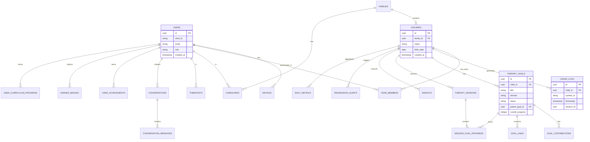

# Flynn AAC Data Model Overview

**Version:** 1.0  
**Last Updated:** January 2025

---

## 1. Entity Relationship Diagram



---

## 2. Core Domain Models

### 2.1 User Domain

```typescript
// Platform user (authenticated via Clerk)
interface User {
  id: string;              // UUID
  clerkId: string;         // Clerk user ID
  email: string;
  role: 'admin' | 'caregiver' | 'therapist';
  createdAt: Date;
}

// Push notification device
interface Device {
  id: string;
  userId: string;
  deviceToken: string;
  platform: 'ios' | 'android' | 'web';
  createdAt: Date;
}
```

### 2.2 Family Domain

```typescript
interface Family {
  id: string;
  name: string;
  createdAt: Date;
}

interface Child {
  id: string;
  familyId: string;
  name: string;
  birthDate?: Date;
  createdAt: Date;
}

interface Caregiver {
  id: string;
  familyId: string;
  userId?: string;         // Link to User if registered
  name: string;
  email: string;
  role: 'parent' | 'guardian' | 'grandparent' | 'nanny' | 'other';
  createdAt: Date;
}

interface Therapist {
  id: string;
  userId?: string;         // Link to User if registered
  name: string;
  email: string;
  createdAt: Date;
}
```

### 2.3 Team Domain (Phase 2)

```typescript
interface TeamMember {
  id: string;
  childId: string;
  userId: string;
  
  relationship: 'parent' | 'primary_therapist' | 'team_therapist' | 'consultant' | 'observer';
  disciplines: TherapyDiscipline[];
  isPrimaryForDiscipline: boolean;
  
  permissions: Permission[];
  canInviteOthers: boolean;
  canModifyGoals: boolean;
  canViewOtherDisciplines: boolean;
  
  grantedBy: string;
  grantedAt: Date;
  expiresAt?: Date;
  revokedAt?: Date;
}

interface AccessInvitation {
  id: string;
  childId: string;
  email: string;
  relationship: string;
  disciplines: TherapyDiscipline[];
  permissions: Permission[];
  token: string;           // Secure random token
  status: 'pending' | 'accepted' | 'expired' | 'revoked';
  invitedBy: string;
  expiresAt: Date;
  acceptedAt?: Date;
}

type TherapyDiscipline = 'ABA' | 'OT' | 'SLP' | 'PT' | 'OTHER';
```

---

## 3. Therapy Domain

### 3.1 Goals

```typescript
interface TherapyGoal {
  id: string;
  childId: string;
  
  // Content
  title: string;
  description?: string;
  targetCriteria: string;
  measurementMethod?: string;
  
  // Categorization
  domain: string;          // communication, motor, behavior, etc.
  subdomain?: string;
  primaryDiscipline: TherapyDiscipline;
  
  // Ownership
  createdBy: string;
  
  // Hierarchy
  parentGoalId?: string;
  
  // Timeline
  status: 'draft' | 'proposed' | 'active' | 'paused' | 'achieved' | 'discontinued';
  startDate?: Date;
  targetDate?: Date;
  achievedDate?: Date;
  
  // Progress
  overallProgress: number; // 0-100
  progressByDiscipline?: Record<TherapyDiscipline, number>;
  
  createdAt: Date;
  updatedAt: Date;
}

interface GoalContribution {
  id: string;
  goalId: string;
  userId: string;
  discipline: TherapyDiscipline;
  role: 'primary' | 'supporting' | 'monitoring';
  specificObjectives?: string[];
  
  status: 'pending' | 'approved' | 'declined';
  approvedBy?: string;
  approvedAt?: Date;
  
  createdAt: Date;
}

interface GoalLink {
  id: string;
  sourceGoalId: string;
  targetGoalId: string;
  linkType: 'supports' | 'conflicts' | 'prerequisite' | 'related';
  description?: string;
  createdBy: string;
  createdAt: Date;
}
```

### 3.2 Sessions

```typescript
interface TherapySession {
  id: string;
  childId: string;
  providerId: string;
  
  sessionType: 'ABA' | 'OT' | 'SLP' | 'HOME_PRACTICE' | 'OTHER';
  startTime: Date;
  endTime: Date;
  location: 'HOME' | 'CLINIC' | 'SCHOOL' | 'REMOTE';
  
  notes?: string;
  attachments?: Attachment[];
  
  createdAt: Date;
  updatedAt: Date;
}

interface SessionGoalProgress {
  id: string;
  sessionId: string;
  goalId: string;
  
  trialsAttempted?: number;
  trialsCorrect?: number;
  promptLevel?: PromptLevel;
  notes?: string;
  
  createdAt: Date;
}

type PromptLevel = 
  | 'INDEPENDENT'
  | 'GESTURAL'
  | 'VERBAL'
  | 'MODEL'
  | 'PARTIAL_PHYSICAL'
  | 'FULL_PHYSICAL';
```

---

## 4. AAC Usage Domain

### 4.1 Raw Events

```typescript
interface UsageLog {
  id: string;
  childId: string;
  
  symbolId: string;        // Reference to ARASAAC symbol
  timestamp: Date;
  sessionId?: string;      // Groups logs from single AAC session
  
  // Extended fields (Phase 2+)
  phraseId?: string;       // If part of multi-word phrase
  language?: 'en' | 'bg';
  deviceId?: string;
}
```

### 4.2 Aggregated Metrics

```typescript
interface DailyMetrics {
  id: string;
  childId: string;
  date: Date;
  
  // Usage metrics
  totalTaps: number;
  uniqueSymbols: number;
  uniqueCategories: number;
  averageSessionLength?: number;
  sessionCount: number;
  
  // Phrase metrics
  phrasesBuilt: number;
  averagePhraseLength?: number;
  maxPhraseLength?: number;
  
  // Language metrics
  bulgarianTaps: number;
  englishTaps: number;
  
  // Distribution
  hourlyDistribution: number[];  // 24 buckets
  topSymbols: { symbolId: string; count: number }[];
  newSymbolsUsed: string[];
  
  computedAt: Date;
}

interface WeeklyMetrics {
  id: string;
  childId: string;
  weekStart: Date;         // Monday
  
  totalTaps: number;
  avgDailyTaps: number;
  activeDays: number;
  
  totalUniqueSymbols: number;
  newSymbolsThisWeek: number;
  vocabularyGrowthRate: number;
  
  avgSessionsPerDay: number;
  peakUsageHour: number;
  weekendVsWeekdayRatio: number;
  
  therapySessionsThisWeek: number;
  therapyCorrelationScore?: number;
  
  computedAt: Date;
}
```

---

## 5. Intelligence Domain

### 5.1 Insights

```typescript
interface Insight {
  id: string;
  childId: string;
  
  type: InsightType;
  content: InsightContent;
  
  generatedAt: Date;
}

type InsightType = 
  | 'daily_digest'
  | 'weekly_report'
  | 'regression_alert'
  | 'milestone_achieved'
  | 'vocabulary_suggestion'
  | 'usage_pattern_change'
  | 'therapy_correlation'
  | 'celebration';

interface InsightContent {
  type: InsightType;
  version: number;
  generatedBy: 'rule_engine' | 'ml_model' | 'claude';
  data: Record<string, unknown>;
  summary: string;
  actionable: boolean;
  actions?: InsightAction[];
}
```

### 5.2 Regression Detection

```typescript
interface RegressionAlert {
  id: string;
  childId: string;
  
  type: 'metric_regression' | 'vocabulary_regression' | 'pattern_change';
  metric?: string;
  severity: 'critical' | 'warning' | 'info';
  
  expectedValue?: number;
  actualValue?: number;
  deviationScore?: number;
  daysPersistent?: number;
  
  confirmationScore?: number;
  confirmationSignals?: string[];
  
  title: string;
  description: string;
  suggestion?: string;
  
  status: 'active' | 'acknowledged' | 'resolved' | 'dismissed';
  acknowledgedAt?: Date;
  acknowledgedBy?: string;
  resolvedAt?: Date;
  
  createdAt: Date;
  expiresAt?: Date;
}

interface BaselineSnapshot {
  id: string;
  childId: string;
  metric: string;
  
  mean: number;
  median: number;
  stdDev: number;
  percentile25?: number;
  percentile75?: number;
  percentile95?: number;
  
  trend?: 'increasing' | 'decreasing' | 'stable';
  trendSlope?: number;
  trendConfidence?: number;
  seasonalFactors?: number[];
  
  sampleSize: number;
  windowStartDate: Date;
  windowEndDate: Date;
  
  computedAt: Date;
  validUntil: Date;
}

interface RegressionThreshold {
  id: string;
  childId: string;
  metric: string;
  
  warningThreshold: number;
  criticalThreshold: number;
  minConsecutiveDays: number;
  minAbsoluteDrop?: number;
  cooldownHours: number;
  
  enabled: boolean;
  customized: boolean;
  
  createdAt: Date;
  updatedAt: Date;
}
```

### 5.3 Conflicts (Phase 2)

```typescript
interface DetectedConflict {
  id: string;
  childId: string;
  
  type: ConflictType;
  severity: 'low' | 'medium' | 'high';
  involvedGoals: string[];
  involvedUsers: string[];
  
  description: string;
  suggestedResolution?: string;
  
  status: 'open' | 'acknowledged' | 'resolved' | 'dismissed';
  
  detectedAt: Date;
}

interface ConflictResolution {
  id: string;
  conflictId: string;
  
  resolutionType: 'merged' | 'dismissed' | 'deferred' | 'modified';
  description: string;
  
  goalsModified?: { goalId: string; changes: Record<string, unknown> }[];
  linksCreated?: { sourceId: string; targetId: string; type: string }[];
  
  agreedBy: string[];
  pendingAgreement?: string[];
  
  resolvedBy: string;
  resolvedAt: Date;
}
```

---

## 6. Coaching Domain (Phase 2)

### 6.1 Content

```typescript
interface CoachingContent {
  id: string;
  
  title: string;
  duration: '30sec' | '1min' | '2min' | '5min';
  format: 'tip' | 'video' | 'activity' | 'reflection' | 'quiz';
  domain: CoachingDomain;
  skillLevel: 'beginner' | 'intermediate' | 'advanced';
  
  content: TipContent | VideoContent | ActivityContent | ReflectionContent | QuizContent;
  
  language: string;
  translations?: Record<string, unknown>;
  
  tags: string[];
  prerequisites?: string[];
  relatedGoalDomains?: string[];
  
  videoUrl?: string;
  thumbnailUrl?: string;
  
  timesDelivered: number;
  helpfulCount: number;
  completionCount: number;
  
  status: 'draft' | 'published';
  publishedAt?: Date;
  
  createdAt: Date;
  updatedAt: Date;
}

type CoachingDomain = 
  | 'modeling'
  | 'wait_time'
  | 'expansion'
  | 'environment'
  | 'reinforcement'
  | 'troubleshooting'
  | 'motivation'
  | 'routine_integration';
```

### 6.2 Gamification

```typescript
interface UserAchievements {
  id: string;
  userId: string;
  
  totalXP: number;
  currentLevel: number;
  xpToNextLevel: number;
  
  currentStreak: number;
  longestStreak: number;
  lastActivityDate?: Date;
  
  coachingsCompleted: number;
  practiceSessionsLogged: number;
  milestoneCelebrations: number;
  
  createdAt: Date;
  updatedAt: Date;
}

interface Badge {
  id: string;
  
  name: string;
  description: string;
  iconUrl: string;
  
  category: string;
  tier: 'bronze' | 'silver' | 'gold' | 'platinum';
  requirements: Record<string, unknown>;
  
  xpReward: number;
  unlocksContent?: string[];
  
  isSecret: boolean;
  
  createdAt: Date;
}

interface EarnedBadge {
  id: string;
  userId: string;
  badgeId: string;
  
  earnedAt: Date;
  notifiedAt?: Date;
  celebratedAt?: Date;
}
```

### 6.3 Curriculum

```typescript
interface CurriculumModule {
  id: string;
  
  order: number;
  tier: 'foundations' | 'core' | 'advanced' | 'mastery';
  name: string;
  description: string;
  
  prerequisiteModuleIds?: string[];
  
  lessons: Lesson[];
  estimatedMinutes: number;
  
  completionCriteria: Record<string, unknown>;
  
  xpReward: number;
  badgeReward?: string;
  
  createdAt: Date;
  updatedAt: Date;
}

interface UserCurriculumProgress {
  id: string;
  userId: string;
  moduleId: string;
  
  status: 'not_started' | 'in_progress' | 'completed';
  lessonsCompleted: string[];
  currentLessonId?: string;
  
  startedAt?: Date;
  completedAt?: Date;
  timeSpentMinutes: number;
  
  quizAttempts?: { lessonId: string; score: number; date: Date }[];
  
  createdAt: Date;
  updatedAt: Date;
}
```

---

## 7. AI Domain (Phase 3)

```typescript
interface NLQuery {
  id: string;
  userId: string;
  childId: string;
  
  rawQuery: string;
  intent?: string;
  entities?: ExtractedEntity[];
  
  response: string;
  visualizations?: Visualization[];
  toolsUsed?: string[];
  
  tokensInput?: number;
  tokensOutput?: number;
  latencyMs?: number;
  
  helpful?: boolean;
  feedback?: string;
  
  createdAt: Date;
}

interface GeneratedSummary {
  id: string;
  childId: string;
  
  type: SummaryType;
  title: string;
  content: SummaryContent;
  
  dateRangeStart: Date;
  dateRangeEnd: Date;
  sourcesUsed?: string[];
  
  status: 'draft' | 'reviewed' | 'approved' | 'sent';
  reviewedBy?: string;
  approvedAt?: Date;
  
  createdAt: Date;
}

interface VocabularyRecommendation {
  id: string;
  childId: string;
  
  type: VocabularyRecommendationType;
  symbolId: string;
  symbolLabel: string;
  category?: string;
  
  reason: string;
  supportingData?: Record<string, unknown>;
  confidence: number;
  priority: 'high' | 'medium' | 'low';
  
  suggestedPosition?: { row: number; col: number };
  
  status: 'pending' | 'accepted' | 'rejected' | 'deferred';
  reviewedBy?: string;
  reviewedAt?: Date;
  addedToDevice?: Date;
  
  createdAt: Date;
}

interface GoalSuggestion {
  id: string;
  childId: string;
  
  domain: string;
  title: string;
  description: string;
  shortTermObjectives: string[];
  targetCriteria: string;
  suggestedTimeframe?: string;
  
  basedOn: GoalBasis[];
  rationale: string;
  expectedOutcome?: string;
  
  status: 'pending' | 'accepted' | 'modified' | 'rejected';
  finalGoalId?: string;
  
  createdAt: Date;
}

interface ProgressPrediction {
  id: string;
  childId: string;
  goalId?: string;
  
  metric: string;
  currentValue: number;
  predictedValue: number;
  predictedDate: Date;
  confidence: number;
  
  trajectory: 'on_track' | 'ahead' | 'behind' | 'at_risk';
  riskFactors?: string[];
  accelerators?: string[];
  recommendations?: string[];
  
  modelVersion: string;
  featuresUsed?: string[];
  
  createdAt: Date;
}
```

---

## 8. Conversation Domain

```typescript
interface Conversation {
  id: string;
  caregiverId: string;
  childId?: string;
  
  title?: string;
  
  createdAt: Date;
  updatedAt: Date;
}

interface ConversationMessage {
  id: string;
  conversationId: string;
  
  role: 'user' | 'assistant' | 'tool_call' | 'tool_result';
  content: string;
  
  toolName?: string;
  toolCallId?: string;
  
  inputTokens?: number;
  outputTokens?: number;
  
  createdAt: Date;
}
```

---

## 9. Notification Domain

```typescript
interface InsightNotification {
  id: string;
  insightId: string;
  recipientId: string;
  
  channel: 'push' | 'email' | 'in_app';
  priority: 'critical' | 'warning' | 'info';
  
  title: string;
  body: string;
  actionUrl?: string;
  
  sentAt?: Date;
  readAt?: Date;
  dismissedAt?: Date;
  
  createdAt: Date;
}

interface NotificationPreferences {
  id: string;
  userId: string;
  
  dailyDigestEnabled: boolean;
  dailyDigestTime?: string;     // HH:MM
  weeklyReportEnabled: boolean;
  anomalyAlertsPush: boolean;
  anomalyAlertsEmail: boolean;
  milestoneAlerts: boolean;
  
  quietHoursStart?: string;     // HH:MM
  quietHoursEnd?: string;       // HH:MM
  timezone: string;
  
  createdAt: Date;
  updatedAt: Date;
}
```

---

## 10. Indexes and Performance

### Key Indexes

```sql
-- Usage queries
CREATE INDEX idx_usage_logs_child_timestamp ON usage_logs(child_id, timestamp DESC);
CREATE INDEX idx_usage_logs_symbol ON usage_logs(symbol_id);

-- Metrics queries
CREATE INDEX idx_daily_metrics_child_date ON daily_metrics(child_id, date DESC);
CREATE INDEX idx_weekly_metrics_child_week ON weekly_metrics(child_id, week_start DESC);

-- Goal queries
CREATE INDEX idx_therapy_goals_child_status ON therapy_goals(child_id, status);
CREATE INDEX idx_therapy_goals_parent ON therapy_goals(parent_goal_id);

-- Session queries
CREATE INDEX idx_therapy_sessions_child_time ON therapy_sessions(child_id, start_time DESC);

-- Team queries
CREATE INDEX idx_team_members_child ON team_members(child_id);
CREATE INDEX idx_team_members_user ON team_members(user_id);

-- Alert queries
CREATE INDEX idx_regression_alerts_child_status ON regression_alerts(child_id, status);
CREATE INDEX idx_regression_alerts_created ON regression_alerts(created_at DESC);

-- Insight queries
CREATE INDEX idx_insights_child_type ON insights(child_id, type);
```

---

*This data model overview covers all entities from Phase 1-3. See individual spec documents for detailed field descriptions and validation rules.*
