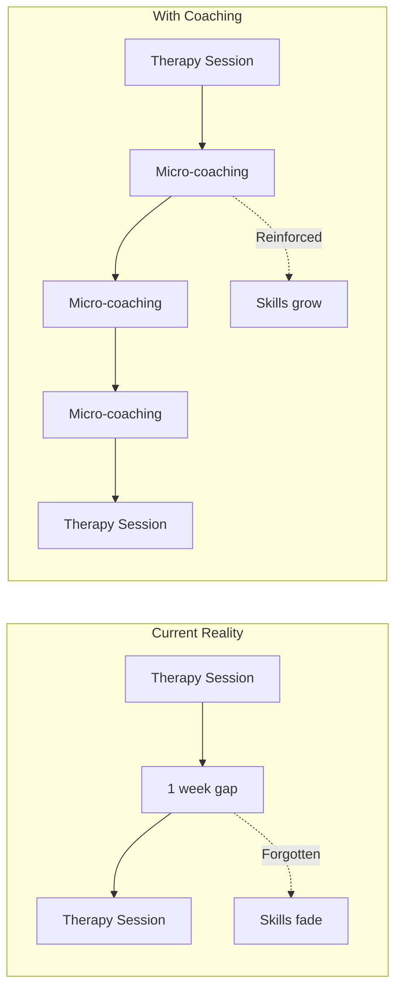
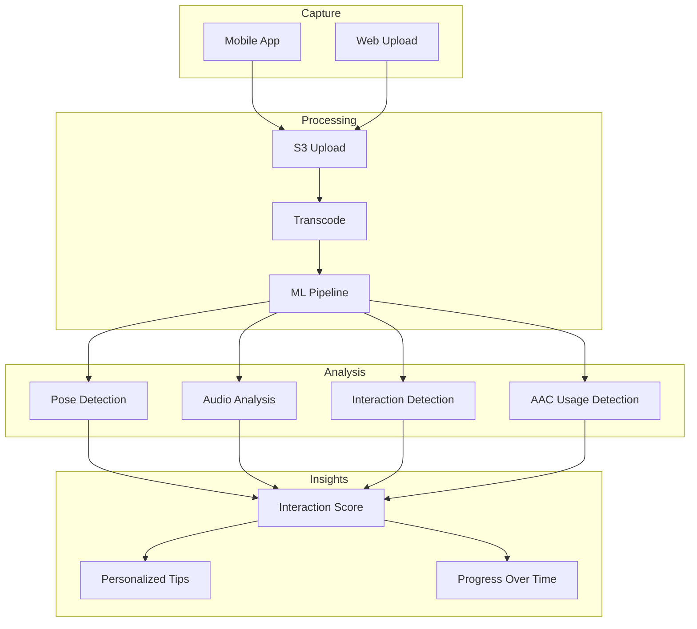
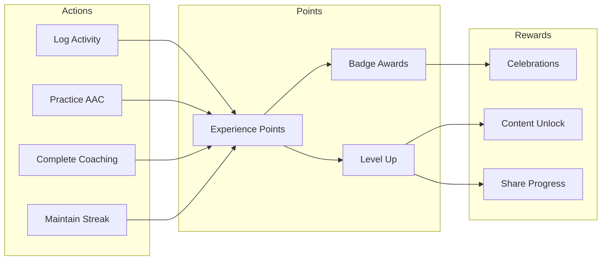
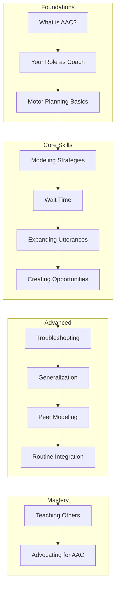

# Parent Coaching System — Technical Specification

**Version:** 1.0  
**Status:** Phase 2 Design  
**Last Updated:** January 2025

---

## 1. Executive Summary

Parents and caregivers are the most important factor in AAC success. Children spend 95%+ of their waking hours with family, yet therapy happens only a few hours per week. The Parent Coaching System bridges this gap by providing just-in-time micro-coaching, celebrating progress, and building caregiver confidence through a gamified learning experience.

### Vision

> "Every parent interaction is a coaching opportunity."

The system transforms the Flynn platform from a passive tracking tool into an active coaching partner that:
- Provides personalized, actionable micro-lessons
- Celebrates wins (big and small) to maintain motivation
- Builds skills progressively through a curriculum
- Uses gamification to make learning engaging
- Creates feedback loops that reinforce good practices

### The Parent Coaching Gap



---

## 2. Micro-Coaching Recommendation Engine

### 2.1 Coaching Moment Detection

The system identifies optimal moments for coaching based on context:

```typescript
interface CoachingMoment {
  id: string;
  userId: string;
  childId: string;
  
  // Trigger context
  trigger: CoachingTrigger;
  confidence: number; // 0-1
  
  // Content
  coaching: MicroCoaching;
  
  // Delivery
  suggestedChannel: 'in_app' | 'push' | 'email';
  urgency: 'immediate' | 'within_hour' | 'next_session';
  
  // State
  deliveredAt?: Date;
  viewedAt?: Date;
  completedAt?: Date;
  feedback?: 'helpful' | 'not_helpful' | 'already_knew';
  
  createdAt: Date;
}

type CoachingTrigger = 
  | { type: 'post_session'; sessionId: string }
  | { type: 'goal_progress'; goalId: string; progress: number }
  | { type: 'usage_pattern'; pattern: UsagePattern }
  | { type: 'milestone_nearby'; milestone: string }
  | { type: 'regression_risk'; metric: string }
  | { type: 'new_vocabulary'; symbolIds: string[] }
  | { type: 'time_based'; schedule: string }
  | { type: 'streak_opportunity'; currentStreak: number }
  | { type: 'therapist_assigned'; assignmentId: string };

interface MicroCoaching {
  id: string;
  title: string;
  duration: '30sec' | '1min' | '2min' | '5min';
  format: 'tip' | 'video' | 'activity' | 'reflection' | 'quiz';
  
  // Content
  content: CoachingContent;
  
  // Targeting
  skillLevel: 'beginner' | 'intermediate' | 'advanced';
  domain: CoachingDomain;
  tags: string[];
  
  // Effectiveness tracking
  timesDelivered: number;
  helpfulRate: number;
  completionRate: number;
}

type CoachingDomain = 
  | 'modeling'           // How to model AAC use
  | 'wait_time'          // Giving processing time
  | 'expansion'          // Expanding child's utterances
  | 'environment'        // Setting up communication opportunities
  | 'reinforcement'      // Responding to communication
  | 'troubleshooting'    // When things aren't working
  | 'motivation'         // Staying encouraged
  | 'routine_integration'; // Incorporating AAC into routines
```

### 2.2 Coaching Content Library

```typescript
export const coachingContent = pgTable("coaching_content", {
  id: uuid("id").primaryKey().defaultRandom(),
  
  // Metadata
  title: varchar("title", { length: 255 }).notNull(),
  duration: varchar("duration", { length: 20 }).notNull(),
  format: varchar("format", { length: 20 }).notNull(),
  domain: varchar("domain", { length: 50 }).notNull(),
  skillLevel: varchar("skill_level", { length: 20 }).notNull(),
  
  // Content (flexible structure)
  content: jsonb("content").notNull(),
  
  // Localization
  language: varchar("language", { length: 5 }).notNull().default('en'),
  translations: jsonb("translations"), // { bg: {...}, de: {...} }
  
  // Targeting
  tags: jsonb("tags").notNull(), // string[]
  prerequisites: jsonb("prerequisites"), // other content IDs
  relatedGoalDomains: jsonb("related_goal_domains"), // string[]
  
  // Media
  videoUrl: varchar("video_url", { length: 500 }),
  thumbnailUrl: varchar("thumbnail_url", { length: 500 }),
  
  // Effectiveness
  timesDelivered: integer("times_delivered").default(0),
  helpfulCount: integer("helpful_count").default(0),
  completionCount: integer("completion_count").default(0),
  
  // Status
  status: varchar("status", { length: 20 }).notNull().default("draft"),
  publishedAt: timestamp("published_at"),
  
  createdAt: timestamp("created_at").defaultNow().notNull(),
  updatedAt: timestamp("updated_at").defaultNow().notNull(),
});

interface TipContent {
  mainTip: string;
  whyItWorks: string;
  tryThis: string;       // Specific action to take
  example?: string;
  commonMistakes?: string[];
}

interface VideoContent {
  videoUrl: string;
  duration: number; // seconds
  transcript: string;
  keyPoints: string[];
  practiceActivity?: string;
}

interface ActivityContent {
  title: string;
  instructions: string[];
  duration: string;
  materials?: string[];
  variations?: string[];
  successIndicators: string[];
}

interface ReflectionContent {
  question: string;
  prompts: string[];
  followUp: string;
}

interface QuizContent {
  question: string;
  options: { text: string; correct: boolean; explanation?: string }[];
  explanation: string;
}
```

### 2.3 Recommendation Algorithm

```typescript
class CoachingRecommendationEngine {
  private readonly MAX_DAILY_COACHINGS = 3;
  private readonly MIN_HOURS_BETWEEN = 4;
  
  async getRecommendations(
    userId: string,
    childId: string,
    limit: number = 3
  ): Promise<CoachingRecommendation[]> {
    // Check rate limiting
    const recentCoachings = await this.getRecentCoachings(userId, 24);
    if (recentCoachings.length >= this.MAX_DAILY_COACHINGS) {
      return [];
    }
    
    // Get user context
    const context = await this.buildUserContext(userId, childId);
    
    // Get candidate coachings
    const candidates = await this.getCandidateCoachings(context);
    
    // Score and rank
    const scored = candidates.map(c => ({
      coaching: c,
      score: this.scoreCoaching(c, context)
    }));
    
    scored.sort((a, b) => b.score - a.score);
    
    // Deduplicate by domain (avoid multiple similar tips)
    const deduped = this.deduplicateByDomain(scored);
    
    return deduped.slice(0, limit).map(s => ({
      coaching: s.coaching,
      reason: this.explainRecommendation(s.coaching, context),
      confidence: s.score
    }));
  }
  
  private async buildUserContext(
    userId: string,
    childId: string
  ): Promise<UserCoachingContext> {
    const [
      userProfile,
      childData,
      completedCoachings,
      currentGoals,
      recentActivity,
      skillAssessment
    ] = await Promise.all([
      this.getUserProfile(userId),
      this.getChildData(childId),
      this.getCompletedCoachings(userId),
      this.getActiveGoals(childId),
      this.getRecentActivity(childId, 7),
      this.getSkillAssessment(userId)
    ]);
    
    return {
      userId,
      childId,
      skillLevel: skillAssessment.overall,
      domainSkills: skillAssessment.byDomain,
      completedContentIds: new Set(completedCoachings.map(c => c.contentId)),
      preferredFormat: userProfile.preferredFormat,
      availableTime: userProfile.availableTime,
      currentFocus: this.determineCurrentFocus(currentGoals, recentActivity),
      recentMilestones: recentActivity.milestones,
      concerns: await this.identifyConcerns(childId, recentActivity)
    };
  }
  
  private scoreCoaching(
    coaching: CoachingContent,
    context: UserCoachingContext
  ): number {
    let score = 0;
    
    // Relevance to current focus (40%)
    if (context.currentFocus.includes(coaching.domain)) {
      score += 0.4;
    }
    
    // Skill level match (20%)
    const levelMatch = this.skillLevelMatch(coaching.skillLevel, context.skillLevel);
    score += 0.2 * levelMatch;
    
    // Not completed recently (15%)
    if (!context.completedContentIds.has(coaching.id)) {
      score += 0.15;
    }
    
    // Format preference (10%)
    if (coaching.format === context.preferredFormat) {
      score += 0.1;
    }
    
    // Time fit (10%)
    if (this.fitsDuration(coaching.duration, context.availableTime)) {
      score += 0.1;
    }
    
    // Historical effectiveness (5%)
    score += 0.05 * coaching.helpfulCount / Math.max(coaching.timesDelivered, 1);
    
    return score;
  }
  
  private skillLevelMatch(contentLevel: string, userLevel: string): number {
    const levels = ['beginner', 'intermediate', 'advanced'];
    const contentIdx = levels.indexOf(contentLevel);
    const userIdx = levels.indexOf(userLevel);
    
    const diff = Math.abs(contentIdx - userIdx);
    
    // Perfect match = 1, one level off = 0.5, two levels = 0
    return Math.max(0, 1 - diff * 0.5);
  }
}
```

### 2.4 Just-In-Time Delivery

```typescript
class JustInTimeCoachingService {
  async handleEvent(event: CoachingTriggerEvent): Promise<void> {
    const moments = await this.detectCoachingMoments(event);
    
    for (const moment of moments) {
      if (moment.confidence > 0.7) {
        await this.scheduleCoaching(moment);
      }
    }
  }
  
  private async detectCoachingMoments(
    event: CoachingTriggerEvent
  ): Promise<CoachingMoment[]> {
    const moments: CoachingMoment[] = [];
    
    switch (event.type) {
      case 'session_completed': {
        // Post-therapy coaching opportunity
        const session = event.data as TherapySession;
        const relevantCoachings = await this.getSessionFollowups(session);
        
        if (relevantCoachings.length > 0) {
          moments.push({
            trigger: { type: 'post_session', sessionId: session.id },
            confidence: 0.9,
            coaching: relevantCoachings[0],
            suggestedChannel: 'push',
            urgency: 'within_hour'
          });
        }
        break;
      }
      
      case 'new_word_used': {
        // Celebrate and reinforce new vocabulary
        const { symbolIds, childId } = event.data;
        const coaching = await this.getVocabularyCoaching(symbolIds);
        
        moments.push({
          trigger: { type: 'new_vocabulary', symbolIds },
          confidence: 0.85,
          coaching,
          suggestedChannel: 'push',
          urgency: 'immediate'
        });
        break;
      }
      
      case 'usage_drop_detected': {
        // Motivational coaching when engagement drops
        const { childId, dropPercent } = event.data;
        const coaching = await this.getMotivationalCoaching(dropPercent);
        
        moments.push({
          trigger: { type: 'usage_pattern', pattern: { type: 'drop', value: dropPercent } },
          confidence: 0.75,
          coaching,
          suggestedChannel: 'in_app',
          urgency: 'next_session'
        });
        break;
      }
      
      case 'milestone_approaching': {
        // Prepare for upcoming milestone
        const { milestone, progress } = event.data;
        const coaching = await this.getMilestonePrep(milestone);
        
        moments.push({
          trigger: { type: 'milestone_nearby', milestone },
          confidence: 0.8,
          coaching,
          suggestedChannel: 'email',
          urgency: 'next_session'
        });
        break;
      }
    }
    
    return moments;
  }
  
  private async scheduleCoaching(moment: CoachingMoment): Promise<void> {
    const deliveryTime = this.calculateDeliveryTime(moment);
    
    await this.db.insert(scheduledCoachings).values({
      userId: moment.userId,
      childId: moment.childId,
      coachingId: moment.coaching.id,
      trigger: moment.trigger,
      scheduledFor: deliveryTime,
      channel: moment.suggestedChannel,
      status: 'pending'
    });
  }
  
  private calculateDeliveryTime(moment: CoachingMoment): Date {
    const now = new Date();
    
    switch (moment.urgency) {
      case 'immediate':
        return now;
      case 'within_hour':
        return addMinutes(now, 30);
      case 'next_session':
        return this.getNextActiveTime(moment.userId);
    }
  }
}
```

---

## 3. Video Analysis Pipeline (Future)

### 3.1 Architecture Vision



### 3.2 Data Model (Future Implementation)

```typescript
export const parentingVideos = pgTable("parenting_videos", {
  id: uuid("id").primaryKey().defaultRandom(),
  userId: uuid("user_id")
    .references(() => users.id, { onDelete: "cascade" })
    .notNull(),
  childId: uuid("child_id")
    .references(() => children.id, { onDelete: "cascade" })
    .notNull(),
  
  // Media
  originalUrl: varchar("original_url", { length: 500 }).notNull(),
  processedUrl: varchar("processed_url", { length: 500 }),
  thumbnailUrl: varchar("thumbnail_url", { length: 500 }),
  duration: integer("duration"), // seconds
  
  // Context
  activityType: varchar("activity_type", { length: 50 }), // mealtime, play, routine
  notes: text("notes"),
  
  // Processing state
  status: varchar("status", { length: 20 }).notNull().default("uploaded"),
  processedAt: timestamp("processed_at"),
  analysisResults: jsonb("analysis_results"),
  
  // Privacy
  retainUntil: timestamp("retain_until").notNull(), // Auto-delete after this
  consentGiven: boolean("consent_given").notNull().default(false),
  
  createdAt: timestamp("created_at").defaultNow().notNull(),
});

interface VideoAnalysisResults {
  version: string;
  processedAt: Date;
  
  // Interaction metrics
  interactionScore: number; // 0-100
  turnTakingCount: number;
  waitTimeAverage: number; // seconds
  modelingInstances: number;
  
  // AAC-specific
  aacDeviceVisible: boolean;
  aacPointingDetected: number;
  jointAttentionMoments: number;
  
  // Coaching opportunities
  coachingMoments: {
    timestamp: number;
    type: string;
    suggestion: string;
    confidence: number;
  }[];
  
  // Positive highlights
  greatMoments: {
    timestamp: number;
    description: string;
  }[];
}
```

### 3.3 Privacy & Consent (Critical)

```typescript
interface VideoConsentRecord {
  userId: string;
  childId: string;
  
  // Consent details
  consentGiven: boolean;
  consentDate: Date;
  consentMethod: 'in_app' | 'written';
  
  // What they consented to
  allowProcessing: boolean;
  allowAIAnalysis: boolean;
  allowAnonymizedResearch: boolean;
  
  // Retention
  retentionPeriod: '7_days' | '30_days' | '90_days';
  autoDeleteEnabled: boolean;
  
  // Revocation
  revokedAt?: Date;
  revocationReason?: string;
}

class VideoPrivacyManager {
  async ensureConsent(userId: string, childId: string): Promise<boolean> {
    const consent = await this.getConsent(userId, childId);
    
    if (!consent || consent.revokedAt) {
      return false;
    }
    
    if (!consent.allowProcessing || !consent.allowAIAnalysis) {
      return false;
    }
    
    return true;
  }
  
  async scheduleVideoDeletion(videoId: string, date: Date): Promise<void> {
    await this.db.insert(scheduledDeletions).values({
      resourceType: 'video',
      resourceId: videoId,
      deleteAt: date,
      reason: 'retention_policy'
    });
  }
  
  async revokeConsent(userId: string, childId: string, reason: string): Promise<void> {
    // Mark consent as revoked
    await this.db.update(videoConsent)
      .set({
        revokedAt: new Date(),
        revocationReason: reason
      })
      .where(and(
        eq(videoConsent.userId, userId),
        eq(videoConsent.childId, childId)
      ));
    
    // Queue all videos for immediate deletion
    const videos = await this.getChildVideos(childId);
    for (const video of videos) {
      await this.deleteVideoImmediately(video.id);
    }
  }
}
```

---

## 4. Gamification and Celebration System

### 4.1 Achievement System



### 4.2 Data Model

```typescript
export const userAchievements = pgTable("user_achievements", {
  id: uuid("id").primaryKey().defaultRandom(),
  userId: uuid("user_id")
    .references(() => users.id, { onDelete: "cascade" })
    .notNull(),
  
  // Points
  totalXP: integer("total_xp").notNull().default(0),
  currentLevel: integer("current_level").notNull().default(1),
  xpToNextLevel: integer("xp_to_next_level").notNull().default(100),
  
  // Streaks
  currentStreak: integer("current_streak").notNull().default(0),
  longestStreak: integer("longest_streak").notNull().default(0),
  lastActivityDate: date("last_activity_date"),
  
  // Counts
  coachingsCompleted: integer("coachings_completed").notNull().default(0),
  practiceSessionsLogged: integer("practice_sessions_logged").notNull().default(0),
  milestoneCelebrations: integer("milestone_celebrations").notNull().default(0),
  
  createdAt: timestamp("created_at").defaultNow().notNull(),
  updatedAt: timestamp("updated_at").defaultNow().notNull(),
});

export const badges = pgTable("badges", {
  id: uuid("id").primaryKey().defaultRandom(),
  
  // Definition
  name: varchar("name", { length: 100 }).notNull(),
  description: text("description").notNull(),
  iconUrl: varchar("icon_url", { length: 500 }).notNull(),
  
  // Requirements
  category: varchar("category", { length: 50 }).notNull(),
  tier: varchar("tier", { length: 20 }).notNull(), // bronze, silver, gold, platinum
  requirements: jsonb("requirements").notNull(),
  
  // Rewards
  xpReward: integer("xp_reward").notNull().default(0),
  unlocksContent: jsonb("unlocks_content"), // content IDs
  
  isSecret: boolean("is_secret").default(false),
  
  createdAt: timestamp("created_at").defaultNow().notNull(),
});

export const earnedBadges = pgTable("earned_badges", {
  id: uuid("id").primaryKey().defaultRandom(),
  userId: uuid("user_id")
    .references(() => users.id, { onDelete: "cascade" })
    .notNull(),
  badgeId: uuid("badge_id")
    .references(() => badges.id)
    .notNull(),
  
  earnedAt: timestamp("earned_at").defaultNow().notNull(),
  notifiedAt: timestamp("notified_at"),
  celebratedAt: timestamp("celebrated_at"),
}, (table) => ({
  userBadgeUnique: unique().on(table.userId, table.badgeId),
}));

// Badge definitions
const BADGE_DEFINITIONS: BadgeDefinition[] = [
  // Streak badges
  {
    name: "First Steps",
    description: "Complete your first coaching tip",
    category: "learning",
    tier: "bronze",
    requirements: { coachingsCompleted: 1 },
    xpReward: 50
  },
  {
    name: "Week Warrior",
    description: "Practice AAC every day for 7 days",
    category: "streak",
    tier: "silver",
    requirements: { streak: 7 },
    xpReward: 200
  },
  {
    name: "Monthly Champion",
    description: "Practice AAC every day for 30 days",
    category: "streak",
    tier: "gold",
    requirements: { streak: 30 },
    xpReward: 1000
  },
  
  // Learning badges
  {
    name: "Modeling Master",
    description: "Complete all modeling coaching content",
    category: "learning",
    tier: "gold",
    requirements: { domainComplete: 'modeling' },
    xpReward: 500
  },
  {
    name: "Wait Time Wizard",
    description: "Complete all wait time coaching content",
    category: "learning",
    tier: "gold",
    requirements: { domainComplete: 'wait_time' },
    xpReward: 500
  },
  
  // Celebration badges
  {
    name: "First Word Celebrated",
    description: "Celebrate your child's first AAC word",
    category: "milestone",
    tier: "platinum",
    requirements: { milestoneType: 'first_word' },
    xpReward: 500
  },
  {
    name: "100 Words Club",
    description: "Your child has used 100 unique words!",
    category: "milestone",
    tier: "platinum",
    requirements: { uniqueWords: 100 },
    xpReward: 2000
  },
  
  // Secret badges
  {
    name: "Night Owl",
    description: "Practice AAC after 10 PM",
    category: "secret",
    tier: "bronze",
    requirements: { practiceAfter: 22 },
    xpReward: 100,
    isSecret: true
  }
];
```

### 4.3 XP and Level System

```typescript
class GamificationService {
  private readonly XP_REWARDS: Record<string, number> = {
    'coaching_viewed': 10,
    'coaching_completed': 25,
    'coaching_marked_helpful': 15,
    'practice_session_logged': 50,
    'daily_streak_maintained': 30,
    'streak_7_days': 100,
    'streak_30_days': 500,
    'milestone_celebrated': 100,
    'goal_completed': 200,
    'new_word_first_use': 20
  };
  
  // Level thresholds (exponential curve)
  private readonly LEVEL_THRESHOLDS = [
    0, 100, 250, 500, 1000, 1750, 2750, 4000, 5500, 7500,
    10000, 13000, 17000, 22000, 28000, 35000, 43000, 52000, 62000, 75000
  ];
  
  async awardXP(
    userId: string,
    action: string,
    context?: Record<string, unknown>
  ): Promise<XPAwardResult> {
    const baseXP = this.XP_REWARDS[action] ?? 0;
    
    // Apply multipliers
    const multiplier = await this.getMultiplier(userId, action);
    const xpAmount = Math.round(baseXP * multiplier);
    
    if (xpAmount === 0) return { awarded: 0, levelUp: false };
    
    // Update user XP
    const user = await this.db.query.userAchievements.findFirst({
      where: eq(userAchievements.userId, userId)
    });
    
    const newTotalXP = (user?.totalXP ?? 0) + xpAmount;
    const newLevel = this.calculateLevel(newTotalXP);
    const levelUp = newLevel > (user?.currentLevel ?? 1);
    
    await this.db.update(userAchievements)
      .set({
        totalXP: newTotalXP,
        currentLevel: newLevel,
        xpToNextLevel: this.getXPToNextLevel(newTotalXP, newLevel),
        updatedAt: new Date()
      })
      .where(eq(userAchievements.userId, userId));
    
    // Log XP transaction
    await this.logXPTransaction(userId, action, xpAmount, context);
    
    // Check for new badges
    const newBadges = await this.checkBadgeUnlocks(userId, action, context);
    
    // Trigger celebration if level up
    if (levelUp) {
      await this.triggerLevelUpCelebration(userId, newLevel);
    }
    
    return {
      awarded: xpAmount,
      newTotal: newTotalXP,
      levelUp,
      newLevel: levelUp ? newLevel : undefined,
      newBadges
    };
  }
  
  private calculateLevel(totalXP: number): number {
    for (let i = this.LEVEL_THRESHOLDS.length - 1; i >= 0; i--) {
      if (totalXP >= this.LEVEL_THRESHOLDS[i]) {
        return i + 1;
      }
    }
    return 1;
  }
  
  private async getMultiplier(userId: string, action: string): Promise<number> {
    let multiplier = 1.0;
    
    // Weekend bonus
    const day = new Date().getDay();
    if (day === 0 || day === 6) {
      multiplier *= 1.5;
    }
    
    // Streak bonus (up to 2x)
    const user = await this.getUserAchievements(userId);
    if (user?.currentStreak > 7) {
      multiplier *= Math.min(1 + (user.currentStreak - 7) * 0.1, 2.0);
    }
    
    return multiplier;
  }
  
  async updateStreak(userId: string): Promise<StreakUpdate> {
    const user = await this.getUserAchievements(userId);
    const today = format(new Date(), 'yyyy-MM-dd');
    
    if (user?.lastActivityDate === today) {
      // Already logged today
      return { streak: user.currentStreak, extended: false };
    }
    
    const yesterday = format(subDays(new Date(), 1), 'yyyy-MM-dd');
    const wasYesterday = user?.lastActivityDate === yesterday;
    
    const newStreak = wasYesterday ? (user?.currentStreak ?? 0) + 1 : 1;
    const newLongest = Math.max(newStreak, user?.longestStreak ?? 0);
    
    await this.db.update(userAchievements)
      .set({
        currentStreak: newStreak,
        longestStreak: newLongest,
        lastActivityDate: today,
        updatedAt: new Date()
      })
      .where(eq(userAchievements.userId, userId));
    
    // Award streak XP
    if (wasYesterday) {
      await this.awardXP(userId, 'daily_streak_maintained');
      
      if (newStreak === 7) {
        await this.awardXP(userId, 'streak_7_days');
      } else if (newStreak === 30) {
        await this.awardXP(userId, 'streak_30_days');
      }
    }
    
    return {
      streak: newStreak,
      extended: wasYesterday,
      isNewRecord: newStreak > (user?.longestStreak ?? 0)
    };
  }
}
```

### 4.4 Celebration System

```typescript
interface Celebration {
  id: string;
  type: CelebrationType;
  userId: string;
  childId?: string;
  
  // Content
  title: string;
  message: string;
  animationType: 'confetti' | 'stars' | 'fireworks' | 'hearts';
  
  // Sharing
  shareableImageUrl?: string;
  shareableText?: string;
  
  // State
  shownAt?: Date;
  sharedAt?: Date;
  sharedTo?: string[];
  
  createdAt: Date;
}

type CelebrationType = 
  | 'first_word'
  | 'vocabulary_milestone'    // 10, 25, 50, 100, 250, 500 words
  | 'goal_achieved'
  | 'streak_milestone'        // 7, 14, 30, 60, 90 days
  | 'level_up'
  | 'badge_earned'
  | 'therapy_progress'
  | 'custom_milestone';

class CelebrationService {
  async createCelebration(
    type: CelebrationType,
    userId: string,
    context: Record<string, unknown>
  ): Promise<Celebration> {
    const content = await this.generateCelebrationContent(type, context);
    const shareableImage = await this.generateShareableImage(content);
    
    const celebration = await this.db.insert(celebrations).values({
      type,
      userId,
      childId: context.childId as string,
      title: content.title,
      message: content.message,
      animationType: this.selectAnimation(type),
      shareableImageUrl: shareableImage.url,
      shareableText: content.shareableText
    }).returning();
    
    // Schedule notification
    await this.scheduleNotification(celebration[0]);
    
    return celebration[0];
  }
  
  private async generateCelebrationContent(
    type: CelebrationType,
    context: Record<string, unknown>
  ): Promise<CelebrationContent> {
    const childName = await this.getChildName(context.childId as string);
    
    switch (type) {
      case 'first_word':
        return {
          title: "🎉 First Word!",
          message: `${childName} used their first AAC word! This is a huge milestone. Celebrate this moment!`,
          shareableText: `${childName} said their first word using AAC! 🌟 #AAC #Milestone`
        };
        
      case 'vocabulary_milestone':
        const wordCount = context.wordCount as number;
        return {
          title: `🌟 ${wordCount} Words!`,
          message: `${childName} has now used ${wordCount} different words! Their vocabulary is growing!`,
          shareableText: `${childName} has reached ${wordCount} words in their AAC vocabulary! 🎊`
        };
        
      case 'streak_milestone':
        const days = context.streak as number;
        return {
          title: `🔥 ${days} Day Streak!`,
          message: `You've practiced with ${childName} every day for ${days} days! Amazing dedication!`,
          shareableText: `${days} days of AAC practice in a row! Consistency is key 💪`
        };
        
      case 'level_up':
        const level = context.level as number;
        return {
          title: `⬆️ Level ${level}!`,
          message: `You've leveled up to Level ${level}! Keep up the amazing work supporting ${childName}.`,
          shareableText: null // Don't share levels externally
        };
        
      case 'badge_earned':
        const badge = context.badge as Badge;
        return {
          title: `🏆 Badge Earned!`,
          message: `You earned the "${badge.name}" badge! ${badge.description}`,
          shareableText: null // Optional sharing for badges
        };
        
      default:
        return {
          title: "🎊 Celebration!",
          message: context.message as string || "Something great happened!",
          shareableText: null
        };
    }
  }
  
  private async generateShareableImage(content: CelebrationContent): Promise<{ url: string }> {
    // Use a template system to generate shareable images
    const template = await this.getImageTemplate(content.type);
    
    const image = await this.imageGenerator.generate({
      template,
      data: {
        title: content.title,
        message: content.message,
        date: format(new Date(), 'MMMM d, yyyy')
      }
    });
    
    // Upload to CDN
    const url = await this.uploadToCDN(image);
    
    return { url };
  }
  
  async shareCelebration(
    celebrationId: string,
    platform: 'facebook' | 'twitter' | 'instagram' | 'copy'
  ): Promise<void> {
    const celebration = await this.getCelebration(celebrationId);
    
    // Track sharing
    await this.db.update(celebrations)
      .set({
        sharedAt: new Date(),
        sharedTo: [...(celebration.sharedTo ?? []), platform]
      })
      .where(eq(celebrations.id, celebrationId));
    
    // Award XP for sharing
    await this.gamificationService.awardXP(
      celebration.userId,
      'celebration_shared',
      { platform }
    );
  }
}
```

---

## 5. Personalized Skill-Building Curriculum

### 5.1 Curriculum Structure



### 5.2 Curriculum Data Model

```typescript
export const curriculumModules = pgTable("curriculum_modules", {
  id: uuid("id").primaryKey().defaultRandom(),
  
  // Structure
  order: integer("order").notNull(),
  tier: varchar("tier", { length: 30 }).notNull(), // foundations, core, advanced, mastery
  name: varchar("name", { length: 255 }).notNull(),
  description: text("description").notNull(),
  
  // Prerequisites
  prerequisiteModuleIds: jsonb("prerequisite_module_ids"), // string[]
  
  // Content
  lessons: jsonb("lessons").notNull(), // Lesson[]
  estimatedMinutes: integer("estimated_minutes").notNull(),
  
  // Completion
  completionCriteria: jsonb("completion_criteria").notNull(),
  
  // Rewards
  xpReward: integer("xp_reward").notNull(),
  badgeReward: uuid("badge_reward").references(() => badges.id),
  
  createdAt: timestamp("created_at").defaultNow().notNull(),
  updatedAt: timestamp("updated_at").defaultNow().notNull(),
});

interface Lesson {
  id: string;
  order: number;
  title: string;
  type: 'video' | 'reading' | 'interactive' | 'practice' | 'quiz';
  duration: number; // minutes
  content: LessonContent;
  completionCriteria: LessonCompletionCriteria;
}

interface LessonContent {
  // Video lesson
  videoUrl?: string;
  transcript?: string;
  
  // Reading
  markdown?: string;
  
  // Interactive
  interactiveId?: string;
  
  // Practice
  practiceActivity?: {
    instructions: string[];
    duration: string;
    checkpoints: string[];
  };
  
  // Quiz
  questions?: QuizQuestion[];
  passingScore?: number;
}

interface LessonCompletionCriteria {
  type: 'view' | 'practice' | 'quiz_pass' | 'manual_confirm';
  minViewPercent?: number;
  quizPassScore?: number;
  practiceConfirmation?: string;
}

export const userCurriculumProgress = pgTable("user_curriculum_progress", {
  id: uuid("id").primaryKey().defaultRandom(),
  userId: uuid("user_id")
    .references(() => users.id, { onDelete: "cascade" })
    .notNull(),
  moduleId: uuid("module_id")
    .references(() => curriculumModules.id)
    .notNull(),
  
  // Progress
  status: varchar("status", { length: 20 }).notNull().default("not_started"),
  lessonsCompleted: jsonb("lessons_completed").notNull().default([]), // lessonId[]
  currentLessonId: varchar("current_lesson_id", { length: 50 }),
  
  // Metrics
  startedAt: timestamp("started_at"),
  completedAt: timestamp("completed_at"),
  timeSpentMinutes: integer("time_spent_minutes").default(0),
  
  // Quiz results
  quizAttempts: jsonb("quiz_attempts"), // {lessonId, score, date}[]
  
  createdAt: timestamp("created_at").defaultNow().notNull(),
  updatedAt: timestamp("updated_at").defaultNow().notNull(),
}, (table) => ({
  userModuleUnique: unique().on(table.userId, table.moduleId),
}));
```

### 5.3 Curriculum Service

```typescript
class CurriculumService {
  async getUserCurriculum(userId: string): Promise<UserCurriculumView> {
    const modules = await this.getAllModules();
    const progress = await this.getUserProgress(userId);
    
    const moduleViews = modules.map(module => {
      const moduleProgress = progress.find(p => p.moduleId === module.id);
      const isUnlocked = this.checkPrerequisites(module, progress);
      
      return {
        ...module,
        status: moduleProgress?.status ?? 'locked',
        isUnlocked,
        lessonsCompleted: moduleProgress?.lessonsCompleted ?? [],
        completionPercent: this.calculateCompletionPercent(module, moduleProgress),
        nextLesson: this.getNextLesson(module, moduleProgress)
      };
    });
    
    return {
      modules: moduleViews,
      overallProgress: this.calculateOverallProgress(moduleViews),
      currentModule: this.getCurrentModule(moduleViews),
      suggestedNextLesson: this.getSuggestedNextLesson(moduleViews)
    };
  }
  
  async completeLesson(
    userId: string,
    moduleId: string,
    lessonId: string,
    completionData?: LessonCompletionData
  ): Promise<LessonCompletionResult> {
    const module = await this.getModule(moduleId);
    const lesson = module.lessons.find(l => l.id === lessonId);
    
    if (!lesson) {
      throw new NotFoundError('Lesson not found');
    }
    
    // Verify completion criteria
    if (!this.verifyCompletionCriteria(lesson, completionData)) {
      return { completed: false, reason: 'Completion criteria not met' };
    }
    
    // Update progress
    const progress = await this.getOrCreateProgress(userId, moduleId);
    const updatedLessons = [...progress.lessonsCompleted, lessonId];
    
    // Check if module is now complete
    const moduleComplete = module.lessons.every(l => updatedLessons.includes(l.id));
    
    await this.db.update(userCurriculumProgress)
      .set({
        lessonsCompleted: updatedLessons,
        currentLessonId: this.getNextLessonId(module, updatedLessons),
        status: moduleComplete ? 'completed' : 'in_progress',
        completedAt: moduleComplete ? new Date() : null,
        updatedAt: new Date()
      })
      .where(eq(userCurriculumProgress.id, progress.id));
    
    // Award XP
    await this.gamificationService.awardXP(userId, 'coaching_completed');
    
    // Award module completion rewards
    if (moduleComplete) {
      await this.gamificationService.awardXP(userId, 'module_completed', {
        moduleId,
        xp: module.xpReward
      });
      
      if (module.badgeReward) {
        await this.badgeService.awardBadge(userId, module.badgeReward);
      }
    }
    
    return {
      completed: true,
      moduleComplete,
      xpAwarded: moduleComplete ? module.xpReward : 25,
      nextLesson: this.getNextLesson(module, { lessonsCompleted: updatedLessons })
    };
  }
  
  private checkPrerequisites(
    module: CurriculumModule,
    progress: UserCurriculumProgress[]
  ): boolean {
    if (!module.prerequisiteModuleIds || module.prerequisiteModuleIds.length === 0) {
      return true;
    }
    
    return module.prerequisiteModuleIds.every(prereqId => {
      const prereqProgress = progress.find(p => p.moduleId === prereqId);
      return prereqProgress?.status === 'completed';
    });
  }
}
```

### 5.4 Adaptive Learning Path

```typescript
class AdaptiveCurriculumEngine {
  /**
   * Adjusts curriculum recommendations based on user behavior and outcomes
   */
  async getAdaptiveRecommendations(userId: string): Promise<AdaptiveRecommendations> {
    const userProfile = await this.getUserLearningProfile(userId);
    const childProgress = await this.getChildProgress(userId);
    const currentGoals = await this.getCurrentGoals(userId);
    
    const recommendations: AdaptiveRecommendations = {
      priorityModules: [],
      skipSuggestions: [],
      reviewSuggestions: [],
      pacing: 'normal'
    };
    
    // Priority: Modules aligned with current therapy goals
    for (const goal of currentGoals) {
      const relevantModules = await this.findModulesForGoal(goal);
      recommendations.priorityModules.push(...relevantModules);
    }
    
    // Skip: Modules where user demonstrated knowledge in quizzes
    const highScoreModules = await this.findHighScoreModules(userId);
    for (const module of highScoreModules) {
      if (module.averageScore > 90) {
        recommendations.skipSuggestions.push({
          moduleId: module.id,
          reason: 'You scored 90%+ on assessment - consider skipping'
        });
      }
    }
    
    // Review: Modules where child isn't progressing
    const strugglingAreas = await this.identifyStrugglingAreas(childProgress);
    for (const area of strugglingAreas) {
      const reviewModule = await this.findModuleForArea(area);
      if (reviewModule) {
        recommendations.reviewSuggestions.push({
          moduleId: reviewModule.id,
          reason: `${area.name} might benefit from a refresher`
        });
      }
    }
    
    // Pacing: Adjust based on engagement
    const engagementScore = await this.calculateEngagement(userId);
    recommendations.pacing = engagementScore < 0.5 ? 'slower' :
                             engagementScore > 0.8 ? 'faster' : 'normal';
    
    return recommendations;
  }
  
  private async getUserLearningProfile(userId: string): Promise<LearningProfile> {
    const completionHistory = await this.getCompletionHistory(userId);
    
    return {
      preferredLessonType: this.calculatePreferredType(completionHistory),
      averageSessionLength: this.calculateAverageSession(completionHistory),
      bestLearningTime: this.calculateBestTime(completionHistory),
      completionRate: this.calculateCompletionRate(completionHistory),
      quizPerformance: await this.calculateQuizPerformance(userId)
    };
  }
}
```

---

## 6. Progress Feedback Loops

### 6.1 Feedback Types

```typescript
interface FeedbackLoop {
  id: string;
  userId: string;
  childId: string;
  
  type: FeedbackLoopType;
  trigger: FeedbackTrigger;
  
  // Content
  question: string;
  options?: FeedbackOption[];
  freeformAllowed: boolean;
  
  // Response
  response?: unknown;
  respondedAt?: Date;
  
  // Impact
  coachingAdjustments?: string[];
  
  createdAt: Date;
}

type FeedbackLoopType = 
  | 'coaching_effectiveness'  // Was this tip helpful?
  | 'practice_reflection'     // How did practice go?
  | 'strategy_check'          // Are you using this strategy?
  | 'confidence_check'        // How confident do you feel?
  | 'celebration_share'       // Did you celebrate with child?
  | 'weekly_reflection';      // Weekly check-in

interface FeedbackOption {
  value: string;
  label: string;
  emoji?: string;
  followUp?: string; // Additional question if selected
}
```

### 6.2 Feedback Collection

```typescript
export const feedbackResponses = pgTable("feedback_responses", {
  id: uuid("id").primaryKey().defaultRandom(),
  userId: uuid("user_id")
    .references(() => users.id, { onDelete: "cascade" })
    .notNull(),
  childId: uuid("child_id")
    .references(() => children.id)
    .notNull(),
  
  // Context
  feedbackType: varchar("feedback_type", { length: 50 }).notNull(),
  relatedEntityType: varchar("related_entity_type", { length: 50 }), // coaching, session, etc.
  relatedEntityId: uuid("related_entity_id"),
  
  // Response
  rating: integer("rating"), // 1-5 or custom scale
  selectedOption: varchar("selected_option", { length: 50 }),
  freeformResponse: text("freeform_response"),
  
  // Analysis
  sentiment: varchar("sentiment", { length: 20 }), // positive, neutral, negative
  keywords: jsonb("keywords"), // Extracted keywords
  
  createdAt: timestamp("created_at").defaultNow().notNull(),
});

class FeedbackCollector {
  async collectCoachingFeedback(
    coachingId: string,
    userId: string,
    feedback: 'helpful' | 'not_helpful' | 'already_knew'
  ): Promise<void> {
    await this.db.insert(feedbackResponses).values({
      userId,
      feedbackType: 'coaching_effectiveness',
      relatedEntityType: 'coaching',
      relatedEntityId: coachingId,
      selectedOption: feedback,
      sentiment: feedback === 'helpful' ? 'positive' : 
                 feedback === 'not_helpful' ? 'negative' : 'neutral'
    });
    
    // Update coaching content effectiveness
    await this.updateCoachingStats(coachingId, feedback);
    
    // Adjust future recommendations
    if (feedback === 'not_helpful') {
      await this.adjustRecommendations(userId, coachingId);
    }
  }
  
  async collectPracticeReflection(
    userId: string,
    childId: string,
    reflection: PracticeReflection
  ): Promise<void> {
    await this.db.insert(feedbackResponses).values({
      userId,
      childId,
      feedbackType: 'practice_reflection',
      rating: reflection.rating,
      freeformResponse: reflection.notes,
      keywords: await this.extractKeywords(reflection.notes)
    });
    
    // Award XP for reflection
    await this.gamificationService.awardXP(userId, 'reflection_completed');
    
    // Analyze for coaching opportunities
    const opportunities = await this.analyzeReflection(reflection);
    if (opportunities.length > 0) {
      await this.scheduleFollowUpCoaching(userId, opportunities);
    }
  }
  
  async collectWeeklyReflection(
    userId: string,
    childId: string,
    reflection: WeeklyReflection
  ): Promise<FeedbackAnalysis> {
    await this.db.insert(feedbackResponses).values({
      userId,
      childId,
      feedbackType: 'weekly_reflection',
      rating: reflection.overallRating,
      freeformResponse: JSON.stringify({
        wins: reflection.wins,
        challenges: reflection.challenges,
        goals: reflection.nextWeekGoals
      })
    });
    
    // Generate personalized insights
    const analysis = await this.analyzeWeeklyReflection(reflection);
    
    // Share relevant insights with therapists
    if (analysis.shareableWithTherapists) {
      await this.shareWithTeam(childId, analysis.summary);
    }
    
    return analysis;
  }
  
  private async analyzeReflection(reflection: PracticeReflection): Promise<CoachingOpportunity[]> {
    const opportunities: CoachingOpportunity[] = [];
    
    // Use Claude to analyze free-form text
    if (reflection.notes && reflection.notes.length > 20) {
      const analysis = await this.claude.chat({
        model: 'haiku',
        system: REFLECTION_ANALYSIS_PROMPT,
        messages: [{
          role: 'user',
          content: reflection.notes
        }],
        maxTokens: 500
      });
      
      const parsed = JSON.parse(analysis.content[0].text);
      
      if (parsed.challenges?.length > 0) {
        for (const challenge of parsed.challenges) {
          const coaching = await this.findCoachingForChallenge(challenge);
          if (coaching) {
            opportunities.push({
              type: 'challenge_based',
              coaching,
              reason: `Based on: "${challenge}"`
            });
          }
        }
      }
    }
    
    return opportunities;
  }
}

const REFLECTION_ANALYSIS_PROMPT = `Analyze this parent's practice reflection.
Identify:
1. Challenges they mentioned
2. Strategies that worked
3. Questions they might have
4. Coaching topics that could help

Respond with JSON: { challenges: [], wins: [], questions: [], coachingTopics: [] }`;
```

### 6.3 Feedback-Driven Adaptation

```typescript
class FeedbackAdaptationEngine {
  /**
   * Analyzes feedback patterns to improve recommendations
   */
  async adaptToFeedback(userId: string): Promise<void> {
    const recentFeedback = await this.getRecentFeedback(userId, 30);
    
    // Identify patterns
    const patterns = this.analyzeFeedbackPatterns(recentFeedback);
    
    // Adjust coaching style preferences
    if (patterns.preferredFormat) {
      await this.updateUserPreference(userId, 'preferredFormat', patterns.preferredFormat);
    }
    
    // Adjust content difficulty
    if (patterns.difficultyMismatch) {
      await this.adjustDifficulty(userId, patterns.difficultyMismatch);
    }
    
    // Flag ineffective content for review
    if (patterns.ineffectiveContent.length > 0) {
      await this.flagForContentReview(patterns.ineffectiveContent);
    }
  }
  
  private analyzeFeedbackPatterns(feedback: FeedbackResponse[]): FeedbackPatterns {
    const helpfulByFormat: Record<string, number[]> = {};
    const ineffective: string[] = [];
    
    for (const f of feedback) {
      if (f.feedbackType === 'coaching_effectiveness') {
        const coaching = f.relatedEntity as CoachingContent;
        
        if (!helpfulByFormat[coaching.format]) {
          helpfulByFormat[coaching.format] = [];
        }
        
        helpfulByFormat[coaching.format].push(f.selectedOption === 'helpful' ? 1 : 0);
        
        if (f.selectedOption === 'not_helpful') {
          ineffective.push(coaching.id);
        }
      }
    }
    
    // Find preferred format
    let preferredFormat: string | null = null;
    let highestRate = 0;
    
    for (const [format, ratings] of Object.entries(helpfulByFormat)) {
      const rate = mean(ratings);
      if (rate > highestRate && ratings.length >= 3) {
        highestRate = rate;
        preferredFormat = format;
      }
    }
    
    return {
      preferredFormat,
      ineffectiveContent: ineffective,
      difficultyMismatch: this.checkDifficultyMismatch(feedback)
    };
  }
  
  private checkDifficultyMismatch(feedback: FeedbackResponse[]): 'too_easy' | 'too_hard' | null {
    const alreadyKnew = feedback.filter(f => f.selectedOption === 'already_knew').length;
    const notHelpful = feedback.filter(f => f.selectedOption === 'not_helpful').length;
    
    const total = feedback.length;
    
    if (alreadyKnew / total > 0.4) {
      return 'too_easy';
    }
    
    if (notHelpful / total > 0.3) {
      return 'too_hard';
    }
    
    return null;
  }
}
```

---

## 7. Claude Tool Definitions

```typescript
// Coaching tools
const getCoachingRecommendationsTool: Tool = {
  name: 'get_coaching_recommendations',
  description: 'Gets personalized coaching recommendations for a caregiver',
  input_schema: {
    type: 'object',
    properties: {
      childId: {
        type: 'string',
        description: 'UUID of the child'
      },
      limit: {
        type: 'number',
        default: 3,
        description: 'Maximum recommendations to return'
      },
      domain: {
        type: 'string',
        enum: ['modeling', 'wait_time', 'expansion', 'environment', 'reinforcement', 'troubleshooting', 'motivation'],
        description: 'Optional: Focus on specific domain'
      }
    },
    required: ['childId']
  }
};

const completeCoachingTool: Tool = {
  name: 'complete_coaching',
  description: 'Marks a coaching item as completed with optional feedback',
  input_schema: {
    type: 'object',
    properties: {
      coachingId: {
        type: 'string',
        description: 'UUID of the coaching content'
      },
      feedback: {
        type: 'string',
        enum: ['helpful', 'not_helpful', 'already_knew'],
        description: 'User feedback on the coaching'
      },
      notes: {
        type: 'string',
        description: 'Optional free-form feedback'
      }
    },
    required: ['coachingId']
  }
};

// Gamification tools
const getUserAchievementsTool: Tool = {
  name: 'get_user_achievements',
  description: 'Gets gamification data including XP, level, streaks, and badges',
  input_schema: {
    type: 'object',
    properties: {
      includeHistory: {
        type: 'boolean',
        default: false,
        description: 'Include XP transaction history'
      }
    }
  }
};

const getLeaderboardTool: Tool = {
  name: 'get_leaderboard',
  description: 'Gets anonymous leaderboard for motivation (opt-in only)',
  input_schema: {
    type: 'object',
    properties: {
      type: {
        type: 'string',
        enum: ['weekly_xp', 'streak', 'level'],
        default: 'weekly_xp',
        description: 'Leaderboard type'
      },
      limit: {
        type: 'number',
        default: 10,
        description: 'Number of entries to return'
      }
    }
  }
};

// Curriculum tools
const getCurriculumProgressTool: Tool = {
  name: 'get_curriculum_progress',
  description: 'Gets user progress through the parent coaching curriculum',
  input_schema: {
    type: 'object',
    properties: {
      includeRecommendations: {
        type: 'boolean',
        default: true,
        description: 'Include adaptive learning recommendations'
      }
    }
  }
};

const completeLessonTool: Tool = {
  name: 'complete_lesson',
  description: 'Marks a curriculum lesson as completed',
  input_schema: {
    type: 'object',
    properties: {
      moduleId: {
        type: 'string',
        description: 'UUID of the curriculum module'
      },
      lessonId: {
        type: 'string',
        description: 'ID of the lesson within the module'
      },
      quizAnswers: {
        type: 'array',
        items: {
          type: 'object',
          properties: {
            questionId: { type: 'string' },
            answerId: { type: 'string' }
          }
        },
        description: 'Answers if lesson includes a quiz'
      }
    },
    required: ['moduleId', 'lessonId']
  }
};

// Celebration tools
const triggerCelebrationTool: Tool = {
  name: 'trigger_celebration',
  description: 'Triggers a celebration for a milestone or achievement',
  input_schema: {
    type: 'object',
    properties: {
      type: {
        type: 'string',
        enum: ['first_word', 'vocabulary_milestone', 'goal_achieved', 'streak_milestone', 'custom_milestone'],
        description: 'Type of celebration'
      },
      childId: {
        type: 'string',
        description: 'UUID of the child (for child milestones)'
      },
      customMessage: {
        type: 'string',
        description: 'Custom message for the celebration (for custom_milestone)'
      }
    },
    required: ['type']
  }
};
```

---

## 8. API Endpoints

### 8.1 Coaching

```typescript
// GET /api/v1/coaching/recommendations
interface GetCoachingRecommendationsResponse {
  recommendations: CoachingRecommendation[];
  dailyLimit: number;
  remainingToday: number;
}

// POST /api/v1/coaching/:coachingId/complete
interface CompleteCoachingRequest {
  feedback?: 'helpful' | 'not_helpful' | 'already_knew';
  notes?: string;
}

interface CompleteCoachingResponse {
  xpAwarded: number;
  newTotal: number;
  badges?: Badge[];
  nextRecommendation?: CoachingRecommendation;
}

// GET /api/v1/coaching/library
interface GetCoachingLibraryRequest {
  domain?: string;
  format?: string;
  skillLevel?: string;
  completed?: boolean;
}
```

### 8.2 Gamification

```typescript
// GET /api/v1/achievements
interface GetAchievementsResponse {
  xp: number;
  level: number;
  xpToNextLevel: number;
  streak: number;
  longestStreak: number;
  badges: EarnedBadge[];
  recentXP: XPTransaction[];
}

// GET /api/v1/badges
interface GetBadgesResponse {
  earned: EarnedBadge[];
  available: Badge[];
  secret: number; // Count of unearned secret badges
}

// POST /api/v1/streak/check
interface CheckStreakResponse {
  currentStreak: number;
  extended: boolean;
  xpAwarded?: number;
  isNewRecord: boolean;
}
```

### 8.3 Curriculum

```typescript
// GET /api/v1/curriculum
interface GetCurriculumResponse {
  modules: CurriculumModuleView[];
  currentModule: CurriculumModuleView;
  overallProgress: number;
  recommendations: AdaptiveRecommendations;
}

// POST /api/v1/curriculum/:moduleId/lessons/:lessonId/complete
interface CompleteLessonRequest {
  quizAnswers?: QuizAnswer[];
  practiceConfirmation?: boolean;
}

interface CompleteLessonResponse {
  completed: boolean;
  quizScore?: number;
  passed?: boolean;
  xpAwarded: number;
  moduleComplete: boolean;
  badgeEarned?: Badge;
}
```

### 8.4 Celebrations

```typescript
// GET /api/v1/celebrations
interface GetCelebrationsResponse {
  pending: Celebration[];
  recent: Celebration[];
}

// POST /api/v1/celebrations/:celebrationId/view
// POST /api/v1/celebrations/:celebrationId/share
interface ShareCelebrationRequest {
  platform: 'facebook' | 'twitter' | 'instagram' | 'copy';
}
```

---

## 9. Implementation Phases

### Phase 2a: Foundation (Weeks 1-4)
- [ ] Coaching content schema and library
- [ ] Basic recommendation engine
- [ ] Coaching completion tracking
- [ ] Feedback collection (helpful/not helpful)

### Phase 2b: Gamification (Weeks 5-8)
- [ ] XP and leveling system
- [ ] Badge definitions and awards
- [ ] Streak tracking
- [ ] Celebration system (basic)

### Phase 2c: Curriculum (Weeks 9-12)
- [ ] Curriculum modules and lessons
- [ ] Progress tracking
- [ ] Quiz system
- [ ] Certificate generation

### Phase 2d: Intelligence (Weeks 13-16)
- [ ] Just-in-time coaching triggers
- [ ] Adaptive learning recommendations
- [ ] Feedback-driven adaptation
- [ ] Advanced celebration sharing

### Future: Video Analysis
- [ ] Video upload infrastructure
- [ ] Privacy and consent system
- [ ] ML pipeline integration
- [ ] Personalized video feedback

---

## 10. Content Strategy

### 10.1 Initial Coaching Library

| Domain | Beginner | Intermediate | Advanced | Total |
|--------|----------|--------------|----------|-------|
| Modeling | 5 | 5 | 3 | 13 |
| Wait Time | 4 | 4 | 2 | 10 |
| Expansion | 3 | 5 | 3 | 11 |
| Environment | 4 | 4 | 2 | 10 |
| Reinforcement | 4 | 4 | 3 | 11 |
| Troubleshooting | 2 | 4 | 4 | 10 |
| Motivation | 5 | 3 | 2 | 10 |
| Routines | 3 | 4 | 3 | 10 |
| **Total** | **30** | **33** | **22** | **85** |

### 10.2 Content Localization

All content should be available in:
- English (primary)
- Bulgarian (priority localization)
- Additional languages as demand grows

Cultural considerations:
- Bulgarian family dynamics (grandparents as caregivers)
- Local therapy terminology
- Regional examples and scenarios

---

*Document authored for Flynn AAC Phase 2 parent coaching system. For content creation questions, consult the clinical team.*
