# Proactive Insights Engine — Technical Specification

**Version:** 1.0  
**Status:** Phase 2 Design  
**Last Updated:** January 2025

---

## 1. Executive Summary

The Proactive Insights Engine is a background intelligence system that continuously analyzes AAC usage data and therapy progress to surface actionable insights for caregivers and therapists. Unlike reactive querying, this system proactively identifies patterns, anomalies, and opportunities without being asked.

### Key Capabilities
- **Automated pattern detection** across AAC usage, therapy sessions, and milestones
- **Anomaly alerts** for regressions, usage drops, or unusual patterns
- **Opportunity identification** for vocabulary expansion and skill development
- **Personalized recommendations** based on individual child profiles
- **Scheduled digest generation** (daily, weekly, monthly)

---

## 2. Architecture Overview


---

## 3. Background Job Architecture

### 3.1 Job Types

| Job Type | Frequency | Complexity | Timeout |
|----------|-----------|------------|---------|
| `daily_digest` | Daily 6am local | Medium | 5 min |
| `weekly_report` | Sunday 8am local | High | 15 min |
| `anomaly_scan` | Every 4 hours | Low | 2 min |
| `milestone_check` | Daily 9pm local | Medium | 3 min |
| `vocabulary_analysis` | Weekly | High | 10 min |
| `cross_child_benchmark` | Monthly | Very High | 30 min |

### 3.2 Job Scheduler Design

```typescript
interface InsightJob {
  id: string;
  type: InsightJobType;
  childId: string;
  scheduledFor: Date;
  status: 'pending' | 'running' | 'completed' | 'failed';
  priority: 1 | 2 | 3; // 1 = highest (anomalies)
  retryCount: number;
  maxRetries: number;
  createdAt: Date;
  startedAt?: Date;
  completedAt?: Date;
  error?: string;
}

type InsightJobType = 
  | 'daily_digest'
  | 'weekly_report'
  | 'anomaly_scan'
  | 'milestone_check'
  | 'vocabulary_analysis'
  | 'regression_detection'
  | 'cross_child_benchmark';

interface JobSchedulerConfig {
  maxConcurrentJobs: number;       // Default: 10
  jobTimeoutMs: number;            // Default: 300000 (5 min)
  retryDelayMs: number;            // Default: 60000 (1 min)
  deadLetterQueueEnabled: boolean; // Default: true
}
```

### 3.3 Worker Implementation

```typescript
class InsightWorker {
  private queue: JobQueue;
  private analyzer: InsightAnalyzer;
  private notifier: NotificationService;
  
  async processJob(job: InsightJob): Promise<InsightResult> {
    const startTime = Date.now();
    
    try {
      // Acquire lock to prevent duplicate processing
      await this.queue.acquireLock(job.id);
      
      // Load child context
      const context = await this.loadChildContext(job.childId);
      
      // Run appropriate analysis
      const insights = await this.runAnalysis(job.type, context);
      
      // Persist insights
      await this.persistInsights(insights);
      
      // Trigger notifications if needed
      await this.notifyIfSignificant(insights);
      
      return {
        jobId: job.id,
        insightsGenerated: insights.length,
        durationMs: Date.now() - startTime,
        status: 'success'
      };
    } catch (error) {
      await this.handleJobFailure(job, error);
      throw error;
    } finally {
      await this.queue.releaseLock(job.id);
    }
  }
  
  private async loadChildContext(childId: string): Promise<ChildContext> {
    // Load all relevant data for analysis
    const [child, recentUsage, goals, sessions, baselines] = await Promise.all([
      this.db.getChild(childId),
      this.db.getRecentUsage(childId, { days: 30 }),
      this.db.getActiveGoals(childId),
      this.db.getRecentSessions(childId, { days: 30 }),
      this.db.getBaselines(childId)
    ]);
    
    return { child, recentUsage, goals, sessions, baselines };
  }
}
```

---

## 4. Anomaly Detection Algorithms

### 4.1 Usage Anomaly Detection

**Algorithm: Modified Z-Score with Rolling Baseline**

```typescript
interface UsageAnomaly {
  type: 'usage_drop' | 'usage_spike' | 'pattern_change' | 'vocabulary_regression';
  severity: 'info' | 'warning' | 'critical';
  metric: string;
  expectedValue: number;
  actualValue: number;
  deviationScore: number;
  detectedAt: Date;
  context: Record<string, unknown>;
}

class UsageAnomalyDetector {
  private readonly LOOKBACK_DAYS = 28;
  private readonly WARNING_THRESHOLD = 2.0;  // Z-score
  private readonly CRITICAL_THRESHOLD = 3.0; // Z-score
  
  async detectAnomalies(childId: string): Promise<UsageAnomaly[]> {
    const anomalies: UsageAnomaly[] = [];
    
    // Get rolling baseline
    const baseline = await this.calculateBaseline(childId);
    const today = await this.getTodayMetrics(childId);
    
    // Check daily tap count
    const tapZScore = this.calculateZScore(
      today.tapCount, 
      baseline.tapCount.mean, 
      baseline.tapCount.stdDev
    );
    
    if (tapZScore < -this.WARNING_THRESHOLD) {
      anomalies.push({
        type: 'usage_drop',
        severity: tapZScore < -this.CRITICAL_THRESHOLD ? 'critical' : 'warning',
        metric: 'daily_taps',
        expectedValue: baseline.tapCount.mean,
        actualValue: today.tapCount,
        deviationScore: Math.abs(tapZScore),
        detectedAt: new Date(),
        context: {
          baseline_period_days: this.LOOKBACK_DAYS,
          baseline_mean: baseline.tapCount.mean,
          baseline_std: baseline.tapCount.stdDev
        }
      });
    }
    
    // Check unique words used
    const vocabularyZScore = this.calculateZScore(
      today.uniqueWords,
      baseline.uniqueWords.mean,
      baseline.uniqueWords.stdDev
    );
    
    if (vocabularyZScore < -this.WARNING_THRESHOLD) {
      anomalies.push({
        type: 'vocabulary_regression',
        severity: vocabularyZScore < -this.CRITICAL_THRESHOLD ? 'critical' : 'warning',
        metric: 'unique_words_daily',
        expectedValue: baseline.uniqueWords.mean,
        actualValue: today.uniqueWords,
        deviationScore: Math.abs(vocabularyZScore),
        detectedAt: new Date(),
        context: {
          words_missing: await this.identifyMissingWords(childId),
          last_seen: await this.getLastSeenDates(childId)
        }
      });
    }
    
    return anomalies;
  }
  
  private calculateZScore(value: number, mean: number, stdDev: number): number {
    if (stdDev === 0) return 0;
    return (value - mean) / stdDev;
  }
  
  private async calculateBaseline(childId: string): Promise<UsageBaseline> {
    const history = await this.db.getDailyMetrics(childId, {
      days: this.LOOKBACK_DAYS
    });
    
    // Use median absolute deviation (MAD) for robustness against outliers
    const tapCounts = history.map(d => d.tapCount);
    const uniqueWordCounts = history.map(d => d.uniqueWords);
    
    return {
      tapCount: {
        mean: this.median(tapCounts),
        stdDev: this.medianAbsoluteDeviation(tapCounts) * 1.4826 // Scale factor
      },
      uniqueWords: {
        mean: this.median(uniqueWordCounts),
        stdDev: this.medianAbsoluteDeviation(uniqueWordCounts) * 1.4826
      }
    };
  }
}
```

### 4.2 Temporal Pattern Detection

**Algorithm: Seasonal Decomposition + Trend Analysis**

```typescript
class TemporalPatternDetector {
  /**
   * Detects changes in usage patterns (time-of-day, day-of-week)
   */
  async detectPatternChanges(childId: string): Promise<PatternChange[]> {
    const changes: PatternChange[] = [];
    
    // Get hourly distribution for last 2 weeks vs previous 2 weeks
    const recent = await this.getHourlyDistribution(childId, { weeksAgo: 0, weeks: 2 });
    const previous = await this.getHourlyDistribution(childId, { weeksAgo: 2, weeks: 2 });
    
    // Chi-squared test for distribution change
    const chiSquared = this.chiSquaredTest(recent, previous);
    
    if (chiSquared.pValue < 0.05) {
      // Find which hours changed most
      const significantHours = this.identifyChangedHours(recent, previous);
      
      changes.push({
        type: 'time_of_day_shift',
        description: this.describeTimeShift(significantHours),
        pValue: chiSquared.pValue,
        affectedHours: significantHours,
        recommendation: this.generateTimeRecommendation(significantHours)
      });
    }
    
    return changes;
  }
  
  /**
   * Identifies vocabulary items that have stopped being used
   */
  async detectAbandonedVocabulary(childId: string): Promise<AbandonedWord[]> {
    const thirtyDaysAgo = subDays(new Date(), 30);
    const sixtyDaysAgo = subDays(new Date(), 60);
    
    // Words used 31-60 days ago but not in last 30 days
    const previouslyUsed = await this.db.getVocabularyUsed(childId, {
      from: sixtyDaysAgo,
      to: thirtyDaysAgo,
      minUses: 3 // Filter out one-off uses
    });
    
    const recentlyUsed = new Set(
      (await this.db.getVocabularyUsed(childId, {
        from: thirtyDaysAgo,
        to: new Date()
      })).map(w => w.symbolId)
    );
    
    return previouslyUsed
      .filter(word => !recentlyUsed.has(word.symbolId))
      .map(word => ({
        symbolId: word.symbolId,
        label: word.label,
        previousUsageCount: word.count,
        lastUsedAt: word.lastUsed,
        daysSinceLastUse: differenceInDays(new Date(), word.lastUsed),
        category: word.category
      }));
  }
}
```

---

## 5. Notification System Design

### 5.1 Notification Hierarchy

```mermaid
flowchart LR
    subgraph Priority
        P1[🔴 Critical]
        P2[🟠 Warning]
        P3[🟢 Info]
    end
    
    subgraph Channels
        Push[Push Notification]
        Email[Email]
        InApp[In-App Feed]
    end
    
    P1 --> Push
    P1 --> Email
    P1 --> InApp
    
    P2 --> Push
    P2 --> InApp
    
    P3 --> InApp
```



### 5.2 Notification Data Model

```typescript
// Database Schema Extension
export const insightNotifications = pgTable("insight_notifications", {
  id: uuid("id").primaryKey().defaultRandom(),
  insightId: uuid("insight_id")
    .references(() => insights.id, { onDelete: "cascade" })
    .notNull(),
  recipientId: uuid("recipient_id")
    .references(() => users.id, { onDelete: "cascade" })
    .notNull(),
  channel: varchar("channel", { length: 20 }).notNull(), // push, email, in_app
  priority: varchar("priority", { length: 20 }).notNull(), // critical, warning, info
  title: varchar("title", { length: 255 }).notNull(),
  body: text("body").notNull(),
  actionUrl: varchar("action_url", { length: 500 }),
  sentAt: timestamp("sent_at"),
  readAt: timestamp("read_at"),
  dismissedAt: timestamp("dismissed_at"),
  createdAt: timestamp("created_at").defaultNow().notNull(),
});

export const notificationPreferences = pgTable("notification_preferences", {
  id: uuid("id").primaryKey().defaultRandom(),
  userId: uuid("user_id")
    .references(() => users.id, { onDelete: "cascade" })
    .notNull()
    .unique(),
  dailyDigestEnabled: boolean("daily_digest_enabled").default(true),
  dailyDigestTime: varchar("daily_digest_time", { length: 5 }), // HH:MM
  weeklyReportEnabled: boolean("weekly_report_enabled").default(true),
  anomalyAlertsPush: boolean("anomaly_alerts_push").default(true),
  anomalyAlertsEmail: boolean("anomaly_alerts_email").default(true),
  milestoneAlerts: boolean("milestone_alerts").default(true),
  quietHoursStart: varchar("quiet_hours_start", { length: 5 }), // HH:MM
  quietHoursEnd: varchar("quiet_hours_end", { length: 5 }),     // HH:MM
  timezone: varchar("timezone", { length: 50 }).default("Europe/Sofia"),
  createdAt: timestamp("created_at").defaultNow().notNull(),
  updatedAt: timestamp("updated_at").defaultNow().notNull(),
});
```

### 5.3 Notification Service

```typescript
class NotificationService {
  private pushProvider: PushNotificationProvider;
  private emailProvider: EmailProvider;
  
  async deliverInsight(insight: Insight, recipients: User[]): Promise<void> {
    for (const recipient of recipients) {
      const prefs = await this.getPreferences(recipient.id);
      const channels = this.determineChannels(insight, prefs);
      
      for (const channel of channels) {
        if (this.isQuietHours(prefs)) {
          // Queue for later delivery
          await this.queueNotification(insight, recipient, channel);
          continue;
        }
        
        await this.sendNotification(insight, recipient, channel);
      }
    }
  }
  
  private determineChannels(
    insight: Insight, 
    prefs: NotificationPreferences
  ): NotificationChannel[] {
    const channels: NotificationChannel[] = ['in_app']; // Always in-app
    
    const priority = this.classifyPriority(insight);
    
    if (priority === 'critical') {
      if (prefs.anomalyAlertsPush) channels.push('push');
      if (prefs.anomalyAlertsEmail) channels.push('email');
    } else if (priority === 'warning') {
      if (prefs.anomalyAlertsPush) channels.push('push');
    }
    
    return channels;
  }
  
  private classifyPriority(insight: Insight): 'critical' | 'warning' | 'info' {
    const content = insight.content as InsightContent;
    
    if (content.type === 'regression_alert' && content.severity === 'critical') {
      return 'critical';
    }
    if (content.type === 'anomaly' && content.deviationScore > 3.0) {
      return 'critical';
    }
    if (content.type === 'regression_alert' || content.type === 'anomaly') {
      return 'warning';
    }
    return 'info';
  }
}
```

---

## 6. Data Pipeline for Pattern Recognition

### 6.1 ETL Pipeline


### 6.2 Aggregation Tables

```typescript
// Pre-computed daily metrics for fast querying
export const dailyMetrics = pgTable("daily_metrics", {
  id: uuid("id").primaryKey().defaultRandom(),
  childId: uuid("child_id")
    .references(() => children.id, { onDelete: "cascade" })
    .notNull(),
  date: date("date").notNull(),
  
  // Usage metrics
  totalTaps: integer("total_taps").notNull().default(0),
  uniqueSymbols: integer("unique_symbols").notNull().default(0),
  uniqueCategories: integer("unique_categories").notNull().default(0),
  averageSessionLength: integer("avg_session_length_seconds"),
  sessionCount: integer("session_count").notNull().default(0),
  
  // Phrase metrics
  phrasesBuilt: integer("phrases_built").notNull().default(0),
  averagePhraseLength: numeric("avg_phrase_length", { precision: 4, scale: 2 }),
  maxPhraseLength: integer("max_phrase_length"),
  
  // Language metrics
  bulgarianTaps: integer("bulgarian_taps").notNull().default(0),
  englishTaps: integer("english_taps").notNull().default(0),
  
  // Time distribution (24 buckets, stored as JSON)
  hourlyDistribution: jsonb("hourly_distribution"),
  
  // Top vocabulary
  topSymbols: jsonb("top_symbols"), // [{symbolId, count}]
  newSymbolsUsed: jsonb("new_symbols_used"), // First-time uses
  
  // Computed at
  computedAt: timestamp("computed_at").defaultNow().notNull(),
}, (table) => ({
  childDateUnique: unique().on(table.childId, table.date),
  childDateIdx: index("daily_metrics_child_date_idx").on(table.childId, table.date),
}));

// Weekly rollups for trend analysis
export const weeklyMetrics = pgTable("weekly_metrics", {
  id: uuid("id").primaryKey().defaultRandom(),
  childId: uuid("child_id")
    .references(() => children.id, { onDelete: "cascade" })
    .notNull(),
  weekStart: date("week_start").notNull(), // Monday
  
  // Aggregated from daily
  totalTaps: integer("total_taps").notNull(),
  avgDailyTaps: numeric("avg_daily_taps", { precision: 6, scale: 2 }),
  activeDays: integer("active_days").notNull(),
  
  // Vocabulary growth
  totalUniqueSymbols: integer("total_unique_symbols").notNull(),
  newSymbolsThisWeek: integer("new_symbols_this_week").notNull(),
  vocabularyGrowthRate: numeric("vocabulary_growth_rate", { precision: 5, scale: 4 }),
  
  // Session patterns
  avgSessionsPerDay: numeric("avg_sessions_per_day", { precision: 4, scale: 2 }),
  peakUsageHour: integer("peak_usage_hour"),
  weekendVsWeekdayRatio: numeric("weekend_weekday_ratio", { precision: 4, scale: 3 }),
  
  // Therapy correlation
  therapySessionsThisWeek: integer("therapy_sessions_this_week"),
  therapyCorrelationScore: numeric("therapy_correlation_score", { precision: 4, scale: 3 }),
  
  computedAt: timestamp("computed_at").defaultNow().notNull(),
}, (table) => ({
  childWeekUnique: unique().on(table.childId, table.weekStart),
}));
```

### 6.3 Aggregation Job

```typescript
class MetricsAggregator {
  /**
   * Runs nightly to compute daily metrics for previous day
   */
  async aggregateDailyMetrics(childId: string, date: Date): Promise<void> {
    const startOfDay = startOfDay(date);
    const endOfDay = endOfDay(date);
    
    // Fetch raw usage logs for the day
    const logs = await this.db.query.usageLogs.findMany({
      where: and(
        eq(usageLogs.childId, childId),
        gte(usageLogs.timestamp, startOfDay),
        lt(usageLogs.timestamp, endOfDay)
      )
    });
    
    // Compute metrics
    const metrics = {
      totalTaps: logs.length,
      uniqueSymbols: new Set(logs.map(l => l.symbolId)).size,
      uniqueCategories: await this.countUniqueCategories(logs),
      hourlyDistribution: this.computeHourlyDistribution(logs),
      topSymbols: this.computeTopSymbols(logs, 10),
      newSymbolsUsed: await this.findNewSymbols(childId, logs, startOfDay),
      // ... more metrics
    };
    
    // Upsert into daily_metrics
    await this.db.insert(dailyMetrics)
      .values({
        childId,
        date: format(date, 'yyyy-MM-dd'),
        ...metrics,
        computedAt: new Date()
      })
      .onConflictDoUpdate({
        target: [dailyMetrics.childId, dailyMetrics.date],
        set: metrics
      });
  }
  
  /**
   * Runs weekly to compute rolling weekly metrics
   */
  async aggregateWeeklyMetrics(childId: string, weekStart: Date): Promise<void> {
    const dailyData = await this.db.query.dailyMetrics.findMany({
      where: and(
        eq(dailyMetrics.childId, childId),
        gte(dailyMetrics.date, format(weekStart, 'yyyy-MM-dd')),
        lt(dailyMetrics.date, format(addDays(weekStart, 7), 'yyyy-MM-dd'))
      )
    });
    
    // Compute weekly aggregates
    const weekly = {
      totalTaps: sum(dailyData.map(d => d.totalTaps)),
      avgDailyTaps: mean(dailyData.map(d => d.totalTaps)),
      activeDays: dailyData.filter(d => d.totalTaps > 0).length,
      vocabularyGrowthRate: await this.computeVocabularyGrowth(childId, weekStart),
      // ... more aggregations
    };
    
    await this.db.insert(weeklyMetrics)
      .values({
        childId,
        weekStart: format(weekStart, 'yyyy-MM-dd'),
        ...weekly,
        computedAt: new Date()
      })
      .onConflictDoUpdate({
        target: [weeklyMetrics.childId, weeklyMetrics.weekStart],
        set: weekly
      });
  }
}
```

---

## 7. Example Insights with Technical Implementation

### 7.1 Insight Type Definitions

```typescript
type InsightType = 
  | 'daily_digest'
  | 'weekly_report'
  | 'regression_alert'
  | 'milestone_achieved'
  | 'vocabulary_suggestion'
  | 'usage_pattern_change'
  | 'therapy_correlation'
  | 'celebration';

interface InsightContent {
  type: InsightType;
  version: number;
  generatedBy: 'rule_engine' | 'ml_model' | 'claude';
  data: Record<string, unknown>;
  summary: string;
  actionable: boolean;
  actions?: InsightAction[];
}

interface InsightAction {
  type: 'navigate' | 'add_vocabulary' | 'schedule_session' | 'dismiss';
  label: string;
  payload: Record<string, unknown>;
}
```

### 7.2 Daily Digest Generation

```typescript
class DailyDigestGenerator {
  private claude: ClaudeService;
  
  async generateDigest(childId: string, date: Date): Promise<Insight> {
    // Gather all data points
    const [
      dailyMetrics,
      yesterdayMetrics,
      weeklyAvg,
      goalsProgress,
      newMilestones,
      anomalies
    ] = await Promise.all([
      this.getDailyMetrics(childId, date),
      this.getDailyMetrics(childId, subDays(date, 1)),
      this.getWeeklyAverage(childId),
      this.getGoalsProgress(childId),
      this.checkNewMilestones(childId, date),
      this.getAnomalies(childId, date)
    ]);
    
    // Generate natural language summary using Claude
    const summary = await this.claude.chat({
      model: 'haiku',
      system: DAILY_DIGEST_SYSTEM_PROMPT,
      messages: [{
        role: 'user',
        content: JSON.stringify({
          childName: await this.getChildName(childId),
          today: dailyMetrics,
          yesterday: yesterdayMetrics,
          weekAverage: weeklyAvg,
          goals: goalsProgress,
          milestones: newMilestones,
          concerns: anomalies
        })
      }],
      maxTokens: 500
    });
    
    return {
      childId,
      type: 'daily_digest',
      content: {
        type: 'daily_digest',
        version: 1,
        generatedBy: 'claude',
        data: {
          metrics: dailyMetrics,
          comparison: {
            vsYesterday: this.compareMetrics(dailyMetrics, yesterdayMetrics),
            vsWeekAvg: this.compareMetrics(dailyMetrics, weeklyAvg)
          },
          highlights: newMilestones,
          concerns: anomalies
        },
        summary: summary.content[0].text,
        actionable: anomalies.length > 0
      },
      generatedAt: new Date()
    };
  }
}

const DAILY_DIGEST_SYSTEM_PROMPT = `You are Flynn's communication assistant. Generate a brief, warm daily summary for caregivers.

Guidelines:
- Lead with celebration if there's positive news
- Use the child's name naturally
- Keep it under 3 paragraphs
- If there are concerns, frame them constructively
- End with an encouraging note
- Use appropriate emojis sparingly

Output a concise summary in 2nd person (addressing the caregiver).`;
```

### 7.3 Vocabulary Suggestion Engine

```typescript
class VocabularySuggestionEngine {
  async generateSuggestions(childId: string): Promise<VocabularySuggestion[]> {
    const suggestions: VocabularySuggestion[] = [];
    
    // Strategy 1: Category expansion
    const categoryGaps = await this.findCategoryGaps(childId);
    for (const gap of categoryGaps) {
      suggestions.push({
        type: 'category_expansion',
        priority: gap.priority,
        symbolId: gap.suggestedSymbol,
        reason: `${gap.category} is frequently used but only has ${gap.currentCount} words`,
        expectedBenefit: 'Expands communication options in a commonly used category'
      });
    }
    
    // Strategy 2: Core vocabulary gaps
    const coreGaps = await this.findCoreVocabularyGaps(childId);
    for (const gap of coreGaps) {
      suggestions.push({
        type: 'core_vocabulary',
        priority: 'high',
        symbolId: gap.symbolId,
        reason: `"${gap.word}" is a core word not yet in vocabulary`,
        expectedBenefit: 'Core words enable more flexible communication'
      });
    }
    
    // Strategy 3: Contextual additions based on usage patterns
    const contextual = await this.findContextualSuggestions(childId);
    suggestions.push(...contextual);
    
    // Rank and limit
    return suggestions
      .sort((a, b) => this.priorityScore(b) - this.priorityScore(a))
      .slice(0, 5);
  }
  
  private async findCategoryGaps(childId: string): Promise<CategoryGap[]> {
    const usage = await this.db.query.usageLogs.findMany({
      where: eq(usageLogs.childId, childId),
      orderBy: desc(usageLogs.timestamp),
      limit: 1000
    });
    
    // Group by category and analyze
    const categoryUsage = groupBy(usage, 'categoryId');
    const gaps: CategoryGap[] = [];
    
    for (const [categoryId, logs] of Object.entries(categoryUsage)) {
      const category = await this.getCategory(categoryId);
      const usedSymbols = new Set(logs.map(l => l.symbolId));
      const availableSymbols = await this.getAvailableSymbols(categoryId);
      
      if (usedSymbols.size < 5 && logs.length > 50) {
        // High usage, low diversity = expansion opportunity
        const unused = availableSymbols.filter(s => !usedSymbols.has(s.id));
        if (unused.length > 0) {
          gaps.push({
            category: category.name,
            currentCount: usedSymbols.size,
            usageFrequency: logs.length,
            suggestedSymbol: unused[0].id,
            priority: logs.length > 100 ? 'high' : 'medium'
          });
        }
      }
    }
    
    return gaps;
  }
}
```

### 7.4 Therapy Session Correlation

```typescript
class TherapyCorrelationAnalyzer {
  /**
   * Analyzes whether AAC usage improves after therapy sessions
   */
  async analyzeTherapyImpact(childId: string): Promise<TherapyImpactInsight> {
    const therapySessions = await this.db.query.sessions.findMany({
      where: and(
        eq(sessions.childId, childId),
        gte(sessions.date, subDays(new Date(), 90))
      ),
      orderBy: desc(sessions.date)
    });
    
    const impacts: DayAfterImpact[] = [];
    
    for (const session of therapySessions) {
      const dayBefore = await this.getDailyMetrics(childId, subDays(session.date, 1));
      const dayOfTherapy = await this.getDailyMetrics(childId, session.date);
      const dayAfter = await this.getDailyMetrics(childId, addDays(session.date, 1));
      
      impacts.push({
        sessionType: session.type,
        beforeTaps: dayBefore?.totalTaps ?? 0,
        afterTaps: dayAfter?.totalTaps ?? 0,
        change: dayAfter ? (dayAfter.totalTaps - (dayBefore?.totalTaps ?? 0)) : 0,
        changePercent: dayBefore?.totalTaps 
          ? ((dayAfter?.totalTaps ?? 0) - dayBefore.totalTaps) / dayBefore.totalTaps * 100
          : 0
      });
    }
    
    // Aggregate by therapy type
    const byType = groupBy(impacts, 'sessionType');
    const summary: Record<string, TherapyTypeImpact> = {};
    
    for (const [type, typeImpacts] of Object.entries(byType)) {
      const avgChange = mean(typeImpacts.map(i => i.changePercent));
      const correlation = this.pearsonCorrelation(
        typeImpacts.map(i => 1), // therapy happened
        typeImpacts.map(i => i.change)
      );
      
      summary[type] = {
        sessionCount: typeImpacts.length,
        avgChangePercent: avgChange,
        correlation,
        significantImpact: Math.abs(avgChange) > 10 && Math.abs(correlation) > 0.3
      };
    }
    
    return {
      type: 'therapy_correlation',
      periodDays: 90,
      byTherapyType: summary,
      insight: this.generateInsightText(summary)
    };
  }
}
```

---

## 8. Claude Tool Definitions

```typescript
// Tool for generating insights on demand
const generateInsightTool: Tool = {
  name: 'generate_insight',
  description: 'Generates a specific type of insight for a child',
  input_schema: {
    type: 'object',
    properties: {
      childId: {
        type: 'string',
        description: 'UUID of the child'
      },
      insightType: {
        type: 'string',
        enum: ['daily_digest', 'weekly_report', 'vocabulary_analysis', 'therapy_correlation'],
        description: 'Type of insight to generate'
      },
      dateRange: {
        type: 'object',
        properties: {
          from: { type: 'string', format: 'date' },
          to: { type: 'string', format: 'date' }
        }
      }
    },
    required: ['childId', 'insightType']
  }
};

// Tool for querying historical insights
const getInsightsTool: Tool = {
  name: 'get_insights',
  description: 'Retrieves generated insights for a child',
  input_schema: {
    type: 'object',
    properties: {
      childId: {
        type: 'string',
        description: 'UUID of the child'
      },
      types: {
        type: 'array',
        items: { type: 'string' },
        description: 'Filter by insight types'
      },
      limit: {
        type: 'number',
        default: 10,
        description: 'Maximum insights to return'
      },
      unreadOnly: {
        type: 'boolean',
        default: false,
        description: 'Only return unread insights'
      }
    },
    required: ['childId']
  }
};

// Tool for configuring notification preferences
const updateNotificationPreferencesTool: Tool = {
  name: 'update_notification_preferences',
  description: 'Updates notification preferences for the current user',
  input_schema: {
    type: 'object',
    properties: {
      dailyDigestEnabled: { type: 'boolean' },
      dailyDigestTime: { type: 'string', pattern: '^[0-2][0-9]:[0-5][0-9]$' },
      weeklyReportEnabled: { type: 'boolean' },
      anomalyAlertsPush: { type: 'boolean' },
      anomalyAlertsEmail: { type: 'boolean' },
      quietHoursStart: { type: 'string', pattern: '^[0-2][0-9]:[0-5][0-9]$' },
      quietHoursEnd: { type: 'string', pattern: '^[0-2][0-9]:[0-5][0-9]$' },
      timezone: { type: 'string' }
    }
  }
};
```

---

## 9. Scalability Considerations

### 9.1 Performance Targets

| Metric | Target | Strategy |
|--------|--------|----------|
| Insight generation latency | < 5s for daily digest | Pre-computed metrics, caching |
| Anomaly detection | < 2s per child | Indexed time-series queries |
| Notification delivery | < 30s from insight | Async queue with priority |
| Dashboard load | < 1s | Materialized views, CDN |

### 9.2 Scaling Strategy


### 9.3 Privacy Considerations

- **Data minimization**: Aggregate metrics only, no raw phrases stored long-term
- **Consent tracking**: All insight generation requires explicit opt-in
- **Audit logging**: Track who accessed which insights
- **Encryption**: All insight content encrypted at rest
- **Retention policies**: Configurable per-family, default 2 years
- **Right to deletion**: Full data purge capability

---

## 10. API Endpoints

### 10.1 Insights API

```typescript
// GET /api/v1/children/:childId/insights
interface GetInsightsRequest {
  childId: string;
  types?: InsightType[];
  from?: Date;
  to?: Date;
  limit?: number;
  offset?: number;
}

interface GetInsightsResponse {
  insights: Insight[];
  total: number;
  hasMore: boolean;
}

// POST /api/v1/children/:childId/insights/generate
interface GenerateInsightRequest {
  childId: string;
  type: InsightType;
  dateRange?: { from: Date; to: Date };
}

interface GenerateInsightResponse {
  insight: Insight;
  cached: boolean;
}

// PATCH /api/v1/insights/:insightId/read
interface MarkInsightReadRequest {
  insightId: string;
}

// GET /api/v1/notifications/preferences
// PUT /api/v1/notifications/preferences
```

---

## 11. Implementation Phases

### Phase 2a: Foundation (Weeks 1-4)
- [ ] Database schema for metrics aggregation tables
- [ ] Daily metrics aggregation job
- [ ] Basic anomaly detection (Z-score method)
- [ ] In-app notification feed

### Phase 2b: Intelligence (Weeks 5-8)
- [ ] Weekly metrics rollup
- [ ] Daily digest generation with Claude
- [ ] Push notification integration
- [ ] Notification preferences UI

### Phase 2c: Advanced (Weeks 9-12)
- [ ] Vocabulary suggestion engine
- [ ] Therapy correlation analysis
- [ ] Pattern change detection
- [ ] Email digest templates

---

*Document authored for Flynn AAC Phase 2. For implementation questions, refer to the backend team.*
