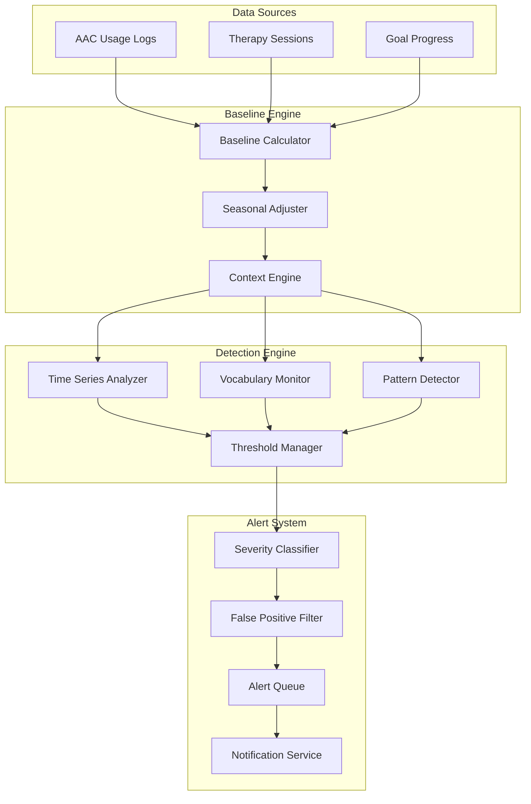
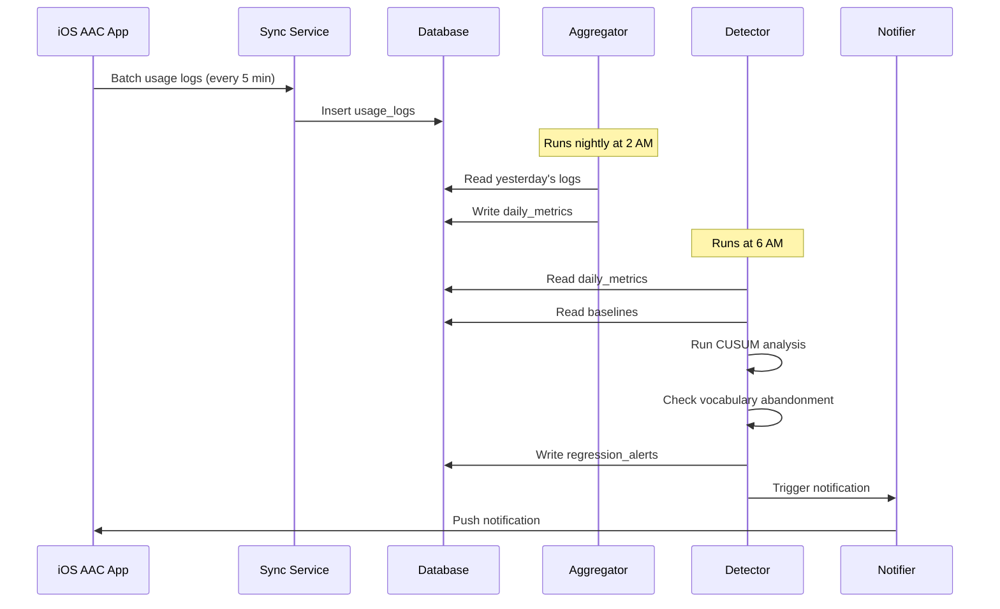

# Regression Detection Algorithms — Technical Specification

**Version:** 1.0  
**Status:** Phase 2 Design  
**Last Updated:** January 2025

---

## 1. Executive Summary

Regression detection is a critical safety feature for AAC users. Early identification of communication skill regressions enables timely intervention and prevents loss of hard-won progress. This system monitors AAC usage patterns and therapy data to detect potential regressions before they become entrenched.

### Why Regression Detection Matters

For children using AAC:
- **Communication is their voice** — losing words feels like losing a part of themselves
- **Skills can regress quickly** — without practice, motor patterns fade
- **Early intervention is critical** — catching regressions in days vs. weeks dramatically improves recovery
- **Caregivers may not notice** — gradual changes are easy to miss without data

### Detection Categories

| Category | Description | Response Time | Severity |
|----------|-------------|---------------|----------|
| **Vocabulary Regression** | Previously used words disappear | 7-14 days | Warning |
| **Usage Volume Drop** | Overall AAC usage decreases | 3-7 days | Warning |
| **Motor Pattern Degradation** | Slower or less accurate selections | 14-21 days | Info |
| **Session Frequency Drop** | Fewer AAC sessions | 5-10 days | Warning |
| **Skill Acquisition Stall** | Goal progress plateaus or reverses | 14-28 days | Warning |
| **Acute Regression** | Sudden dramatic drop | 1-2 days | Critical |

---

## 2. Architecture Overview



---

## 3. Time-Series Analysis Approach

### 3.1 Core Algorithm: CUSUM with Seasonal Adjustment

**CUSUM (Cumulative Sum)** is ideal for detecting small but persistent shifts in a process mean, making it perfect for gradual regression detection.

```typescript
interface CUSUMConfig {
  targetMean: number;        // Expected baseline value
  standardDeviation: number; // Historical standard deviation
  kSigma: number;           // Slack parameter (typically 0.5)
  hThreshold: number;       // Decision interval (typically 4-5)
  warmupPeriod: number;     // Days before detection active
}

class CUSUMDetector {
  private upperSum: number = 0;
  private lowerSum: number = 0;
  
  /**
   * Process a new observation and return whether a shift is detected
   */
  processObservation(value: number, config: CUSUMConfig): CUSUMResult {
    const z = (value - config.targetMean) / config.standardDeviation;
    
    // Update cumulative sums
    this.upperSum = Math.max(0, this.upperSum + z - config.kSigma);
    this.lowerSum = Math.min(0, this.lowerSum + z + config.kSigma);
    
    // Check for threshold breach
    const upperBreach = this.upperSum > config.hThreshold;
    const lowerBreach = Math.abs(this.lowerSum) > config.hThreshold;
    
    return {
      upperSum: this.upperSum,
      lowerSum: this.lowerSum,
      shiftDetected: upperBreach || lowerBreach,
      direction: upperBreach ? 'increase' : (lowerBreach ? 'decrease' : 'none'),
      magnitude: Math.max(this.upperSum, Math.abs(this.lowerSum))
    };
  }
  
  /**
   * Reset after shift is acknowledged
   */
  reset(): void {
    this.upperSum = 0;
    this.lowerSum = 0;
  }
}

interface CUSUMResult {
  upperSum: number;
  lowerSum: number;
  shiftDetected: boolean;
  direction: 'increase' | 'decrease' | 'none';
  magnitude: number;
}
```

### 3.2 Seasonal Adjustment

Children's AAC usage naturally varies by day-of-week and time-of-year:

```typescript
interface SeasonalPattern {
  childId: string;
  dayOfWeekFactors: number[];      // [Mon=1.0, Tue=0.9, ..., Sun=0.7]
  monthlyFactors: number[];         // [Jan=0.9, Feb=0.9, ..., Dec=0.8]
  schoolDayFactor: number;          // e.g., 1.2 (more use during school)
  holidayFactor: number;            // e.g., 0.6 (less during holidays)
}

class SeasonalAdjuster {
  private patterns: Map<string, SeasonalPattern> = new Map();
  
  async getExpectedValue(
    childId: string, 
    baselineValue: number, 
    date: Date
  ): Promise<number> {
    const pattern = await this.getOrComputePattern(childId);
    
    const dayFactor = pattern.dayOfWeekFactors[getDay(date)];
    const monthFactor = pattern.monthlyFactors[getMonth(date)];
    const contextFactor = await this.getContextFactor(childId, date);
    
    return baselineValue * dayFactor * monthFactor * contextFactor;
  }
  
  private async getContextFactor(childId: string, date: Date): Promise<number> {
    // Check for school days, holidays, illness, etc.
    const context = await this.getChildContext(childId, date);
    
    if (context.isHoliday) return 0.6;
    if (context.isIll) return 0.3;  // Expect very low usage
    if (context.isSchoolDay) return 1.2;
    
    return 1.0;
  }
  
  /**
   * Compute seasonal patterns from historical data
   */
  async computePattern(childId: string): Promise<SeasonalPattern> {
    const history = await this.db.getDailyMetrics(childId, { days: 365 });
    
    // Group by day of week
    const byDayOfWeek = groupBy(history, (d) => getDay(d.date));
    const dayOfWeekMeans = Object.entries(byDayOfWeek).map(([day, data]) => ({
      day: parseInt(day),
      mean: mean(data.map(d => d.totalTaps))
    }));
    
    const overallMean = mean(history.map(d => d.totalTaps));
    
    // Normalize to factors (1.0 = average)
    const dayOfWeekFactors = new Array(7).fill(1.0);
    for (const { day, mean: dayMean } of dayOfWeekMeans) {
      dayOfWeekFactors[day] = overallMean > 0 ? dayMean / overallMean : 1.0;
    }
    
    // Similar computation for monthly factors
    const monthlyFactors = await this.computeMonthlyFactors(history, overallMean);
    
    return {
      childId,
      dayOfWeekFactors,
      monthlyFactors,
      schoolDayFactor: await this.computeSchoolDayFactor(childId),
      holidayFactor: 0.6 // Default, can be learned
    };
  }
}
```

### 3.3 Multi-Metric Time Series Monitoring

```typescript
interface MetricDefinition {
  name: string;
  aggregation: 'sum' | 'mean' | 'max' | 'count';
  warningThreshold: number;  // Standard deviations
  criticalThreshold: number;
  minDataPoints: number;     // Before detection active
  seasonallyAdjusted: boolean;
}

const MONITORED_METRICS: MetricDefinition[] = [
  {
    name: 'daily_taps',
    aggregation: 'sum',
    warningThreshold: 2.0,
    criticalThreshold: 3.0,
    minDataPoints: 14,
    seasonallyAdjusted: true
  },
  {
    name: 'unique_words',
    aggregation: 'count',
    warningThreshold: 2.0,
    criticalThreshold: 2.5,
    minDataPoints: 14,
    seasonallyAdjusted: true
  },
  {
    name: 'avg_session_length',
    aggregation: 'mean',
    warningThreshold: 1.5,
    criticalThreshold: 2.5,
    minDataPoints: 21,
    seasonallyAdjusted: false
  },
  {
    name: 'phrase_length_avg',
    aggregation: 'mean',
    warningThreshold: 1.5,
    criticalThreshold: 2.0,
    minDataPoints: 14,
    seasonallyAdjusted: false
  },
  {
    name: 'sessions_per_day',
    aggregation: 'count',
    warningThreshold: 2.0,
    criticalThreshold: 3.0,
    minDataPoints: 10,
    seasonallyAdjusted: true
  }
];

class MultiMetricMonitor {
  private detectors: Map<string, CUSUMDetector> = new Map();
  
  async runDailyCheck(childId: string): Promise<RegressionAlert[]> {
    const alerts: RegressionAlert[] = [];
    const baseline = await this.getBaseline(childId);
    const today = await this.getTodayMetrics(childId);
    
    for (const metric of MONITORED_METRICS) {
      const key = `${childId}:${metric.name}`;
      
      // Get or create detector
      if (!this.detectors.has(key)) {
        this.detectors.set(key, new CUSUMDetector());
      }
      const detector = this.detectors.get(key)!;
      
      // Get expected value
      let expected = baseline[metric.name].mean;
      if (metric.seasonallyAdjusted) {
        expected = await this.adjuster.getExpectedValue(
          childId, 
          expected, 
          new Date()
        );
      }
      
      // Process observation
      const result = detector.processObservation(today[metric.name], {
        targetMean: expected,
        standardDeviation: baseline[metric.name].stdDev,
        kSigma: 0.5,
        hThreshold: metric.warningThreshold,
        warmupPeriod: metric.minDataPoints
      });
      
      if (result.shiftDetected && result.direction === 'decrease') {
        alerts.push({
          type: 'metric_regression',
          metric: metric.name,
          severity: result.magnitude > metric.criticalThreshold ? 'critical' : 'warning',
          expectedValue: expected,
          actualValue: today[metric.name],
          magnitude: result.magnitude,
          daysPersistent: await this.countConsecutiveDropDays(childId, metric.name)
        });
      }
    }
    
    return alerts;
  }
}
```

---

## 4. Baseline Modeling Techniques

### 4.1 Rolling Baseline Calculator

```typescript
interface Baseline {
  metric: string;
  mean: number;
  median: number;
  stdDev: number;
  percentile25: number;
  percentile75: number;
  percentile95: number;
  sampleSize: number;
  computedAt: Date;
  validUntil: Date;
}

class BaselineCalculator {
  private readonly BASELINE_WINDOW_DAYS = 28;
  private readonly MIN_SAMPLE_SIZE = 14;
  private readonly OUTLIER_THRESHOLD = 3.0; // Z-score for outlier removal
  
  async calculateBaseline(
    childId: string, 
    metric: string,
    asOf: Date = new Date()
  ): Promise<Baseline | null> {
    const windowStart = subDays(asOf, this.BASELINE_WINDOW_DAYS);
    
    const data = await this.db.query.dailyMetrics.findMany({
      where: and(
        eq(dailyMetrics.childId, childId),
        gte(dailyMetrics.date, format(windowStart, 'yyyy-MM-dd')),
        lt(dailyMetrics.date, format(asOf, 'yyyy-MM-dd'))
      ),
      orderBy: asc(dailyMetrics.date)
    });
    
    if (data.length < this.MIN_SAMPLE_SIZE) {
      return null; // Insufficient data
    }
    
    // Extract metric values
    const values = data.map(d => d[metric as keyof typeof d] as number);
    
    // Remove outliers using IQR method
    const cleanValues = this.removeOutliers(values);
    
    if (cleanValues.length < this.MIN_SAMPLE_SIZE / 2) {
      return null; // Too many outliers, data unreliable
    }
    
    // Calculate statistics
    const sorted = [...cleanValues].sort((a, b) => a - b);
    
    return {
      metric,
      mean: mean(cleanValues),
      median: this.percentile(sorted, 50),
      stdDev: this.standardDeviation(cleanValues),
      percentile25: this.percentile(sorted, 25),
      percentile75: this.percentile(sorted, 75),
      percentile95: this.percentile(sorted, 95),
      sampleSize: cleanValues.length,
      computedAt: new Date(),
      validUntil: addDays(new Date(), 7) // Refresh weekly
    };
  }
  
  private removeOutliers(values: number[]): number[] {
    const q1 = this.percentile(values, 25);
    const q3 = this.percentile(values, 75);
    const iqr = q3 - q1;
    
    const lowerBound = q1 - 1.5 * iqr;
    const upperBound = q3 + 1.5 * iqr;
    
    return values.filter(v => v >= lowerBound && v <= upperBound);
  }
  
  private percentile(sorted: number[], p: number): number {
    const index = (p / 100) * (sorted.length - 1);
    const lower = Math.floor(index);
    const upper = Math.ceil(index);
    
    if (lower === upper) return sorted[lower];
    
    return sorted[lower] + (index - lower) * (sorted[upper] - sorted[lower]);
  }
  
  private standardDeviation(values: number[]): number {
    const avg = mean(values);
    const squareDiffs = values.map(v => Math.pow(v - avg, 2));
    return Math.sqrt(mean(squareDiffs));
  }
}
```

### 4.2 Adaptive Baseline with Trend

```typescript
interface TrendBaseline extends Baseline {
  trend: 'increasing' | 'decreasing' | 'stable';
  trendSlope: number;        // Units per day
  trendConfidence: number;   // R-squared
  seasonalComponent: number[];
}

class AdaptiveBaselineCalculator extends BaselineCalculator {
  /**
   * Calculates baseline accounting for expected growth/decline trends
   */
  async calculateAdaptiveBaseline(
    childId: string,
    metric: string
  ): Promise<TrendBaseline | null> {
    const history = await this.getExtendedHistory(childId, metric, 90);
    
    if (history.length < 30) {
      // Fall back to simple baseline
      const simple = await this.calculateBaseline(childId, metric);
      if (!simple) return null;
      return { ...simple, trend: 'stable', trendSlope: 0, trendConfidence: 0, seasonalComponent: [] };
    }
    
    // Decompose time series
    const decomposition = this.decomposeTimeSeries(history);
    
    // Calculate trend using linear regression
    const { slope, rSquared } = this.linearRegression(
      history.map((_, i) => i),
      decomposition.trend
    );
    
    // Determine trend direction
    const trend: 'increasing' | 'decreasing' | 'stable' = 
      slope > 0.1 && rSquared > 0.3 ? 'increasing' :
      slope < -0.1 && rSquared > 0.3 ? 'decreasing' :
      'stable';
    
    // Calculate residual statistics (after removing trend + seasonal)
    const residuals = decomposition.residual;
    
    return {
      metric,
      mean: mean(residuals),
      median: this.percentile(residuals.sort((a, b) => a - b), 50),
      stdDev: this.standardDeviation(residuals),
      percentile25: this.percentile(residuals, 25),
      percentile75: this.percentile(residuals, 75),
      percentile95: this.percentile(residuals, 95),
      sampleSize: history.length,
      computedAt: new Date(),
      validUntil: addDays(new Date(), 7),
      trend,
      trendSlope: slope,
      trendConfidence: rSquared,
      seasonalComponent: decomposition.seasonal
    };
  }
  
  /**
   * Simple time series decomposition (additive model)
   */
  private decomposeTimeSeries(values: number[]): TimeSeriesDecomposition {
    // Estimate trend using moving average
    const windowSize = 7; // Weekly for daily data
    const trend = this.movingAverage(values, windowSize);
    
    // Remove trend to get seasonal + residual
    const detrended = values.map((v, i) => v - trend[i]);
    
    // Estimate seasonal component (day-of-week pattern)
    const seasonal = this.estimateSeasonality(detrended, 7);
    
    // Residual = original - trend - seasonal
    const residual = values.map((v, i) => v - trend[i] - seasonal[i % 7]);
    
    return { trend, seasonal, residual };
  }
  
  private movingAverage(values: number[], windowSize: number): number[] {
    const result: number[] = [];
    const halfWindow = Math.floor(windowSize / 2);
    
    for (let i = 0; i < values.length; i++) {
      const start = Math.max(0, i - halfWindow);
      const end = Math.min(values.length, i + halfWindow + 1);
      const window = values.slice(start, end);
      result.push(mean(window));
    }
    
    return result;
  }
  
  private estimateSeasonality(values: number[], period: number): number[] {
    const buckets: number[][] = Array.from({ length: period }, () => []);
    
    values.forEach((v, i) => {
      buckets[i % period].push(v);
    });
    
    return buckets.map(bucket => mean(bucket));
  }
  
  private linearRegression(x: number[], y: number[]): { slope: number; intercept: number; rSquared: number } {
    const n = x.length;
    const sumX = x.reduce((a, b) => a + b, 0);
    const sumY = y.reduce((a, b) => a + b, 0);
    const sumXY = x.reduce((total, xi, i) => total + xi * y[i], 0);
    const sumX2 = x.reduce((total, xi) => total + xi * xi, 0);
    const sumY2 = y.reduce((total, yi) => total + yi * yi, 0);
    
    const slope = (n * sumXY - sumX * sumY) / (n * sumX2 - sumX * sumX);
    const intercept = (sumY - slope * sumX) / n;
    
    // R-squared
    const yMean = sumY / n;
    const ssTotal = y.reduce((total, yi) => total + Math.pow(yi - yMean, 2), 0);
    const ssResidual = y.reduce((total, yi, i) => {
      const predicted = slope * x[i] + intercept;
      return total + Math.pow(yi - predicted, 2);
    }, 0);
    const rSquared = 1 - (ssResidual / ssTotal);
    
    return { slope, intercept, rSquared };
  }
}

interface TimeSeriesDecomposition {
  trend: number[];
  seasonal: number[];
  residual: number[];
}
```

---

## 5. Alert Threshold Configuration

### 5.1 Threshold Schema

```typescript
// Database table for configurable thresholds
export const regressionThresholds = pgTable("regression_thresholds", {
  id: uuid("id").primaryKey().defaultRandom(),
  childId: uuid("child_id")
    .references(() => children.id, { onDelete: "cascade" })
    .notNull(),
  metric: varchar("metric", { length: 50 }).notNull(),
  
  // Threshold levels (in standard deviations)
  warningThreshold: decimal("warning_threshold", { precision: 4, scale: 2 }).notNull(),
  criticalThreshold: decimal("critical_threshold", { precision: 4, scale: 2 }).notNull(),
  
  // Minimum consecutive days before alerting
  minConsecutiveDays: integer("min_consecutive_days").default(2),
  
  // Minimum absolute drop (not just relative)
  minAbsoluteDrop: decimal("min_absolute_drop", { precision: 6, scale: 2 }),
  
  // Alert cooldown (don't re-alert for same metric within this period)
  cooldownHours: integer("cooldown_hours").default(48),
  
  // Is this threshold active?
  enabled: boolean("enabled").default(true),
  
  // Override global defaults
  customized: boolean("customized").default(false),
  
  createdAt: timestamp("created_at").defaultNow().notNull(),
  updatedAt: timestamp("updated_at").defaultNow().notNull(),
}, (table) => ({
  childMetricUnique: unique().on(table.childId, table.metric),
}));

// Default thresholds (applied when no custom threshold exists)
const DEFAULT_THRESHOLDS: Record<string, Partial<RegressionThreshold>> = {
  'daily_taps': {
    warningThreshold: 2.0,
    criticalThreshold: 3.0,
    minConsecutiveDays: 3,
    minAbsoluteDrop: 10,
    cooldownHours: 24
  },
  'unique_words': {
    warningThreshold: 1.5,
    criticalThreshold: 2.5,
    minConsecutiveDays: 5,
    minAbsoluteDrop: 3,
    cooldownHours: 72
  },
  'avg_phrase_length': {
    warningThreshold: 1.5,
    criticalThreshold: 2.0,
    minConsecutiveDays: 7,
    minAbsoluteDrop: 0.5,
    cooldownHours: 168 // 1 week
  },
  'sessions_per_day': {
    warningThreshold: 2.0,
    criticalThreshold: 3.0,
    minConsecutiveDays: 2,
    minAbsoluteDrop: 2,
    cooldownHours: 24
  }
};
```

### 5.2 Threshold Manager

```typescript
class ThresholdManager {
  async getThreshold(childId: string, metric: string): Promise<RegressionThreshold> {
    // Check for custom threshold
    const custom = await this.db.query.regressionThresholds.findFirst({
      where: and(
        eq(regressionThresholds.childId, childId),
        eq(regressionThresholds.metric, metric),
        eq(regressionThresholds.enabled, true)
      )
    });
    
    if (custom) {
      return custom;
    }
    
    // Return default
    const defaults = DEFAULT_THRESHOLDS[metric] ?? {
      warningThreshold: 2.0,
      criticalThreshold: 3.0,
      minConsecutiveDays: 3,
      minAbsoluteDrop: null,
      cooldownHours: 48
    };
    
    return {
      id: null,
      childId,
      metric,
      ...defaults,
      enabled: true,
      customized: false,
      createdAt: null,
      updatedAt: null
    };
  }
  
  async updateThreshold(
    childId: string, 
    metric: string, 
    updates: Partial<RegressionThreshold>
  ): Promise<RegressionThreshold> {
    return await this.db.insert(regressionThresholds)
      .values({
        childId,
        metric,
        ...updates,
        customized: true,
        updatedAt: new Date()
      })
      .onConflictDoUpdate({
        target: [regressionThresholds.childId, regressionThresholds.metric],
        set: {
          ...updates,
          customized: true,
          updatedAt: new Date()
        }
      })
      .returning();
  }
  
  async shouldAlert(
    childId: string,
    metric: string,
    magnitude: number,
    consecutiveDays: number
  ): Promise<{ shouldAlert: boolean; severity: 'warning' | 'critical' | null; reason?: string }> {
    const threshold = await this.getThreshold(childId, metric);
    
    // Check cooldown
    const lastAlert = await this.getLastAlert(childId, metric);
    if (lastAlert) {
      const hoursSinceLastAlert = differenceInHours(new Date(), lastAlert.createdAt);
      if (hoursSinceLastAlert < threshold.cooldownHours) {
        return { 
          shouldAlert: false, 
          severity: null,
          reason: `Cooldown active (${threshold.cooldownHours - hoursSinceLastAlert}h remaining)`
        };
      }
    }
    
    // Check consecutive days
    if (consecutiveDays < threshold.minConsecutiveDays) {
      return { 
        shouldAlert: false, 
        severity: null,
        reason: `Need ${threshold.minConsecutiveDays - consecutiveDays} more days of data`
      };
    }
    
    // Check thresholds
    if (magnitude >= threshold.criticalThreshold) {
      return { shouldAlert: true, severity: 'critical' };
    }
    
    if (magnitude >= threshold.warningThreshold) {
      return { shouldAlert: true, severity: 'warning' };
    }
    
    return { shouldAlert: false, severity: null };
  }
}
```

### 5.3 Dynamic Threshold Adjustment

```typescript
class AdaptiveThresholdManager extends ThresholdManager {
  /**
   * Automatically adjust thresholds based on false positive/negative feedback
   */
  async adjustBasedOnFeedback(
    childId: string,
    metric: string,
    alertId: string,
    feedback: 'true_positive' | 'false_positive' | 'false_negative'
  ): Promise<void> {
    const current = await this.getThreshold(childId, metric);
    
    switch (feedback) {
      case 'false_positive':
        // Increase threshold (less sensitive)
        await this.updateThreshold(childId, metric, {
          warningThreshold: Math.min(current.warningThreshold + 0.25, 4.0),
          criticalThreshold: Math.min(current.criticalThreshold + 0.25, 5.0)
        });
        break;
        
      case 'false_negative':
        // Decrease threshold (more sensitive)
        await this.updateThreshold(childId, metric, {
          warningThreshold: Math.max(current.warningThreshold - 0.25, 1.0),
          criticalThreshold: Math.max(current.criticalThreshold - 0.25, 1.5)
        });
        break;
        
      case 'true_positive':
        // Log but don't change (confirming good calibration)
        await this.logFeedback(alertId, 'true_positive');
        break;
    }
  }
  
  /**
   * Suggest threshold adjustments based on historical alert accuracy
   */
  async suggestThresholdAdjustments(childId: string): Promise<ThresholdSuggestion[]> {
    const suggestions: ThresholdSuggestion[] = [];
    
    for (const metric of Object.keys(DEFAULT_THRESHOLDS)) {
      const alerts = await this.getRecentAlerts(childId, metric, 90);
      
      if (alerts.length < 5) continue; // Not enough data
      
      const falsePositiveRate = alerts.filter(a => a.feedback === 'false_positive').length / alerts.length;
      const missedRegressions = alerts.filter(a => a.feedback === 'false_negative').length;
      
      if (falsePositiveRate > 0.3) {
        suggestions.push({
          metric,
          currentThreshold: await this.getThreshold(childId, metric),
          suggestedChange: 'increase',
          reason: `${Math.round(falsePositiveRate * 100)}% of alerts were false positives`,
          suggestedWarning: (await this.getThreshold(childId, metric)).warningThreshold + 0.5
        });
      }
      
      if (missedRegressions > 0) {
        suggestions.push({
          metric,
          currentThreshold: await this.getThreshold(childId, metric),
          suggestedChange: 'decrease',
          reason: `${missedRegressions} regressions were missed`,
          suggestedWarning: (await this.getThreshold(childId, metric)).warningThreshold - 0.5
        });
      }
    }
    
    return suggestions;
  }
}
```

---

## 6. Integration with AAC Usage Data

### 6.1 Data Flow



### 6.2 Vocabulary Regression Detector

```typescript
class VocabularyRegressionDetector {
  private readonly ABANDONMENT_THRESHOLD_DAYS = 14;
  private readonly MIN_PREVIOUS_USES = 5;
  
  async detectVocabularyRegression(childId: string): Promise<VocabularyRegressionAlert[]> {
    const alerts: VocabularyRegressionAlert[] = [];
    
    // Get words used frequently in past but not recently
    const abandonedWords = await this.findAbandonedWords(childId);
    
    // Get words with decreasing usage trend
    const decliningWords = await this.findDecliningWords(childId);
    
    // Combine and deduplicate
    const allConcerning = [...abandonedWords, ...decliningWords];
    
    for (const word of allConcerning) {
      // Check if this word is important (core vocabulary or high previous use)
      const importance = await this.assessWordImportance(word);
      
      if (importance > 0.5) {
        alerts.push({
          type: 'vocabulary_regression',
          symbolId: word.symbolId,
          label: word.label,
          category: word.category,
          previousUsageCount: word.previousCount,
          currentUsageCount: word.currentCount,
          daysSinceLastUse: word.daysSinceLastUse,
          importance,
          severity: importance > 0.8 ? 'warning' : 'info',
          suggestion: await this.generateRecoverySuggestion(word)
        });
      }
    }
    
    return alerts;
  }
  
  private async findAbandonedWords(childId: string): Promise<WordUsageChange[]> {
    const cutoffDate = subDays(new Date(), this.ABANDONMENT_THRESHOLD_DAYS);
    
    // SQL query to find words used before cutoff but not after
    const result = await this.db.execute(sql`
      WITH previous_usage AS (
        SELECT 
          symbol_id,
          COUNT(*) as usage_count,
          MAX(timestamp) as last_used
        FROM usage_logs
        WHERE child_id = ${childId}
          AND timestamp < ${cutoffDate}
          AND timestamp > ${subDays(cutoffDate, 60)} -- 60-day lookback window
        GROUP BY symbol_id
        HAVING COUNT(*) >= ${this.MIN_PREVIOUS_USES}
      ),
      recent_usage AS (
        SELECT 
          symbol_id,
          COUNT(*) as usage_count
        FROM usage_logs
        WHERE child_id = ${childId}
          AND timestamp >= ${cutoffDate}
        GROUP BY symbol_id
      )
      SELECT 
        p.symbol_id,
        p.usage_count as previous_count,
        COALESCE(r.usage_count, 0) as current_count,
        p.last_used
      FROM previous_usage p
      LEFT JOIN recent_usage r ON p.symbol_id = r.symbol_id
      WHERE COALESCE(r.usage_count, 0) = 0
      ORDER BY p.usage_count DESC
    `);
    
    return result.rows.map(row => ({
      symbolId: row.symbol_id,
      previousCount: row.previous_count,
      currentCount: 0,
      lastUsed: row.last_used,
      daysSinceLastUse: differenceInDays(new Date(), row.last_used),
      ...await this.enrichSymbolData(row.symbol_id)
    }));
  }
  
  private async findDecliningWords(childId: string): Promise<WordUsageChange[]> {
    const today = new Date();
    const twoWeeksAgo = subDays(today, 14);
    const fourWeeksAgo = subDays(today, 28);
    
    // Compare last 2 weeks vs previous 2 weeks
    const result = await this.db.execute(sql`
      WITH recent_usage AS (
        SELECT symbol_id, COUNT(*) as count
        FROM usage_logs
        WHERE child_id = ${childId}
          AND timestamp >= ${twoWeeksAgo}
        GROUP BY symbol_id
      ),
      previous_usage AS (
        SELECT symbol_id, COUNT(*) as count
        FROM usage_logs
        WHERE child_id = ${childId}
          AND timestamp >= ${fourWeeksAgo}
          AND timestamp < ${twoWeeksAgo}
        GROUP BY symbol_id
      )
      SELECT 
        p.symbol_id,
        p.count as previous_count,
        COALESCE(r.count, 0) as current_count,
        (COALESCE(r.count, 0)::float - p.count) / p.count as change_ratio
      FROM previous_usage p
      LEFT JOIN recent_usage r ON p.symbol_id = r.symbol_id
      WHERE p.count >= 5
        AND (COALESCE(r.count, 0)::float - p.count) / p.count < -0.5
      ORDER BY change_ratio ASC
    `);
    
    return result.rows.map(row => ({
      symbolId: row.symbol_id,
      previousCount: row.previous_count,
      currentCount: row.current_count,
      changeRatio: row.change_ratio,
      ...await this.enrichSymbolData(row.symbol_id)
    }));
  }
  
  private async assessWordImportance(word: WordUsageChange): Promise<number> {
    let score = 0;
    
    // Core vocabulary words are more important
    if (await this.isCoreVocabulary(word.symbolId)) {
      score += 0.4;
    }
    
    // Frequently used words are more important
    if (word.previousCount > 20) score += 0.3;
    else if (word.previousCount > 10) score += 0.2;
    else if (word.previousCount > 5) score += 0.1;
    
    // Words in active therapy goals are more important
    if (await this.isInActiveGoal(word.symbolId)) {
      score += 0.3;
    }
    
    return Math.min(score, 1.0);
  }
  
  private async generateRecoverySuggestion(word: WordUsageChange): Promise<string> {
    // Generate contextual suggestion for reintroducing the word
    return `Consider modeling "${word.label}" during daily activities. ` +
           `This word was previously used ${word.previousCount} times and may benefit from renewed exposure.`;
  }
}
```

---

## 7. False Positive Mitigation

### 7.1 Multi-Signal Confirmation

```typescript
class FalsePositiveFilter {
  private readonly CONFIRMATION_SIGNALS = [
    'consecutive_days',
    'multiple_metrics',
    'vocabulary_correlation',
    'session_pattern_change'
  ];
  
  async filterAlerts(alerts: RegressionAlert[]): Promise<RegressionAlert[]> {
    const confirmed: RegressionAlert[] = [];
    
    for (const alert of alerts) {
      const confirmationScore = await this.calculateConfirmationScore(alert);
      
      if (confirmationScore >= 0.6) {
        confirmed.push({
          ...alert,
          confirmationScore,
          confirmationSignals: await this.getConfirmingSignals(alert)
        });
      } else {
        // Log but don't alert
        await this.logFilteredAlert(alert, confirmationScore);
      }
    }
    
    return confirmed;
  }
  
  private async calculateConfirmationScore(alert: RegressionAlert): Promise<number> {
    let score = 0;
    const weights = {
      consecutive_days: 0.3,
      multiple_metrics: 0.25,
      vocabulary_correlation: 0.25,
      session_pattern_change: 0.2
    };
    
    // Check consecutive days
    if (alert.daysPersistent >= 3) {
      score += weights.consecutive_days * Math.min(alert.daysPersistent / 7, 1);
    }
    
    // Check if multiple metrics are declining
    const decliningMetrics = await this.countDecliningMetrics(alert.childId);
    if (decliningMetrics >= 2) {
      score += weights.multiple_metrics * Math.min(decliningMetrics / 4, 1);
    }
    
    // Check vocabulary correlation
    if (await this.hasVocabularyCorrelation(alert)) {
      score += weights.vocabulary_correlation;
    }
    
    // Check session pattern changes
    if (await this.hasSessionPatternChange(alert.childId)) {
      score += weights.session_pattern_change;
    }
    
    return score;
  }
  
  private async getConfirmingSignals(alert: RegressionAlert): Promise<string[]> {
    const signals: string[] = [];
    
    if (alert.daysPersistent >= 3) {
      signals.push(`Persistent for ${alert.daysPersistent} days`);
    }
    
    const decliningMetrics = await this.countDecliningMetrics(alert.childId);
    if (decliningMetrics >= 2) {
      signals.push(`${decliningMetrics} metrics declining simultaneously`);
    }
    
    // Add more signal descriptions...
    
    return signals;
  }
}
```

### 7.2 Context-Aware Suppression

```typescript
interface SuppressionContext {
  childId: string;
  date: Date;
  reason: 'illness' | 'travel' | 'vacation' | 'device_issue' | 'therapy_change' | 'other';
  startDate: Date;
  endDate?: Date;
  notes?: string;
}

// Database table
export const alertSuppressions = pgTable("alert_suppressions", {
  id: uuid("id").primaryKey().defaultRandom(),
  childId: uuid("child_id")
    .references(() => children.id, { onDelete: "cascade" })
    .notNull(),
  reason: varchar("reason", { length: 50 }).notNull(),
  startDate: date("start_date").notNull(),
  endDate: date("end_date"),
  notes: text("notes"),
  createdBy: uuid("created_by")
    .references(() => users.id)
    .notNull(),
  createdAt: timestamp("created_at").defaultNow().notNull(),
});

class ContextAwareSuppressor {
  async shouldSuppressAlert(alert: RegressionAlert): Promise<{ suppress: boolean; reason?: string }> {
    const suppressions = await this.db.query.alertSuppressions.findMany({
      where: and(
        eq(alertSuppressions.childId, alert.childId),
        lte(alertSuppressions.startDate, format(new Date(), 'yyyy-MM-dd')),
        or(
          isNull(alertSuppressions.endDate),
          gte(alertSuppressions.endDate, format(new Date(), 'yyyy-MM-dd'))
        )
      )
    });
    
    if (suppressions.length > 0) {
      const active = suppressions[0];
      return {
        suppress: true,
        reason: `Alert suppressed: ${active.reason}${active.notes ? ` - ${active.notes}` : ''}`
      };
    }
    
    // Check for automatic suppression contexts
    const autoContext = await this.detectAutomaticContext(alert.childId);
    if (autoContext) {
      return {
        suppress: true,
        reason: `Auto-detected: ${autoContext}`
      };
    }
    
    return { suppress: false };
  }
  
  private async detectAutomaticContext(childId: string): Promise<string | null> {
    // Check for device sync issues (no data for 24+ hours)
    const lastSync = await this.getLastSyncTime(childId);
    if (differenceInHours(new Date(), lastSync) > 24) {
      return 'Device sync issue detected - no recent data';
    }
    
    // Check for holiday/vacation patterns
    if (await this.isLikelyVacation(childId)) {
      return 'Possible vacation/holiday period';
    }
    
    return null;
  }
  
  private async isLikelyVacation(childId: string): Promise<boolean> {
    // Check if usage pattern suggests vacation
    // (very low usage but no preceding decline pattern)
    const recentDays = await this.getRecentDailyMetrics(childId, 7);
    const previousWeek = await this.getRecentDailyMetrics(childId, 14);
    
    const recentAvg = mean(recentDays.map(d => d.totalTaps));
    const previousAvg = mean(previousWeek.slice(0, 7).map(d => d.totalTaps));
    
    // Sudden drop to very low (not gradual) suggests vacation
    return recentAvg < previousAvg * 0.2 && recentAvg < 10;
  }
}
```

### 7.3 Alert Feedback Loop

```typescript
export const alertFeedback = pgTable("alert_feedback", {
  id: uuid("id").primaryKey().defaultRandom(),
  alertId: uuid("alert_id")
    .references(() => regressionAlerts.id)
    .notNull(),
  userId: uuid("user_id")
    .references(() => users.id)
    .notNull(),
  feedback: varchar("feedback", { length: 20 }).notNull(), // true_positive, false_positive, unsure
  notes: text("notes"),
  createdAt: timestamp("created_at").defaultNow().notNull(),
});

class AlertFeedbackCollector {
  async collectFeedback(
    alertId: string,
    userId: string,
    feedback: 'true_positive' | 'false_positive' | 'unsure',
    notes?: string
  ): Promise<void> {
    // Store feedback
    await this.db.insert(alertFeedback).values({
      alertId,
      userId,
      feedback,
      notes
    });
    
    // Trigger threshold adjustment if needed
    if (feedback === 'false_positive' || feedback === 'true_positive') {
      const alert = await this.getAlert(alertId);
      await this.thresholdManager.adjustBasedOnFeedback(
        alert.childId,
        alert.metric,
        alertId,
        feedback
      );
    }
    
    // Log for ML training data
    await this.logTrainingExample(alertId, feedback);
  }
  
  async getFeedbackStats(childId: string): Promise<FeedbackStats> {
    const alerts = await this.db.query.regressionAlerts.findMany({
      where: eq(regressionAlerts.childId, childId),
      with: {
        feedback: true
      }
    });
    
    const withFeedback = alerts.filter(a => a.feedback.length > 0);
    
    return {
      totalAlerts: alerts.length,
      alertsWithFeedback: withFeedback.length,
      truePositiveRate: withFeedback.filter(a => 
        a.feedback.some(f => f.feedback === 'true_positive')
      ).length / withFeedback.length,
      falsePositiveRate: withFeedback.filter(a => 
        a.feedback.some(f => f.feedback === 'false_positive')
      ).length / withFeedback.length,
      feedbackPending: alerts.length - withFeedback.length
    };
  }
}
```

---

## 8. Database Schema Changes

```typescript
// New tables for regression detection

export const regressionAlerts = pgTable("regression_alerts", {
  id: uuid("id").primaryKey().defaultRandom(),
  childId: uuid("child_id")
    .references(() => children.id, { onDelete: "cascade" })
    .notNull(),
  
  // Alert classification
  type: varchar("type", { length: 50 }).notNull(), // metric_regression, vocabulary_regression, pattern_change
  metric: varchar("metric", { length: 50 }),        // Which metric triggered
  severity: varchar("severity", { length: 20 }).notNull(), // critical, warning, info
  
  // Detection details
  expectedValue: decimal("expected_value", { precision: 10, scale: 2 }),
  actualValue: decimal("actual_value", { precision: 10, scale: 2 }),
  deviationScore: decimal("deviation_score", { precision: 6, scale: 3 }),
  daysPersistent: integer("days_persistent"),
  
  // Confirmation
  confirmationScore: decimal("confirmation_score", { precision: 4, scale: 3 }),
  confirmationSignals: jsonb("confirmation_signals"),
  
  // Content
  title: varchar("title", { length: 255 }).notNull(),
  description: text("description").notNull(),
  suggestion: text("suggestion"),
  
  // State
  status: varchar("status", { length: 20 }).notNull().default("active"), // active, acknowledged, resolved, dismissed
  acknowledgedAt: timestamp("acknowledged_at"),
  acknowledgedBy: uuid("acknowledged_by").references(() => users.id),
  resolvedAt: timestamp("resolved_at"),
  
  createdAt: timestamp("created_at").defaultNow().notNull(),
  expiresAt: timestamp("expires_at"), // Auto-dismiss after this time
}, (table) => ({
  childStatusIdx: index("regression_alerts_child_status_idx").on(table.childId, table.status),
  createdAtIdx: index("regression_alerts_created_at_idx").on(table.createdAt),
}));

export const baselineSnapshots = pgTable("baseline_snapshots", {
  id: uuid("id").primaryKey().defaultRandom(),
  childId: uuid("child_id")
    .references(() => children.id, { onDelete: "cascade" })
    .notNull(),
  metric: varchar("metric", { length: 50 }).notNull(),
  
  // Statistics
  mean: decimal("mean", { precision: 10, scale: 4 }).notNull(),
  median: decimal("median", { precision: 10, scale: 4 }).notNull(),
  stdDev: decimal("std_dev", { precision: 10, scale: 4 }).notNull(),
  percentile25: decimal("percentile_25", { precision: 10, scale: 4 }),
  percentile75: decimal("percentile_75", { precision: 10, scale: 4 }),
  percentile95: decimal("percentile_95", { precision: 10, scale: 4 }),
  
  // Trend analysis
  trend: varchar("trend", { length: 20 }), // increasing, decreasing, stable
  trendSlope: decimal("trend_slope", { precision: 8, scale: 6 }),
  trendConfidence: decimal("trend_confidence", { precision: 4, scale: 3 }),
  seasonalFactors: jsonb("seasonal_factors"),
  
  // Metadata
  sampleSize: integer("sample_size").notNull(),
  windowStartDate: date("window_start_date").notNull(),
  windowEndDate: date("window_end_date").notNull(),
  
  computedAt: timestamp("computed_at").defaultNow().notNull(),
  validUntil: timestamp("valid_until").notNull(),
}, (table) => ({
  childMetricIdx: index("baseline_snapshots_child_metric_idx").on(table.childId, table.metric),
}));
```

---

## 9. Claude Tool Definitions

```typescript
// Tool to get regression alerts
const getRegressionAlertsTool: Tool = {
  name: 'get_regression_alerts',
  description: 'Retrieves active regression alerts for a child',
  input_schema: {
    type: 'object',
    properties: {
      childId: {
        type: 'string',
        description: 'UUID of the child'
      },
      severity: {
        type: 'array',
        items: { type: 'string', enum: ['critical', 'warning', 'info'] },
        description: 'Filter by severity levels'
      },
      status: {
        type: 'string',
        enum: ['active', 'acknowledged', 'resolved', 'all'],
        default: 'active',
        description: 'Filter by alert status'
      },
      limit: {
        type: 'number',
        default: 10,
        description: 'Maximum alerts to return'
      }
    },
    required: ['childId']
  }
};

// Tool to acknowledge/resolve alerts
const updateAlertStatusTool: Tool = {
  name: 'update_alert_status',
  description: 'Updates the status of a regression alert',
  input_schema: {
    type: 'object',
    properties: {
      alertId: {
        type: 'string',
        description: 'UUID of the alert'
      },
      status: {
        type: 'string',
        enum: ['acknowledged', 'resolved', 'dismissed'],
        description: 'New status for the alert'
      },
      notes: {
        type: 'string',
        description: 'Optional notes about the status change'
      }
    },
    required: ['alertId', 'status']
  }
};

// Tool to provide alert feedback
const provideAlertFeedbackTool: Tool = {
  name: 'provide_alert_feedback',
  description: 'Provides feedback on whether an alert was accurate',
  input_schema: {
    type: 'object',
    properties: {
      alertId: {
        type: 'string',
        description: 'UUID of the alert'
      },
      feedback: {
        type: 'string',
        enum: ['true_positive', 'false_positive', 'unsure'],
        description: 'Whether the alert was accurate'
      },
      notes: {
        type: 'string',
        description: 'Optional explanation'
      }
    },
    required: ['alertId', 'feedback']
  }
};

// Tool to configure suppression periods
const manageAlertSuppressionTool: Tool = {
  name: 'manage_alert_suppression',
  description: 'Creates or removes alert suppression periods (e.g., for vacation)',
  input_schema: {
    type: 'object',
    properties: {
      action: {
        type: 'string',
        enum: ['create', 'remove', 'list'],
        description: 'Action to perform'
      },
      childId: {
        type: 'string',
        description: 'UUID of the child'
      },
      suppressionId: {
        type: 'string',
        description: 'UUID of suppression to remove (for remove action)'
      },
      reason: {
        type: 'string',
        enum: ['illness', 'travel', 'vacation', 'device_issue', 'therapy_change', 'other'],
        description: 'Reason for suppression (for create action)'
      },
      startDate: {
        type: 'string',
        format: 'date',
        description: 'Start date for suppression (for create action)'
      },
      endDate: {
        type: 'string',
        format: 'date',
        description: 'End date for suppression, or null for indefinite (for create action)'
      },
      notes: {
        type: 'string',
        description: 'Additional notes (for create action)'
      }
    },
    required: ['action', 'childId']
  }
};

// Tool to customize thresholds
const configureThresholdsTool: Tool = {
  name: 'configure_regression_thresholds',
  description: 'Customizes regression detection thresholds for a child',
  input_schema: {
    type: 'object',
    properties: {
      childId: {
        type: 'string',
        description: 'UUID of the child'
      },
      metric: {
        type: 'string',
        description: 'Metric to configure (e.g., daily_taps, unique_words)'
      },
      warningThreshold: {
        type: 'number',
        description: 'Standard deviations for warning (default: 2.0)'
      },
      criticalThreshold: {
        type: 'number',
        description: 'Standard deviations for critical (default: 3.0)'
      },
      minConsecutiveDays: {
        type: 'number',
        description: 'Days before alerting (default: 3)'
      },
      cooldownHours: {
        type: 'number',
        description: 'Hours between repeat alerts (default: 48)'
      },
      enabled: {
        type: 'boolean',
        description: 'Whether alerts for this metric are enabled'
      }
    },
    required: ['childId', 'metric']
  }
};
```

---

## 10. Implementation Phases

### Phase 2a: Foundation (Weeks 1-3)
- [ ] Database schema for baselines and alerts
- [ ] Basic baseline calculator (rolling 28-day window)
- [ ] Simple Z-score anomaly detection
- [ ] Daily detection job infrastructure

### Phase 2b: Intelligence (Weeks 4-6)
- [ ] CUSUM implementation for persistent shift detection
- [ ] Seasonal adjustment model
- [ ] Vocabulary regression detector
- [ ] Multi-metric correlation

### Phase 2c: Refinement (Weeks 7-9)
- [ ] False positive filter with confirmation scoring
- [ ] Context-aware suppression system
- [ ] Feedback collection and threshold adjustment
- [ ] Adaptive baseline with trend

### Phase 2d: Integration (Weeks 10-12)
- [ ] Notification integration
- [ ] Dashboard visualizations for regressions
- [ ] Therapist-facing regression reports
- [ ] Claude tool implementations

---

*Document authored for Flynn AAC Phase 2 regression detection. For algorithm questions, consult the data science team.*
